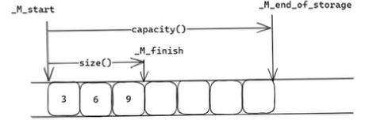

### vector底层实现

vector是动态数组，由三个指针+一段线性连续空间构成

_M_start：使用内存的起始位置或分配内存的起始位置。

_M_finish：使用内存的结束位置或未使用内存的起始位置。

_M_end_of_storage：分配内存的结束位置。

当没有给vector设置大小时，vector初始只有3个指针，64位下3*8=24个字节，此时无堆内存分配。

vector中的元素存储在堆上，因为这个线性的连续空间是vector底层通过分配器动态创建、自主维护的内存，不属于栈内存，因此分配在堆上。

##### 扩容机制

当vector的size==capacity时，下一次插入元素就会引发扩容。先分配新的空间（VS是1.5倍扩容，GCC是2倍扩容），将原有空间的数据迁移到新的内存空间，再释放旧的内存空间。

2倍相较于1.5倍的扩容：2倍扩容单次扩容容量更大，扩容次数更少，时间效率更优，但空间利用率较低，容易造成内存空间浪费，且无法复用已释放的内存；1.5倍扩容空间利用率更高，可复用部分释放的内存，但扩容触发次数更多。

vector的分配器将**内存分配与对象构建分离、内存释放与对象销毁分离**。底层通过std::allocator分配内存，主流编译器分配器底层基于malloc实现；对象构建采用placement new（定位new）方式，在已经分配好的裸内存中调用构造函数完成对象初始化。

避免扩容移动代价：如果可以提前预测元素个数，可通过reserve预分配内存，避免多次扩容和数据迁移的开销。

**将原有空间的数据，移动到新的内存空间：**

扩容数据迁移时，会优先使用对象的**移动构造、移动赋值运算符**；若对象不支持移动语义，才会降级调用拷贝构造、拷贝赋值运算符完成数据迁移，以此尽可能降低内存拷贝开销。

##### vector存放对象和指针的优缺点：

存储对象：要求对象支持拷贝和赋值操作，优点是对象的生命周期统一由vector管理，无需手动维护，内存管理安全；缺点是插入、扩容时存在拷贝/移动开销。

存储指针：优点是不存在对象拷贝和赋值的开销，读写效率更高；缺点是需要开发者自行手动管理指针和堆对象的生命周期，容易出现内存泄漏、野指针问题，建议优先使用智能指针。

##### vector迭代器失效

###### 扩容引起迭代器失效：

涉及接口：insert、emplace、push_back、emplace_back

当size==capacity触发扩容时，内存地址发生改变，原有所有迭代器全部失效；未扩容时，仅push_back/emplace_back会导致尾后迭代器失效，其余迭代器有效。

###### 元素移动引起迭代器失效：

涉及接口：erase、emplace、insert

插入或删除元素时，会导致后续元素发生内存移动，造成**操作位置及之后的所有迭代器失效**，之前的迭代器保持有效。

##### 一些使用场景

###### resize和reserve区别：

resize：操作有效元素个数size，会初始化/销毁元素，支持扩容和缩容，会改变容器实际元素数量。

reserve：操作容器容量capacity，仅预分配内存，不会创建、裁剪、销毁元素，不初始化内存，只扩容不缩容，不改变有效元素个数。

###### vector在中间插入一个元素会发生什么：

首先判断当前容器是否满（size==capacity），满则触发扩容；再将待插入位置及后面的所有元素向后挪动一位，最后将新元素插入到目标位置，整体时间复杂度O(n)。

###### vector在中间删除一个元素会发生什么：

删除中间元素时，先调用该元素的析构函数销毁对象，将被删元素后续的所有元素向前移动一位，最后更新_M_finish指针，完成元素删除，整体时间复杂度O(n)。

###### 如何完全清空vector：

vector< T >().swap(v)：彻底清空容器，释放所有堆内存，size和capacity均置0；

v.clear()：仅销毁所有元素，size置0，不释放堆内存，capacity保持不变；

v.shrink_to_fit()：向编译器发起缩容请求，将capacity收缩至当前size，释放未使用的空闲内存（非强制，编译器可忽略）。

###### push_back和emplace_back区别：

push_back：先构造临时对象，再将临时对象拷贝或移动到vector末尾，存在额外的临时对象构造与销毁开销；

emplace_back：通过参数完美转发，直接在vector末尾的内存空间中原地构造对象，避免了额外的拷贝、移动操作，性能更优。

###### vector erase允许元素打乱的优化：

常规erase删除中间元素需移动后续元素，效率低；允许打乱元素顺序时，可将目标位置元素与容器最后一个元素交换，再删除末尾元素，将时间复杂度从O(n)优化为O(1)。

###### C++11 vector增加了哪些内容？

1、新增常量迭代器，支持只读遍历容器；

2、全面支持移动语义，扩容、插入时优先移动对象，降低拷贝开销；

3、新增shrink_to_fit接口，支持释放容器未使用的空闲堆内存；

4、新增emplace、emplace_back接口，支持元素原地构造，规避临时对象开销。