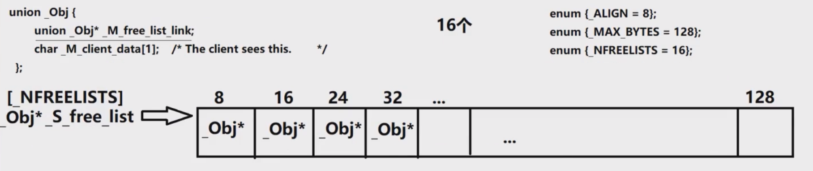

我们先查看`__STL_DEFAULT_ALLOCATOR(_Tp)`的源码，它会接收容器实例化的类型参数。

```c++
template <class _Tp, class _Alloc = __STL_DEFAULT_ALLOCATOR(_Tp) >
```

```c++
# ifndef __STL_DEFAULT_ALLOCATOR
#   ifdef __STL_USE_STD_ALLOCATORS
#     define __STL_DEFAULT_ALLOCATOR(T) allocator< T >
#   else
#     define __STL_DEFAULT_ALLOCATOR(T) alloc
#   endif
# endif
```

```c++
template <class _Tp>
class allocator {
  typedef alloc _Alloc;          // The underlying allocator.
public:
  typedef size_t     size_type;
  typedef ptrdiff_t  difference_type;
  typedef _Tp*       pointer;
  typedef const _Tp* const_pointer;
  typedef _Tp&       reference;
  typedef const _Tp& const_reference;
  typedef _Tp        value_type;

  template <class _Tp1> struct rebind {
    typedef allocator<_Tp1> other;
  };

  allocator() __STL_NOTHROW {}
  allocator(const allocator&) __STL_NOTHROW {}
  template <class _Tp1> allocator(const allocator<_Tp1>&) __STL_NOTHROW {}
  ~allocator() __STL_NOTHROW {}

  pointer address(reference __x) const { return &__x; }
  const_pointer address(const_reference __x) const { return &__x; }

  // __n is permitted to be 0.  The C++ standard says nothing about what
  // the return value is when __n == 0.
  _Tp* allocate(size_type __n, const void* = 0) {
    return __n != 0 ? static_cast<_Tp*>(_Alloc::allocate(__n * sizeof(_Tp))) 
                    : 0;
  }

  // __p is not permitted to be a null pointer.
  void deallocate(pointer __p, size_type __n)
    { _Alloc::deallocate(__p, __n * sizeof(_Tp)); }

  size_type max_size() const __STL_NOTHROW 
    { return size_t(-1) / sizeof(_Tp); }

  void construct(pointer __p, const _Tp& __val) { new(__p) _Tp(__val); }
  void destroy(pointer __p) { __p->~_Tp(); }
};
```

从这些源码可以看出来，一级空间配置器和 C++ 标准的`allocator`作用一致，底层基于`malloc`和`free`实现。

```c++
typedef __default_alloc_template<__NODE_ALLOCATOR_THREADS, 0> alloc;
```

SGI STL 默认使用二级空间配置器，`__NODE_ALLOCATOR_THREADS`用于控制节点分配是否线程安全，C++ 标准 STL 的空间配置器本身不考虑线程安全问题。

从上述代码可知，`__STL_DEFAULT_ALLOCATOR`通过宏定义提供两种实现，分别是`allocator`和`alloc`，对应 SGI STL 的一级空间配置器和二级空间配置器。

```c++
template<int __inst>
class _malloc_alloc_template //一级空间配置器内存管理类，通过malloc、free管理内存
```

```c++
template <bool threads, int inst>
class __default_alloc_template {//二级空间配置器内存管理类，通过自定义内存池实现内存管理
```

接下来详细学习二级空间配置器的核心设置：



```c++
// 内存池的粒度信息
enum {_ALIGN = 8}; //8字节对齐，按照8字节进行扩容
enum {_MAX_BYTES = 128}; //内存块最大上限为128字节
enum {_NFREELISTS = 16}; //自由链表的数量为16个
```

内存块按照 8 字节递增，每个链表对应一种大小的内存块，总计 16 个自由链表，最大管理 128 字节的小块内存；大于 128 字节的大块内存，直接使用`malloc`和`free`管理。

```c++
// 每一个内存chunk块的头信息
union _Obj {
union _Obj* _M_free_list_link;
char _M_client_data[1];    
};
```

```c++
// 组织所有自由链表的数组，数组的每一个元素的类型是_Obj*，全部初始化为0
static _Obj* __STL_VOLATILE _S_free_list[_NFREELISTS];
```

`_S_free_list`是携带`volatile`修饰的静态指针数组，存储在数据段；在多线程环境下，堆和数据段上的共享变量会添加`volatile`关键字，防止编译器缓存数据，避免多个线程读取到的数据不一致。

`_S_free_list`包含 16 个元素，每个元素都是`_Obj*`类型的指针，作为静态成员变量，需要在类外初始化，所有元素默认初始化为 0，在 C++11 及以后标准中推荐使用`nullptr`初始化。

动态链表的节点通过独立的`new`或`malloc`分配，节点之间内存不连续；静态链表的节点内存连续，除此之外结构与动态链表相似。

```c++
// Chunk allocation state. 记录内存chunk块的分配情况
static char* _S_start_free;
static char* _S_end_free;
static size_t _S_heap_size;
template <bool __threads, int __inst>
char* __default_alloc_template<__threads, __inst>::_S_start_free = 0; //内存池起始地址
template <bool __threads, int __inst>
char* __default_alloc_template<__threads, __inst>::_S_end_free = 0; //内存池结束地址
template <bool __threads, int __inst>
size_t __default_alloc_template<__threads, __inst>::_S_heap_size = 0; //堆内存总大小
```

这三个静态成员变量的初始值均为 0。