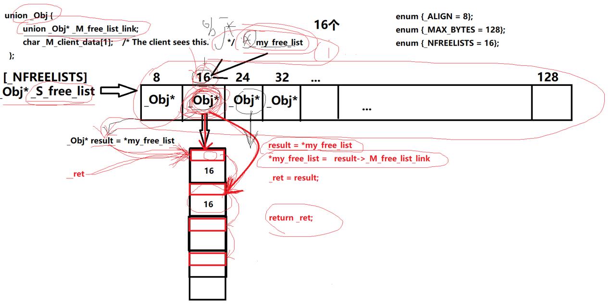

### 这节来学习 allocate 源代码

```c++
 static void* allocate(size_t __n)
  {
    void* __ret = 0;

    if (__n > (size_t) _MAX_BYTES) {
      __ret = malloc_alloc::allocate(__n);
    }
    else {
      _Obj* __STL_VOLATILE* __my_free_list
          = _S_free_list + _S_freelist_index(__n);
      // Acquire the lock here with a constructor call.
      // This ensures that it is released in exit or during stack
      // unwinding.
#     ifndef _NOTHREADS
      /*REFERENCED*/
      _Lock __lock_instance;
#     endif
      _Obj* __RESTRICT __result = *__my_free_list;
      if (__result == 0)
        __ret = _S_refill(_S_round_up(__n));
      else {
        *__my_free_list = __result -> _M_free_list_link;
        __ret = __result;
      }
    }

    return __ret;
  };
```

函数接收参数`__n`，代表用户通过容器申请的内存大小，核心分配逻辑如下：

如果申请的内存大小**大于 _MAX_BYTES（128 字节）**，则不使用内存池管理，和一级空间配置器一致，直接通过`malloc`开辟内存；

如果申请的内存大小**小于等于 128 字节**，则由二级空间配置器的内存池统一管理。

------

当内存大小 ≤ 128 字节时，执行内存池分配流程：



1. **定位自由链表**

   通过二级指针`__my_free_list`，指向`_S_free_list`数组的起始地址 + 计算得到的自由链表下标，将申请的内存大小映射到对应规格的内存块。

   举个例子：申请 15 字节内存，`__my_free_list`会指向自由链表的 1 号位置（对应 16 字节的内存块）。

2. **多线程安全加锁**

   自由链表的增删改操作不具备线程安全性，因此在核心分配逻辑前加锁，保证多线程环境下的操作安全。

   ```c++
         _Lock __lock_instance;
   #     endif
         _Obj* __RESTRICT __result = *__my_free_list;
         if (__result == 0)
           __ret = _S_refill(_S_round_up(__n));
         else {
           *__my_free_list = __result -> _M_free_list_link;
           __ret = __result;
         }
   ```

   

3. **分配空闲内存块**

```c++
_Obj* __RESTRICT __result = *__my_free_list;
// 1. 取出当前自由链表的首个节点，准备分配
if (__result == 0)
  // 自由链表为空，无空闲块，调用_S_refill重新填充内存池
  __ret = _S_refill(_S_round_up(__n));
else {
  // 2. 链表头指针后移，指向原节点的下一个空闲块
  *__my_free_list = __result -> _M_free_list_link;
  // 3. 将取出的空闲块返回给用户
  __ret = __result;
}
```

`__result = *__my_free_list` 的作用是获取当前自由链表的第一个空闲内存块。

以申请 15 字节为例，对应 16 字节的 chunk 块（内存块），每个 chunk 块通过`union`实现内存复用：空闲时存储下一个节点的地址，使用时存储用户数据。

- 如果`__result`为空：说明当前规格的 chunk 块未分配，调用`_S_refill`分配内存池，将内存池首地址赋值给`__ret`后返回；
- 如果`__result`不为空：执行**链表头删操作**，从空闲链表头部取下节点，分配给用户使用。

------

定义二级指针操作`__my_free_list`指针数组，根据申请的内存大小定位到对应规格的 chunk 块（内存块）；

解引用指针获取链表头节点并赋值给`result`：

1. 若`result`为空：说明对应大小的 chunk 块无空闲内存，调用`_S_refill`填充内存池，返回新分配的内存；
2. 若`result`不为空：执行链表头删操作，从空闲链表头部取下节点，返回给用户使用。