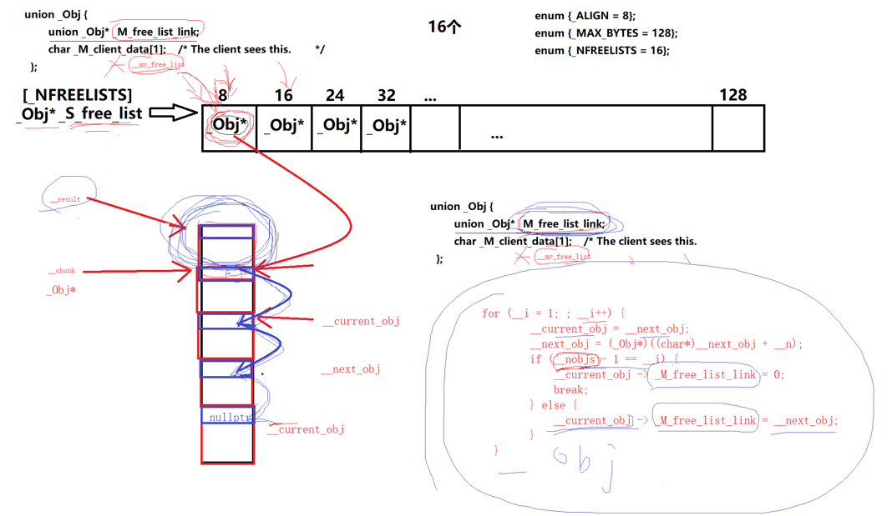

上一节中当result为0时，当我们调用 `allocate` 申请内存时，**对应规格的自由链表为空**（比如想申请 24 字节，但 24 字节的自由链表一个块都没有），就会先通过 `_S_round_up` 对齐字节数，然后调用`_S_refill` 函数。

它是二级配置器的 填充函数，也是自由链表的 补给站

```c++
__default_alloc_template<__threads, __inst>::_S_refill(size_t __n)
{
    int __nobjs = 20;// 1. 默认一次性申请 20 个内存块
    // 2. 调用内存池分配函数：申请 20个 n字节 的块，返回大块内存起始地址
    // __nobjs 是引用传递：内存池不够时，会修改为实际分配到的块数
    char* __chunk = _S_chunk_alloc(__n, __nobjs);
    _Obj* __STL_VOLATILE* __my_free_list;// 指向对应自由链表的指针
    _Obj* __result;                      // 要返回给用户的内存块
    _Obj* __current_obj;                 // 构建链表的当前节点
    _Obj* __next_obj;                     // 构建链表的下一个节点
    int __i;                              // 循环计数器
   // 4. 特殊情况：如果内存池只够分配1个块，直接返回给用户，不用构建链表
    if (1 == __nobjs) return(__chunk);
   // 5. 定位自由链表：找到 n字节 对应的链表槽位 
    __my_free_list = _S_free_list + _S_freelist_index(__n);
 
    /* Build free list in chunk */
    // 核心：将大块内存切分 + 构建链表
    // 6. 第一个块：作为返回值给用户
      __result = (_Obj*)__chunk;
    // 7. 自由链表指向「第二个块」（第一个要被拿走，剩下的挂链表）
      *__my_free_list = __next_obj = (_Obj*)(__chunk + __n);
    // 8. 循环：把剩下的块全部串成单向链表
      for (__i = 1; ; __i++) {
        __current_obj = __next_obj;
    // 关键：指针偏移 n 字节（必须转char*！后面讲坑）
        __next_obj = (_Obj*)((char*)__next_obj + __n);
        // 9. 最后一个节点：next指针置空（链表结尾）
        if (__nobjs - 1 == __i) {
            __current_obj -> _M_free_list_link = 0;
            break;
        // 普通节点：当前节点指向下一个节点（串链表）
        } else {
            __current_obj -> _M_free_list_link = __next_obj;
        }
      }
    // 10. 返回第一个块给用户
    return(__result);
}
```

**向内存池申请内存**：默认一次性申请 **20 个** 对齐后的小内存块（比如 8 字节 ×20、24 字节 ×20）；

**构建自由链表**：把这一大块连续内存，切分成 20 个独立小块，**串成链表**；

**返回内存**：把**第一个块**返回给用户使用，剩下的 19 个挂在自由链表中，供下次申请直接使用。



**变量初始化 —— 申请 20 个块**

```c++
int __nobjs = 20;
char* __chunk = _S_chunk_alloc(__n, __nobjs);
```

- `__nobjs=20`：默认要**20 个**n 字节的小内存块；
- `_S_chunk_alloc`：**真正向内存池 / 系统申请内存的函数**；
- `__chunk`：指向申请到的**一整块连续内存**的起始地址（比如 8×20=160 字节的连续内存）；
- 重点：`__nobjs` 是**引用传递**！如果内存池不够 20 个块，函数会自动修改为实际能分配的数量（比如只剩 5 个，就变成 5）。

------

特殊情况 —— 只分到 1 个块

```c++
if (1 == __nobjs) return(__chunk);
```

如果内存池特别紧张，只够分配**1 个块**：

直接把这个块返回给用户，**不用构建链表**（剩下 0 个，没必要串链表）。

------

**定位自由链表**

```c++
__my_free_list = _S_free_list + _S_freelist_index(__n);
```

- `_S_free_list`：自由链表数组（存 16 种规格的链表头）；
- `_S_freelist_index(__n)`：计算 n 字节对应的数组下标（8 字节→0 号，16 字节→1 号）；
- `__my_free_list`：**二级指针**，直接指向「对应规格的自由链表槽位」，后面用来挂链表。

------

**切分内存 + 构建链表**

我们用 **8 字节 ×20 块** 举例，内存布局是：

`[块0][块1][块2]...[块19]`（连续 160 字节）

第 1 步：分配第一个块给用户

```c++
__result = (_Obj*)__chunk;
```

- `__chunk` 是连续内存的首地址 → 就是**块 0**；
- `__result` 保存块 0 的地址 → 最后直接返回给用户使用。

第 2 步：自由链表指向第二个块

```c++
*__my_free_list = __next_obj = (_Obj*)(__chunk + __n);
```

- `__chunk + 8`：偏移 8 字节 → 指向**块 1**；
- 因为块 0 要被用户拿走，所以**自由链表的头节点必须指向块 1**。

------

指针偏移为什么要转 `char*`？

```c++
__next_obj = (_Obj*)((char*)__next_obj + __n);
```

#### 为什么不能直接写 `__next_obj + __n`？

1. `_Obj` 是一个**联合体**，大小是 **4 字节**（指针大小）；
2. 如果直接写 __next_obj + 8,指针运算规则 → 4字节 ×8 = 32字节，直接偏移 32 字节，直接越界，彻底错误
3. 先转 char * : char *是 1 字节指针，+8就精准偏移 8 字节，完美切分内存块。

所以**转 char \* 是为了精准按字节偏移，切分内存块**

------

**循环串链表**

```c++
for (__i = 1; ; __i++) {
  __current_obj = __next_obj;    // 当前节点 = 下一个待处理的块
  __next_obj = 下一个块;         // 指针偏移n字节

  if (最后一个块) {
    __current_obj->next = 0;     // 尾节点置空，链表结束
  } else {
    __current_obj->next = __next_obj; // 串链表：当前块指向下一块
  }
}
```

**链表构建过程（8 字节为例）：**

1. `i=1`：处理块 1 → 块 1 的 next 指向块 2；
2. `i=2`：处理块 2 → 块 2 的 next 指向块 3；
3. ...
4. `i=19`：处理最后一个块（块 19）→ next 置空；

最终效果：

```
自由链表头 → 块1 → 块2 → ... → 块19 → nullptr
```

------

## 函数效果

我们调用 `_S_refill(8)` 后：

1. **用户**：拿到了 **块 0（8 字节）**，直接使用；
2. **自由链表**：挂着 `块1~块19` 共 19 个 8 字节块；
3. **下次申请**：直接从自由链表取块 1，不用再找内存池，速度极快

这里的块0,就是给用户用的内存，剩下的块由自由链表对应字节大小的成员指向起始地址。

用户用完内存后，会用deallocate手动释放，然后重新挂回对应的自由链表槽位，循环复用。

