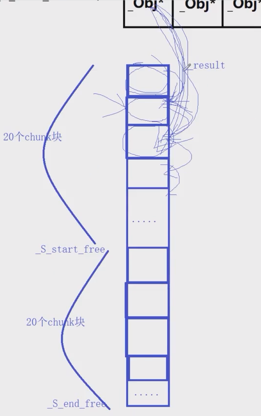

上节课分析了_S_refill的函数，这节学习 _S_chunk_aclloc学习具体内存块的分配

需要接收 __n chunk块的大小， 和应该分配的个数，最后把分配的内存地址返回回来。

```c++
template <bool __threads, int __inst>
char*
__default_alloc_template<__threads, __inst>::_S_chunk_alloc(size_t __size, 
                                                            int& __nobjs)
{
    char* __result;
    size_t __total_bytes = __size * __nobjs;//计算了内存池需要分配的总字节数
    size_t __bytes_left = _S_end_free - _S_start_free;
   //_S_end_free 和 _S_start_free 都是在二级空间配置器中定义的静态成员变量，初始值为0
    if (__bytes_left >= __total_bytes) {
        __result = _S_start_free;
        _S_start_free += __total_bytes;
        return(__result);
    } else if (__bytes_left >= __size) {
        __nobjs = (int)(__bytes_left/__size);
        __total_bytes = __size * __nobjs;
        __result = _S_start_free;
        _S_start_free += __total_bytes;
        return(__result);
    } else {
        size_t __bytes_to_get = 
	  2 * __total_bytes + _S_round_up(_S_heap_size >> 4);
        // Try to make use of the left-over piece.
        if (__bytes_left > 0) {
            _Obj* __STL_VOLATILE* __my_free_list =
                        _S_free_list + _S_freelist_index(__bytes_left);

            ((_Obj*)_S_start_free) -> _M_free_list_link = *__my_free_list;
            *__my_free_list = (_Obj*)_S_start_free;
        }
        _S_start_free = (char*)malloc(__bytes_to_get);
        if (0 == _S_start_free) {
            size_t __i;
            _Obj* __STL_VOLATILE* __my_free_list;
	    _Obj* __p;
            // Try to make do with what we have.  That can't
            // hurt.  We do not try smaller requests, since that tends
            // to result in disaster on multi-process machines.
            for (__i = __size;
                 __i <= (size_t) _MAX_BYTES;
                 __i += (size_t) _ALIGN) {
                __my_free_list = _S_free_list + _S_freelist_index(__i);
                __p = *__my_free_list;
                if (0 != __p) {
                    *__my_free_list = __p -> _M_free_list_link;
                    _S_start_free = (char*)__p;
                    _S_end_free = _S_start_free + __i;
                    return(_S_chunk_alloc(__size, __nobjs));
                    // Any leftover piece will eventually make it to the
                    // right free list.
                }
            }
	    _S_end_free = 0;	// In case of exception.
            _S_start_free = (char*)malloc_alloc::allocate(__bytes_to_get);
            // This should either throw an
            // exception or remedy the situation.  Thus we assume it
            // succeeded.
        }
        _S_heap_size += __bytes_to_get;
        _S_end_free = _S_start_free + __bytes_to_get;
        return(_S_chunk_alloc(__size, __nobjs));
    }
}
```

在这里假设size为8，nobjs为20，

假如之前都没分配过，那么bytes_left为0，执行else语句，

此时bytes_to_get等于 两倍的total_bytes 加上 S_heap_size（初始为0）向右移4位，最后等于320字节，相当于开辟40个chunk块。

简单来说，刚进这个函数，如果相应的字节数的chunk块的内存池从来没有被分配过，先计算20个相应字节大小的Chunk块，然后字节数*2，开辟40个chunk块的内存赋给 _S_start_free，检查 _S_start_free为0，说明开辟内存失败，否则成功，假设开辟成功， _S_heap_size 加上 __bytes_to_get（320字节），让  _S_end_free指向末尾，然后最自身进行递归调用。



再次进行调用时，此时8字节的chunk块内存池已经被分配完成，__ bytes_left为320字节。__

if ( __ bytes_left >= __total_bytes) 条件满足执行，result指向第一个分配的chunk块处，

  _S_start_free向下移动20个chunk块，返回 result。

在上次学的 _ S_refill里，把这20个chunk块顺序链接起来（头节点指向下一个节点），串成一个链表，将 第一个chunk块返回回去，让相应的8字节Obj指针指向空闲的第一个chunk块。

回到allocate里，因为有了8字节的内存池，会方便很多，假如 __my_free_list指向8字节的内存块，再通过result获取0号位元素的值，也就是 Obj指针指向的第一个空闲的chunk块，进行类似链表头删操作，将现在第一个空闲的chunk块赋给 _ret，Obj*指向下一个节点。最后返回 _ret。后续申请8字节内存块都是这个流程，直到分配最后一个节点的时候，节点头部为空，此时allocate中判断result为空，再次分配。