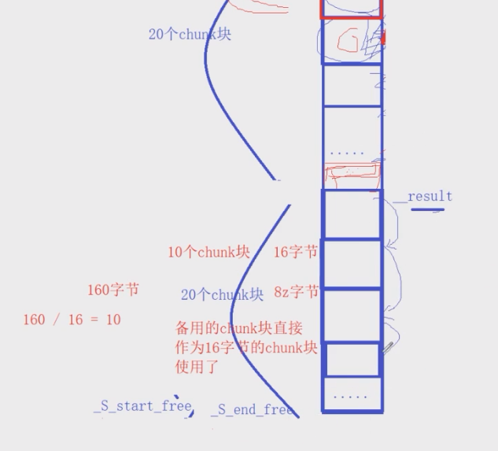
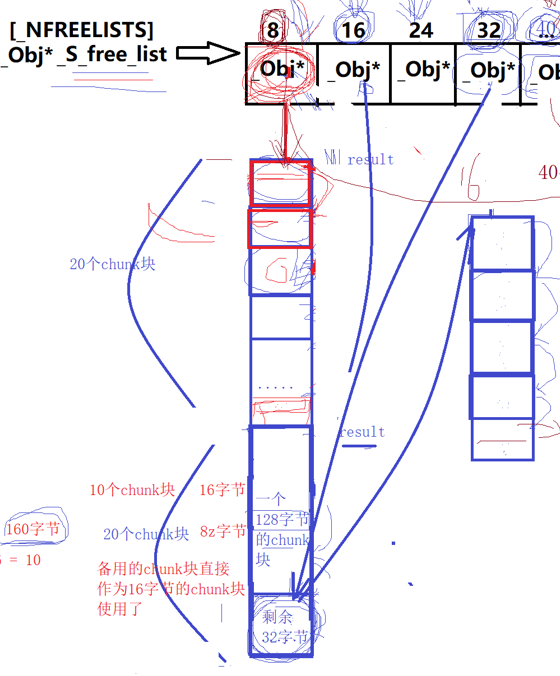
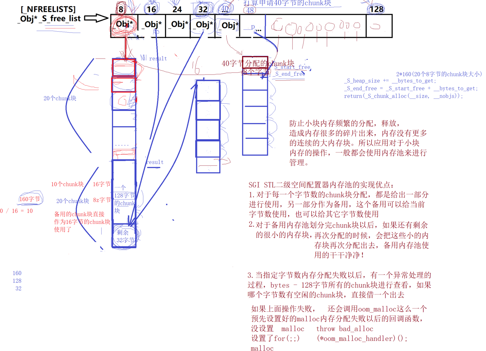

接着上次_S_chunk_alloc代码的学习，上次讨论的是正常情况下，这次看各种不同的情况

（1）当使用字节为8的内存时，发现内存块用完了，在allocate里result=0，在之前已经调用过一次_S_chunk_alloc的情况下，因为多分配了20个内存块，刚好 __bytes_left >= _totoal_bytes，直接挪动 _S_start_free指针指向20个内存块的末尾，然后返回这些内存块的起始地址。

如果再使用完了，需要再次申请，但这次 _S_heap_size（320）不为空， bytes_to_get = 40 +20，总共开辟了60个chunk块，越开辟越大，在这里使用 _S_heap_size进行控制。

（2）在前面申请过只一次8字节内存块的前提下，现在我们又需要申请16字节的，此时参数 size为16， nobjs仍然是20， total_bytes为320，bytes_left为end_free-start_free等于160字节。此时判断bytes_left >= total_bytes不满足，然后判断bytes_left (160)>= size(16)是否满足，它在分配新的字节数的情况下不是直接分配，而是先去检测之前分配过的备用的chunk块是否满足， nobjs计算为10个，result还是指向分配的第一个chunk块的位置，start_free指向末尾，返回result地址。在后面的函数处理中，将这些chunk块头指针链接起来，让自由链表中的16字节的Obj*指向这些chunk块的第一个空闲chunk块（因为第0个被分配出去了）。



(3)在前面申请过只一次8字节内存块的前提下，现在我们又需要申请128字节的，判断bytes_left (160)>= size(128)满足， nobjs为1个，total_bytes为128,result指向起始地址，start_free指向一个128chunk块末尾，返回result。备用内存池剩余32字节。在_S_refill里判断nobjs等于1，直接把chunk块起始地址返回，不用再链接节点了。

(4)在前面(3)的前提下，再去申请40字节的chunk块，total_bytes为800字节，bytes_left为32字节，只能执行else语句，此时 bytes_to_get为60个40字节的chunk块大小，如果bytes_left不为0，说明备用内存池还有，虽然分配不了这次chunk块，也不能浪费，把剩余的32字节对齐到对应的自由链表位置，进行链表头插操作(假如之前32字节的有5个，进行头插操作后为6个空闲的chunk块)。



对于当前40字节，只能重新malloc开辟空间，需要申请2400个字节，假如分配失败(且48下挂了一些chunk块)

```c++
        if (0 == _S_start_free) {
            size_t __i;
            _Obj* __STL_VOLATILE* __my_free_list;
	    _Obj* __p;
            // Try to make do with what we have.  That can't
            // hurt.  We do not try smaller requests, since that tends
            // to result in disaster on multi-process machines.
            for (__i = __size; //i=40
                 __i <= (size_t) _MAX_BYTES;//i<=128
                 __i += (size_t) _ALIGN) {//i+=8  从当前字节节点开始，向后遍历到末尾
                //通过 __my_free_list来遍历自由链表
                __my_free_list = _S_free_list + _S_freelist_index(__i);
                __p = *__my_free_list;//访问每个字节大小里面的内容
                if (0 != __p) {//如果不为空,假如48下挂了一些chunk块
                    //进行链表头删操作
                    *__my_free_list = __p -> _M_free_list_link;
                    _S_start_free = (char*)__p;//从48字节这里取走一个chunk块
                    _S_end_free = _S_start_free + __i;
                    return(_S_chunk_alloc(__size, __nobjs));
                    //递归调用，在下个_S_chunk_alloc满足 __bytes_left>=__size条件，返回一个chunk块
                }
            }
	    _S_end_free = 0;	// In case of exception.
            _S_start_free = (char*)malloc_alloc::allocate(__bytes_to_get);
            // This should either throw an
            // exception or remedy the situation.  Thus we assume it
            // succeeded.
        }
```

当遍历完整个自由链表，都没有空闲的chunk块，将   _S_end_free 重置为0，使用(char*)malloc_alloc::allocate分配内存(里面用的malloc）,如果有其他内存块在期间释放，可能会开辟成功，如果依然不为空，调用 _s_oom_malloc。

```c++
  static void* allocate(size_t __n)
  {
    void* __result = malloc(__n);
    if (0 == __result) __result = _S_oom_malloc(__n);
    return __result;
  }
```

```c++
template <int __inst>
void (* __malloc_alloc_template<__inst>::__malloc_alloc_oom_handler)() = 0;
#endif

template <int __inst>
void*
__malloc_alloc_template<__inst>::_S_oom_malloc(size_t __n)
{
    void (* __my_malloc_handler)();//函数指针 指向返回值是void
    void* __result;

    for (;;) {//使用用户预先设置好的回调函数__malloc_alloc_oom_handler
        __my_malloc_handler = __malloc_alloc_oom_handler;
        //==0说明没有设置，抛出异常
        if (0 == __my_malloc_handler) { __THROW_BAD_ALLOC; }
        (*__my_malloc_handler)();
        __result = malloc(__n);
        if (__result) return(__result);
        //如果有用户设置好的回调函数就一直调用，直到分配成功为止
    }
}
```



