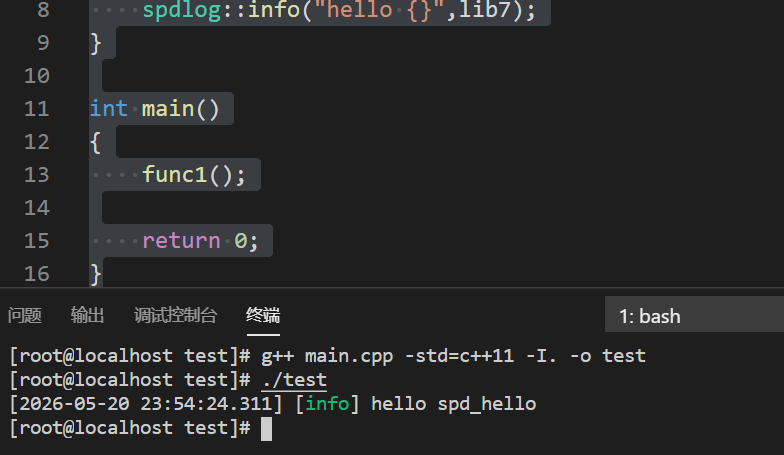
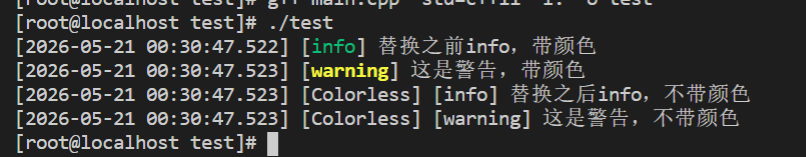

##### 第一个spdlog程序

spdlog是一个速度极快，仅包含头文件的C++日志库。它被设计为既易于使用又具有高度可扩展性，提供了丰富的功能来满足各种日志记录需求。

spdlog最大的特点是我们可以把日志内容交给它的一个核心对象logger(日志对象/日志记录器)，这个logger可以把同一行日志吐给不同的槽，比如标准输出槽cout，单一文件槽，自定义槽等。

spdlog不用预编译成库，但它自身依赖于fmt，在C++20中已经包含了fmt的部分功能。可以使用直接引用头文件或者源码编译安装。

使用spdlog需要引入头文件 \#include<spdlog/spdlog.h>

```c++
#include<cstdlib>
#include<iostream>
#include<spdlog/spdlog.h>

void func1()
{
    char const* lib7="spd_hello";
    spdlog::info("hello {}",lib7);//格式化输出
}

int main()
{
    func1();

    return 0;
}
```



##### 独立使用记录器

大部分情况下我们都是通过自由函数的形式来输出日志，记录器和槽spdlog会帮我们创建一个全局的日志记录器，并且这个记录器拥有一个槽，这个槽就是输出到控制台上并且带有颜色（带色的标准输出槽）。可以通过default_logger()函数来取得默认的日志记录器，通过set_default_logger 来替换原有默认的全局日志记录器。

比如刚才的info不想要带有颜色的输出，可以替换成不带有颜色的记录器。spdlog提供了常用的日志记录器的工程方法

如 spdlog::stdout_logger_mt("ColorlessLogger");

就是用来创建标准输出记录器，跟默认的记录器最大的区别就是输出的内容不会有颜色。这里的std（标准），输出（out），记录器（logger），_mt(multi-threading 多线程程序使用)，也有 _st（single-threading 单线程程序使用），且每个日志记录器必须拥有唯一的名字，重名则出错。这个工厂方法得到的是一个日志记录器的指针指针(std::shared_ptr< logger > )，用colorlessLogger来解释，传给set_default_logger(colorlessLogger)来替换掉原有的默认全局的记录器。因为原来的默认全局记录器也是一个智能指针，所以不用考虑释放问题。因为日志记录器仍然需要用到某个槽，所以需要先在头文件里包含对应类型的槽(sink头文件)

```c++
#include<spdlog/sinks/stdout_sinks.h>//引入sink头文件

void func2()//替换全局日志记录器
{
    spdlog::info("替换之前info，带颜色");
    spdlog::warn("这是警告，带颜色");

    //创建新的记录器（不带颜色的标准输出）
    auto colorlessLogger = spdlog::stdout_logger_mt("Colorless");
    spdlog::set_default_logger(colorlessLogger);
    spdlog::info("替换之后info，不带颜色");
    spdlog::warn("这是警告，不带颜色");  
}
```



可以发现，不但颜色发生了变化而且新的日志记录器是有名字的，这个名字夹在时间和等级中间。

标准控制台(stdout)记录器可以分成两种

1.不带颜色

使用头文件#include<spdlog/sinks/stdout_sinks.h>

工厂方法：

spdlog::stdout_logger_mt(std::string const&logger_name)

spdlog::stdout_logger_st(std::string const&logger_name)

2.带颜色

头文件#include<spdlog/sinks/stdout_color_sinks.h>

工厂方法：

spdlog::stdout_color_mt(std::string const&logger_name)

spdlog::stdout_color_st(std::string const&logger_name)

带名字可以方便通过名字取到logger，如auto logger = spdlog::get("name")

在c++中有三个负责在控制台输出的全局对象cout,cerr,clog