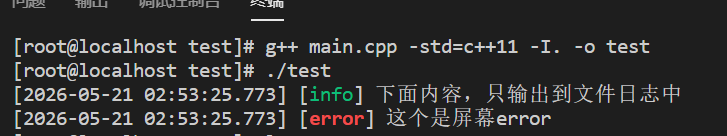
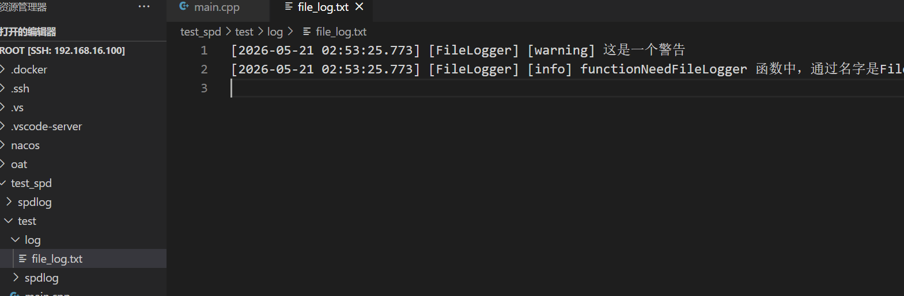
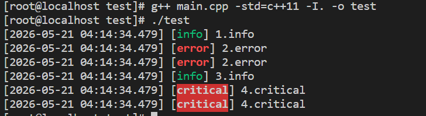
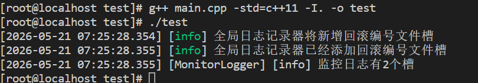

### 第一个spdlog程序

spdlog是一个速度极快，仅包含头文件的C++日志库。它被设计为既易于使用又具有高度可扩展性，提供了丰富的功能来满足各种日志记录需求。

spdlog最大的特点是我们可以把日志内容交给它的一个核心对象logger(日志对象/日志记录器)，这个logger可以把同一行日志吐给不同的槽，比如标准输出槽cout，单一文件槽，自定义槽等。

spdlog不用预编译成库，但它自身依赖于fmt，在C++20中已经包含了fmt的部分功能。可以使用直接引用头文件或者源码编译安装。

使用spdlog需要引入头文件 \#include<spdlog/spdlog.h>

```c++
#include<cstdlib>
#include<iostream>
#include<spdlog/spdlog.h>

void func1()
{
    char const* lib7="spd_hello";
    spdlog::info("hello {}",lib7);//格式化输出
}

int main()
{
    func1();

    return 0;
}
```


### 独立使用记录器

大部分情况下我们都是通过自由函数的形式来输出日志，记录器和槽spdlog会帮我们创建一个全局的日志记录器，并且这个记录器拥有一个槽，这个槽就是输出到控制台上并且带有颜色（带色的标准输出槽）。可以通过default_logger()函数来取得默认的日志记录器，通过set_default_logger 来替换原有默认的全局日志记录器。

比如刚才的info不想要带有颜色的输出，可以替换成不带有颜色的记录器。spdlog提供了常用的日志记录器的工程方法

如 spdlog::stdout_logger_mt("ColorlessLogger");

就是用来创建标准输出记录器，跟默认的记录器最大的区别就是输出的内容不会有颜色。这里的std（标准），输出（out），记录器（logger），_mt(multi-threading 多线程程序使用)，也有 _st（single-threading 单线程程序使用），且每个日志记录器必须拥有唯一的名字，重名则出错。这个工厂方法得到的是一个日志记录器的指针指针(std::shared_ptr< logger > )，用colorlessLogger来解释，传给set_default_logger(colorlessLogger)来替换掉原有的默认全局的记录器。因为原来的默认全局记录器也是一个智能指针，所以不用考虑释放问题。因为日志记录器仍然需要用到某个槽，所以需要先在头文件里包含对应类型的槽(sink头文件)

```c++
#include<spdlog/sinks/stdout_sinks.h>//引入sink头文件

void func2()//替换全局日志记录器
{
    spdlog::info("替换之前info，带颜色");
    spdlog::warn("这是警告，带颜色");

    //创建新的记录器（不带颜色的标准输出）
    auto colorlessLogger = spdlog::stdout_logger_mt("Colorless");
    spdlog::set_default_logger(colorlessLogger);
    spdlog::info("替换之后info，不带颜色");
    spdlog::warn("这是警告，不带颜色");  
}
```


可以发现，不但颜色发生了变化而且新的日志记录器是有名字的，这个名字夹在时间和等级中间。

##### 输出到屏幕

在c++中有三个负责在控制台输出的全局对象cout,cerr,clog

标准控制台(stdout)记录器可以分成两种

1.不带颜色

使用头文件#include<spdlog/sinks/stdout_sinks.h>

工厂方法：

```c++
spdlog::stdout_logger_mt(std::string const&logger_name)

spdlog::stdout_logger_st(std::string const&logger_name)
```

2.带颜色

头文件#include<spdlog/sinks/stdout_color_sinks.h>

工厂方法：

```c++
spdlog::stdout_color_mt(std::string const&logger_name)

spdlog::stdout_color_st(std::string const&logger_name)
```

带名字可以方便通过名字取到logger，如auto logger = spdlog::get("name")

错误控制台(stderr)记录器跟标准控制台(stdout)记录器类似，都有带颜色和不带颜色的，单线程和多线程的，将stdout换成stderr就行。

但没有clog的日志记录器，因为clog就是用来输出日志的，spdlog取代了它。

##### 输出到文件

1.basic_logger 单一文件    ;最简单的文件日志记录器

```c++
//工厂函数(区分mt/st)
basic_logger_mt(std::string const&logger_name,std::string const&filename,bool truncate=false);//logger名，文件日志名，truncate为ture追加内容/false覆盖重写
basic_logger_st(...)
```

2.rotating_file_sink 回滚序号多文件  ;指定一个日志文件最多存储指定字节的日志内容，一旦超过这个大小就会以新的编号创建一个新的日志文件

```c++
//工厂函数(区分mt/st)
rotating_file_sink_mt(std::string const&logger_name,
std::string const&filename,//基础文件名
std::size_t max_size,//单个文件允许的最大字节数
std::size_t max_files,//最多文件个数
bool rotate_on_open = false,//首次打开立刻回滚序号？
std::string const&extension);//拓展名
rotating_file_sink_st(...)
```

比如最初的日志文件时log.txt，当文件的内容超过max_size该日志记录器将创建log.1.txt新日志文件，依次类推log.2.txt..直到max_files 指定的最多的文件个数，然后回到log.txt，清空它的内容。

3.更多文件日志类型 ：daily_logger_mt/st按日分割，hourly_logger_mt/st按小时分割


```c++
void functionNeedFileLogger()
{
    auto logger = spdlog::get("FileLogger");
    assert(logger);
    logger->info("{} 函数中，通过名字是{}的记录器，输出本日志",__FUNCTION__,logger->name());
}

void func3()
{
    spdlog::info("下面内容，只输出到文件日志中");
    auto fileLogger = spdlog::basic_logger_mt("FileLogger","log/file_log.txt");
    fileLogger->warn("这是一个警告");

    spdlog::error("这个是屏幕error");

    functionNeedFileLogger();
}
```



同时log日志文件也一块被创建出来了



### 多个记录器，多个槽

将同一行日志，一次性地输出到多个不同的目标位置，在spdlog中，将一个logger挂接多个槽，

实现方法1：

  1.创建多个槽 2.[可选]清空默认记录器原来的槽 3.把这些槽加入（挂接）到默认记录器。

实现方法2：

  1.创建多个槽 2.使用这些槽，创建一个新的记录器 3.[可选]使用新的记录器，替换全局记录器。

stdout和stderr的区别：stdout有缓冲区，而stderr无缓存。这二者可以分别重定向，可以得到标准输出和标准出错输出内容分开的效果。

```c++
1.一个记录器同时挂接 stdout 和 stderr 两个槽；
2.让 stdout 输出普通信息 + 出错信息日志；
3.让 stderr 仅输出出错日志（警告、错误、危急）；
4.将 stdcout 和 stderr 分别重定向到文件（因此会有两个日志文件，其中一个是完整日志，一个是仅含错误的日志）
```

```c++
//方法1
void func4()
{
    //创建标准输出（带彩色）槽
    auto stdoutSink = std::make_shared<spdlog::sinks::stdout_color_sink_mt>();

    //创建一个标准错误输出（带彩色）槽
    auto stderrSink = std::make_shared<spdlog::sinks::stderr_color_sink_mt>();

    //设置 stderr 槽只输出warn及以上级别的日志（在挂接之前设置好）
    stderrSink->set_level(spdlog::level::warn);

    //获取默认的日志记录器，并清空它原有的槽
    auto defaultLogger = spdlog::default_logger();
    defaultLogger->sinks().clear();

    //将上面的新创建的槽挂接到默认记录器：
    defaultLogger->sinks().push_back(stdoutSink);
    defaultLogger->sinks().push_back(stderrSink);

    spdlog::info("1.info");
    spdlog::error("2.error");
    spdlog::info("3.info");
    spdlog::critical("4.critical");


}
```



现在是都输出到屏幕上，因为默认记录器里放了stdoutSink和stderrSink，且stderrSink只会输出warn基本及以上的，所以屏幕上的info只输出一次，error和critical输出两次。

使用./test 1>stdout.txt 2>stderr.txt重定向，输出到文件里。此时多出了stdout.txt和stderr.txt两个文件。stderr.txt方便查看错误，stdout.txt方便查找出现错误的原因。

```c++
//stdout.txt
[2026-05-21 04:32:47.421] [info] 1.info
[2026-05-21 04:32:47.421] [error] 2.error
[2026-05-21 04:32:47.421] [info] 3.info
[2026-05-21 04:32:47.421] [critical] 4.critical
```

```c++
//stderr.txt
[2026-05-21 04:32:47.421] [error] 2.error
[2026-05-21 04:32:47.421] [critical] 4.critical
```

##### 如何划分logger？

可以根据线程划分，每一个工作线程使用一个独立的日志记录器，可以使用_st单线程版本的记录器且性能更高。

但不是每个多线程都可以这样做，至少需要满足几个特征：进程里面的线程是固定的；程序完成的某一业务，从开始到结束都在使用同一个线程。

可以根据业务划分，把主业务全部都写到一个程序里，可以使用默认的全局日志记录器记录主业务，其他的业务各自分配一个独立的日志记录器，但实际使用时这些业务会被拆分成多个程序，各自记录日志。

可以按照层次划分，每一层日志记录可以用独立的日志记录器，但这是在横向，依赖与支撑关系的层次。

当同一业务跨进程，跨主机实现，应采用相同的日志记录策略，通过后台脚本实现合并。

##### 业务场景实例

|      记录器类型      |           挂接的 Sink（输出槽）组合            |
| :------------------: | :--------------------------------------------: |
| 默认（主业务）记录器 |       带颜色的控制台槽 + 序号回滚文件槽        |
|    监控业务记录器    | 普通控制台槽 + 单一文件槽 + Windows 系统事件槽 |

------

##### 核心要点（3 条关键规则）

1. Sink 必须用智能指针管理

   所有日志槽（sink）都需创建为 std::shared_ptr< sink >  类型，推荐用 std::make_shared<>() 直接创建，避免手动内存管理的问题。

2. Logger 支持多 Sink 动态管理

   每个记录器（logger）内部维护一个 std::vector< std::shared_ptr< sink > > 数组，支持：

   - `push_back()`：添加新的输出槽
   - `clear()`：清空所有已有输出槽

3. Windows 系统事件日志需手动创建 Sink

   spdlog 没有提供 Windows 系统事件日志的工厂函数，需先手动创建 

   win_eventlog_sink_mt/st  实例，再将其加入目标 logger 中。

------

##### 常用 Sink 创建方式（含头文件 + 示例）

###### 头文件引入

```c++
#include <spdlog/sinks/stdout_color_sinks.h>   // 带颜色控制台输出
#include <spdlog/sinks/stdout_sinks.h>           // 普通控制台输出
#include <spdlog/sinks/basic_file_sink.h>        // 单一文件日志输出
#include <spdlog/sinks/rotating_file_sink.h>     // 按大小回滚文件日志
#include <spdlog/sinks/win_eventlog_sink.h>      // Windows 系统事件日志
```

###### 示例代码

```c++
// 1. 带颜色的控制台输出槽
auto colorOutSink = std::make_shared<spdlog::sinks::stdout_color_sink_mt>();

// 2. 普通控制台输出槽
auto outSink = std::make_shared<spdlog::sinks::stdout_sink_mt>();

// 3. 单一文件日志输出槽（固定路径）
auto fileSink = std::make_shared<spdlog::sinks::basic_file_sink_mt>("log/monitor.txt");

// 4. 按大小回滚文件日志槽（参数：日志路径、单文件最大大小、保留文件数量）
auto rotatingFileSink = std::make_shared<spdlog::sinks::rotating_file_sink_mt>(
    "log/main-rotating.txt", 
    1024*1024*5,  // 单文件最大 5MB
    9             // 最多保留 9 个历史文件
);

// 5. Windows 系统事件日志槽（仅 Windows 平台有效）
auto winEvtSink = std::make_shared<spdlog::sinks::win_eventlog_sink_mt>(
    "HelloSpdlog",  // 事件查看器中显示的“来源”字段
    1000           // 自定义事件 ID
);
```

------

###### Windows 平台特殊说明

- 若需要向 Windows 系统事件日志发送中文内容，需在项目中添加宏定义：

  ```c++
  #define SPDLOG_WCHAR_TO_UTF8_SUPPORT
  ```

- 该宏仅对 `win_eventlog_sink` 生效，Linux/UNIX 环境无需配置。

```c++
//多记录
void func5()
{
   spdlog::info("全局日志记录器将新增回滚编号文件槽");

   //1.全局日志记录器 - 颜色控制台 + 回滚编号文件槽
   auto rotatingFileSink = std::make_shared<spdlog::sinks::rotating_file_sink_mt>("log/main-rotating.txt",1024*1024*5,9);
   //取默认记录器
   auto defaultLogger = spdlog::default_logger();
   defaultLogger->sinks().push_back(rotatingFileSink);//加入新槽

   spdlog::info("全局日志记录器已经添加回滚编号文件槽");

   //2.专用于监控业务的日志记录器
   auto colornessOutSink = std::make_shared<spdlog::sinks::stdout_sink_mt>();

   //创建普通文件槽
   auto fileSink = std::make_shared<spdlog::sinks::basic_file_sink_mt>("log/monitor.txt");

   #ifdef _WIN32
   //创建windowsOS的时间记录槽
   auto winEvtSink=std::make_shared<spdlog::sinks::win_eventlog_sink_mt>("HelloSpdlog");
   #endif
  
   //创建一个全新的日志记录器
   auto monitorLogger = std::make_shared<spdlog::logger>("MonitorLogger");
   monitorLogger->sinks().push_back(colornessOutSink);
   monitorLogger->sinks().push_back(fileSink);

   #ifdef _WIN32
    monitorLogger->sinks().push_back(winEvtSink);
   #endif

   monitorLogger->info("监控日志有{}个槽",monitorLogger->sinks().size());

}
```

因为我是LInux环境，所以只会显示出两个槽



```c++
//monitor.txt文件中
[2026-05-21 07:25:28.355] [MonitorLogger] [info] 监控日志有2个槽

//main-rotating.txt文件中
[2026-05-21 07:25:28.355] [info] 全局日志记录器已经添加回滚编号文件槽

```

