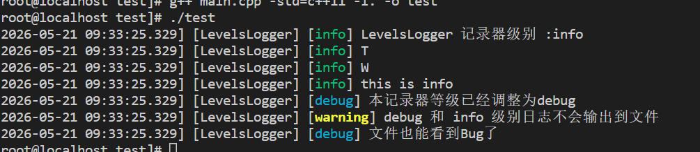
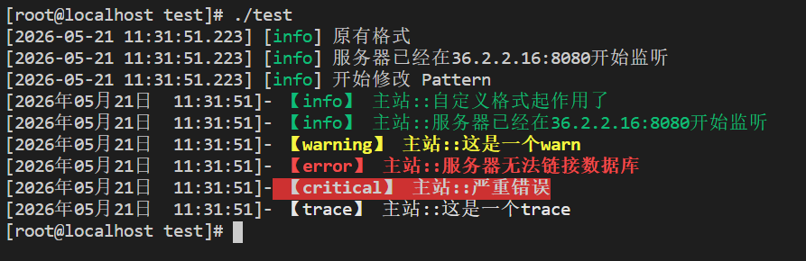
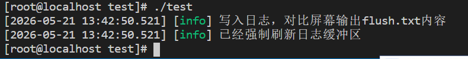
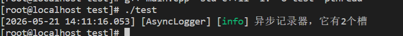

### 日志基本控制

##### 日志等级

怎么确定一条日志的等级？

   主观记录：注重为什么？ 记录这条日志有明确的目的

   客观记录：注重记什么？ 

(为什么在前说明偏主观，记什么在前说明偏客观)

###### trace

   记什么：记录基于（技术）实现的步骤信息（通常偏重记录正确路径）

   为什么：清楚当前代码的工作机制（总有一天，自己也会忘记这代码是干什么的）

###### debug

  为什么：为了抓住那个BUG

  记什么：为了找出错误，想怎么记就怎么记（问题解决后，它们都会被删除）

###### info

  记什么：记录基于业务的过程信息（里程碑，关键节点，状态等）

  为什么：帮助发现系统是正常，同时延缓维护人员退化到必须看"trace"的时刻

###### warn

  为什么：系统的每一笔业务都还能正确执行，但是出现反常信息

  记什么：不影响系统每一笔业务正确执行的反常信息  

###### err

  为什么：某一笔业务运行出错了

  记什么：业务执行出错信息

###### critical

  记什么：能让系统某些功能直接罢工的事

  为什么：这个错误要是出现，系统必然出现大量错误，甚至崩溃。

##### 两级控制

记录器拥有一个控制级别，通过logger->level()查看，如果要记录的日志级别比设置的底，这条日志就会被抛弃。如果>=设置的级别，会进入后面一个个槽，每一个槽又都有自己的一个最小级别控制sink1->level()，如果要记录的日志级别比设置槽的级别底，这条日志同样会被抛弃。

记录器和槽都可以通过level()的方法查看日志级别，set_level()方式来修改日志级别。

新建的槽，默认使用最低级别(trace)。如果set_level(level::off)就相当于这个记录器/槽被关闭，会拦截所有的日志。

这里还提供了两个工具函数

level::to_string_view()得到级别枚举值名称，level::to_short_c_str()得到大写单字母名称(比如err会得到E)。

##### 动态控制

优点是支持程序运行时调整日志级别，缺点是不输出的日志，仍然会耗费一定资源。

  1.把sink加入logger之前，先设置它的级别（默认是最低级别：trace）

  2.用常量定义  sink  的加入顺序，后序如确实需要调整级别，使用该常量为下标。

  3.sink加入logger后，如需关闭其输出，使用set_level(off)，而非删除。

```c++
//日志级别调整
void func6()
{
    int const IDX_CONSOLE_SINK = 0;//控制台槽的下标
    int const IDX_FILE_SINK = 1;//文件槽的下标
    
    //使用工厂方法创建全新的日志记录器(默认自带一个对应功能的槽)
    auto levelsLogger = spdlog::stdout_color_mt("LevelsLogger");
    //创建文件槽
    auto fileSink = std::make_shared<spdlog::sinks::basic_file_sink_mt>("log/levels.txt");
    //修改文件槽的级别
    fileSink->set_level(spdlog::level::warn);
    //加入到记录器
    levelsLogger->sinks().push_back(fileSink);

    //查看记录器的级别
    levelsLogger->info("LevelsLogger 记录器级别 :{}",spdlog::level::to_string_view(levelsLogger->level()));

    //查看各个槽的级别
    for(auto sink:levelsLogger->sinks())
    {
        levelsLogger->info(spdlog::level::to_short_c_str(sink->level()));
    }

    levelsLogger->info("this is info ");
    levelsLogger->debug("this is debug");

    //先调整记录器的级别
    levelsLogger->set_level(spdlog::level::debug);
    levelsLogger->debug("本记录器等级已经调整为debug");
    levelsLogger->warn("debug 和 info 级别日志不会输出到文件");

    levelsLogger->sinks()[IDX_FILE_SINK]->set_level(spdlog::level::debug);
    levelsLogger->debug("文件也能看到Bug了");
}
```



```c++
//levels.txt内容
[2026-05-21 09:33:25.329] [LevelsLogger] [warning] debug 和 info 级别日志不会输出到文件
[2026-05-21 09:33:25.329] [LevelsLogger] [debug] 文件也能看到Bug了
```

### 日志格式控制

这里学习的是spdlog中对日志内容最简单的格式控制，也成为模式匹配。

  1.使用{}作为占位符，简单好用 

```c++
spdlog::info("服务器{}:{}开始监听","1.1.1.1",8080);
//[2026-01-01 00:01:11:111][info] 服务器1.1.1.1:8080开始监听
```

  2.自定义输出内容匹配模式(pattern)

```c++
logger 或 sink ->set_pattern("格式指定串");

例：logger->set_pattern("[%Y年%m月%d日 %H:%M:%S]- 【%l】 %n::%^%v%$");

> %Y-%m-%d %H:%M:%S：表示日期和时间。
> %l：%l表示日志级别
> %^ %$：用于设置颜色作用在二者之间的内容，仅对控制台有效，并且截止1.15.2版本，只能用一次
> %n：记录器名称（如前所述，通常取业务或层次名称）
> %v：原始日志内容
```

```c++
//修改Pattern
void func7()
{
    spdlog::info("原有格式");
    spdlog::info("服务器已经在{}:{}开始监听","36.2.2.16",8080);
    spdlog::info("开始修改 Pattern");

    //先创建一个带颜色的控制台日志记录器
    auto mainLogger = spdlog::stdout_color_mt("主站");

    //修改它的Pattern
    mainLogger->set_pattern("[%Y年%m月%d日  %H:%M:%S]-%^ 【%l】 %n::%v%$");
   
    //创建一个文件 sink
    auto fileSink = std::make_shared<spdlog::sinks::basic_file_sink_mt>("log/pattern.txt");
    fileSink->set_pattern("[%Y-%m-%d %H:%M:%S] >%l< [%n] %v");
    mainLogger->sinks().push_back(fileSink);

    //调整为最低级别
    mainLogger->set_level(spdlog::level::trace);

    //取代默认
    spdlog::set_default_logger(mainLogger);

    spdlog::info("自定义格式起作用了");
    spdlog::info("服务器已经在{}:{}开始监听","36.2.2.16",8080);
    spdlog::warn("这是一个warn");
    spdlog::error("服务器无法链接数据库");
    spdlog::critical("严重错误");
    spdlog::trace("这是一个trace");
}
```



```c++
//pattern.txt内容
[2026-05-21 11:31:51] >info< [主站] 自定义格式起作用了
[2026-05-21 11:31:51] >info< [主站] 服务器已经在36.2.2.16:8080开始监听
[2026-05-21 11:31:51] >warning< [主站] 这是一个warn
[2026-05-21 11:31:51] >error< [主站] 服务器无法链接数据库
[2026-05-21 11:31:51] >critical< [主站] 严重错误
[2026-05-21 11:31:51] >trace< [主站] 这是一个trace
```

### 异步记录器

##### 同步：

  1、同步≠立即写入：虽是同步模式，在目标有缓冲区，且数据未灌满缓冲区时，日志并未 “落袋为安”，仍有可能丢失；

  2、正事要等候：同步模式下，必须等写日志完事后，才继续干正事。

由于缓冲区的存在，同步日志输出的性能其实可以支撑大多数业务系统的日志记录压力的需求。

如果当前日志比较重要可以使用flush()来强制输出当前缓冲区的日志。

或者使用spdlog::flush_every(时长)，来定期强制输出。(后台定时刷新功能，它内部会创建线程)

```c++
//flush缓冲区
void func8()
{
   auto fileSink = std::make_shared<spdlog::sinks::basic_file_sink_mt>("log/flush.txt");
   spdlog::default_logger()->sinks().push_back(fileSink);
   spdlog::info("写入日志，对比屏幕输出flush.txt内容");
    
   spdlog::default_logger()->flush();
   spdlog::info("已经强制刷新日志缓冲区");
}
```



```c++
//flush_every缓冲区
void func9()
{
    //每三秒强制清空一次
    spdlog::flush_every(std::chrono::seconds(3));
   auto fileSink = std::make_shared<spdlog::sinks::basic_file_sink_mt>("log/flush_every.txt");
   spdlog::default_logger()->sinks().push_back(fileSink);
   spdlog::info("写入日志，对比屏幕输出flush_every.txt内容，并等待3秒");
   spdlog::info("写入日志，对比屏幕输出flush_every.txt内容，并等待2秒");
   spdlog::info("写入日志，对比屏幕输出flush_every.txt内容，并等待1秒");

}
```


##### 异步：

异步记录器的机制是主线程将写日志的工作交给工作线程来完成，日志任务会暂存在内部的队列中，工作线程可以有多个。可以设置线程个数，任务上限，超出任务上限的处理方式。

```c++
#include <spdlog/async.h>

// step 1: 初始化异步后台线程: 队列大小、后台线程数
spdlog::init_thread_pool(8192, 1);
 //异步日志任务队列上限（8K 条），后台处理线程数（范围 1~1000）
// step 2: 定制异步记录器工厂类型，指定“任务积压超标”的处理策略
using factory = spdlog::async_factory_impl<spdlog::async_overflow_policy::block>;

// step 3: 使用工厂类型，创建你所需要日志记录器
auto asyncColorLogger = spdlog::stdout_color_mt<factory>("惟一名称");
```

任务积压超标的处理策略

|       策略       |                   行为说明                   | 常用程度 |
| :--------------: | :------------------------------------------: | :------: |
|     `block`      | 死等，直到队列任务下降，期间会卡住调用者业务 |   常用   |
|  `discard_new`   |            直接丢掉当前最新的日志            | 相对少用 |
| `overrun_oldest` |       保留新日志，丢弃队列中最旧的一条       | 相对多用 |

- `async_factory`：对应 `block` 策略，默认即可使用（`step 2` 可省略）
- `async_factory_nonblock`：对应 `overrun_oldest` 策略

```c++
//异步日志记录器
void func10()
{
   spdlog::init_thread_pool(1000,1);
   //为异步日志记录器的工厂类型，取简短的别名
   //using async_factory = spdlog::async_factory_impl<spdlog::async_overflow_policy::block>;
   //using async_factory_nb = spdlog::async_factory_impl<spdlog::async_overflow_policy::overrun_oldest>;
   //创建带颜色的控制台日志记录器 使用指定异步工厂
   auto asyncColorLogger = spdlog::stdout_color_mt<spdlog::async_factory>("AsyncLogger");//async_factory_nonblock

   //创建文件
   auto fileSink = std::make_shared<spdlog::sinks::basic_file_sink_mt>("log/async_file.txt");
   asyncColorLogger->sinks().push_back(fileSink);

   spdlog::set_default_logger(asyncColorLogger);
   spdlog::info("异步记录器，它有{}个槽",spdlog::default_logger()->sinks().size());

}

//asyncfile.txt内容
[2026-05-21 14:11:16.053] [AsyncLogger] [info] 异步记录器，它有2个槽
```



**相比同步，异步记录的短处？**

① 日志记录的延迟更大；（更长的路径，包括线程切换）；

② 如发生程序意外退出，丢失的日志可能更多（队列 + 系统缓冲区）；

③ 占用更多内存（队列中积压的日志）；

④ 更复杂的参数调节（三个关键参数 + 运行环境配置 + 业务负载数据）

**长处：** 大压力下，对业务线程（日志生产者）的负面影响，可降低一个数量级（10 倍）。