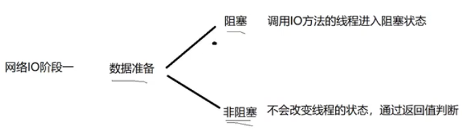
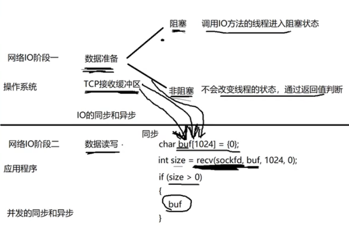
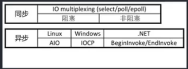

在网络IO中，一次IO的两个阶段是 数据准备 和 数据读写。

比如常用的 int size = recv(sockfd,buf,1024,0);默认阻塞读取。返回读取数据大小，如果将socket设为非阻塞，recv无数据也会返回。size == -1表示接收出错，当size==-1&&errno ==EAGAIN表示远端无数据，size==0对端关闭连接。size >0表示读取的数据长度。

在应用程序上调用recv，从内核的TCP接收缓冲区数据，不断的存入buf中，如果size>0则访问buf内容。

IO同步：在IO阶段一数据准备好之后，在数据读写时是应用层自己读写的，耗时过程在应用程序上。

IO异步：当请求内核时，应用程序干自己的事，让操作系统接收buf，接收完成后发送sigio信号通知应用程序。(如aio_read,aio_write等)

(Node.js 基于异步非阻塞模式下的高性能服务器)

在处理IO的时候，阻塞和非阻塞都是同步IO，只有用了特殊的API才是异步IO。(epoll是同步IO)

业务层面的一个逻辑处理，同步：A操作等待B操作做完事情，得到返回值继续处理。异步：A操作告诉B操作它感兴趣的时间以及通知方式，A操作继续执行自己的业务逻辑了，等B监听到对应事件发生后，B会通知A，A开始响应的数据处理逻辑。

阻塞，非阻塞，同步，异步描述的都是IO的一些状态。

一个典型的网络 IO 接口调用，分为两个阶段，分别是 “数据就绪” 和 "数据读写"，数据就绪阶段分为阻塞和非阻塞，表现得结果就是，阻塞当前线程或是直接返回。

同步表示 A 向 B 请求调用一个网络 IO 接口时（或者调用某个业务逻辑 API 接口时），数据的读写都是由请求方 A 自己来完成的（不管是阻塞还是非阻塞）；异步表示 A 向 B 请求调用一个网络 IO 接口时（或者调用某个业务逻辑 API 接口时)，向 B 传入请求的事件以及事件发生时通知的方式，A 就可以处理其它逻辑了，当 B 监听到事件处理完成后，会用事先约定好的通知方式，通知 A 处理结果。

  同步阻塞：int size = recv(fd,buf,1024,0);

  异步非阻塞：int size = recv(fd,buf,1024,0);

  异步阻塞：不会让A闲着，所以基本不存在。

  异步非阻塞：使用比较多，主流