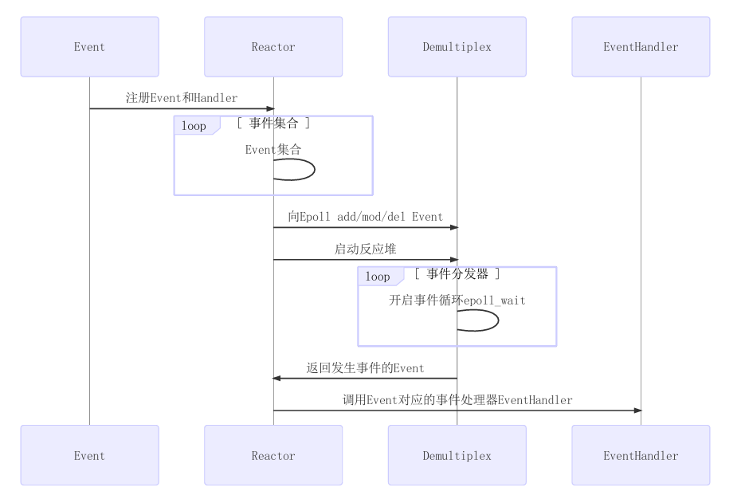
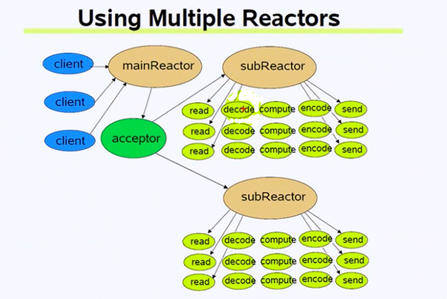

### Reactor模型

重要组件：Event事件，Reactor反应堆，Demultiplex事件分发器，Eventhandler事件处理器。

首先将Event和对应的处理函数handler注册到Reactor反应堆中，反应堆存储了事件和事件处理的集合，反应堆通过epoll add等修改事件分发器的设置，启动反应堆后就开启事件循环epoll_wait()，就在这里监听新用户链接或已连接用户的读写事件。如果epoll_wait监听到新事件产生，分发器会返回到反应堆，在Reactor里查找调用对应的Eventhandler。在EventHandler里先读取用户的请求（read），然后反序列化解码，进行业务逻辑操作，进行编码操作序列化，通过send 返回给用户。

在这里说明的是single Reactor模型。

muduo库的是multiple Reactors模型：

这里的mainReactor和subReactor相当于上面Reactor和事件分发器的合体。