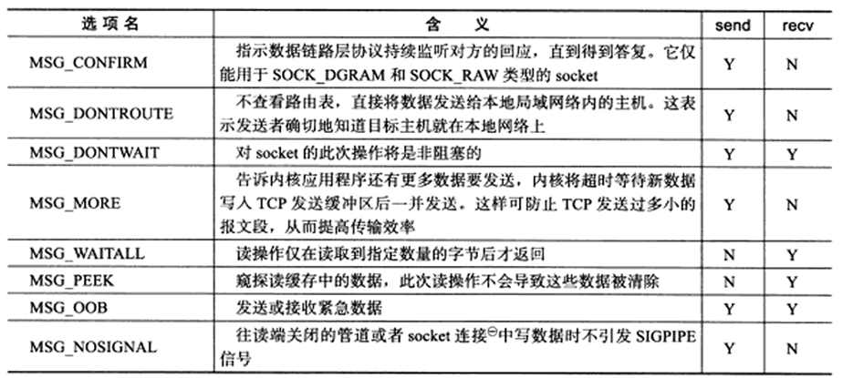
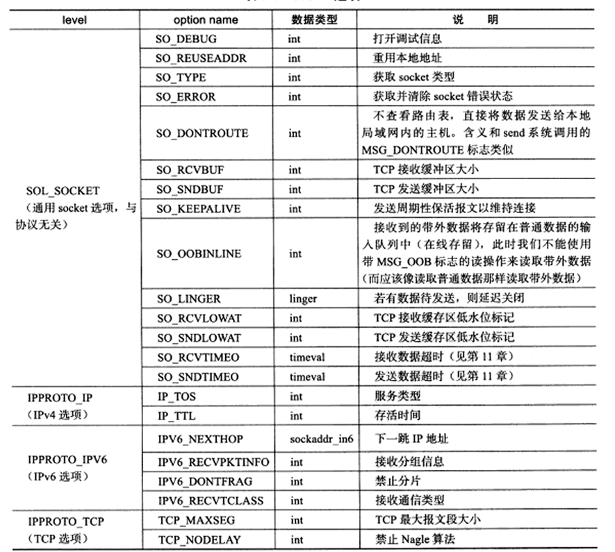

### Socket地址API

##### 主机字节序和网络字节序

字节序分为大端字节序和小段字节序，大端字节序是指一个整数的高位字节存储在内存的底地址出，底位字节存储在内存的高地址处。

小端字节序则是指整数的高位字节存储在内存的高地址处，而低位字节则存储在内存的底地址处。

可以通过union或指针强转法来查看

```c++
// 共用体：int 和 char[1] 共享内存
union EndianTest {
    int num;    // 4字节
    char c;     // 1字节，指向低地址
};

int checkEndianByUnion() {
    union EndianTest u;
    u.num = 0x12345678;
    // 低地址字节是 0x78 → 小端；是 0x12 → 大端
    return (u.c == 0x78); 
}

// 指针强转法
int checkEndianByPointer() {
   // 定义int变量，存储4字节数据 
    int a = 0x12345678;
    // 强转为 char*，取第一个字节（低地址）
    char *c = (char *)&a;
    return (*c == 0x78);
}
```

现代的PC大多采用小端字节序，因此小端字节序又被称为主机字节序。

```c++
//Linux 提供了如下 4 个函数来完成主机字节序和网络字节序之间的转换:
//比如htonl表示host to network long将长整型的主机字节序数据转化为网络字节序
#include <netinet/in.h>

unsigned long int htonl( unsigned long int hostlong );
unsigned short int htons( unsigned short int hostshort );
unsigned long int ntohl( unsigned long int netlong );
unsigned short int ntohs( unsigned short int netshort );
```

##### socket地址

TCP/IP 协议族有 `sockaddr_in` 和 `sockaddr_in6` 两个专用 socket 地址结构体，它们分别用于 IPv4 和 IPv6：

```c++
struct sockaddr_in
{
    sa_family_t sin_family;    /* 地址族：AF_INET */
    u_int16_t sin_port;         /* 端口号，要用网络字节序表示 */
    struct in_addr sin_addr;    /* IPv4地址结构体，见下面 */
};

struct in_addr
{
    u_int32_t s_addr;           /* IPv4地址，要用网络字节序表示 */
};

struct sockaddr_in6
{
    sa_family_t sin6_family;    /* 地址族：AF_INET6 */
    u_int16_t sin6_port;        /* 端口号，要用网络字节序表示 */
    u_int32_t sin6_flowinfo;    /* 流信息，应设置为 0 */
    struct in6_addr sin6_addr;  /* IPv6地址结构体，见下面 */
    u_int32_t sin6_scope_id;    /* scope ID，尚处于实验阶段 */
};

struct in6_addr
{
    unsigned char sa_addr[16];  /* IPv6地址，要用网络字节序表示 */
};
```

所有专用 socket 地址（以及`sockaddr_storage`）类型的变量在实际使用时都需要转化为通用 socket 地址类型`sockaddr`（强制转换即可），因为所有 socket 编程接口使用的地址参数的类型都是`sockaddr`。

通常人们使用字符串来表示IP地址，比如点分十进制字符串，但编程里需要先把它们都转化为整数（二进制数）方便使用，记录日志时需要把整数表示的IP地址转为字符串。

```c++
//IPv4地址转换：
#include <arpa/inet.h>
in_addr_t inet_addr( const char* strptr );
int inet_aton( const char* cp, struct in_addr* inp );
char* inet_ntoa( struct in_addr in );

//inet_addr 函数将用点分十进制字符串表示的 IPv4 地址转化为用网络字节序整数表示的 IPv4 地址。它失败时返回 INADDR_NONE。

//inet_aton 函数完成和 inet_addr 同样的功能，但是将转化结果存储于参数 inp 指向的地址结构中。它成功时返回 1，失败则返回 0。

//inet_ntoa 函数将用网络字节序整数表示的 IPv4 地址转化为用点分十进制字符串表示的 IPv4 地址。
```

### Socket操作

##### 创建 socket

遵循 UNIX/Linux「万物皆文件」的哲学，创建一个可读写、可控制、可关闭的 socket 文件描述符，作为网络通信的基础句柄。

```c++
#include <sys/types.h>
#include <sys/socket.h>
int socket( int domain, int type, int protocol );
```

###### 参数详解

1. **`domain`（协议族）**
   - 指定底层通信协议族，常见取值：
     - `PF_INET`/`AF_INET`：IPv4 协议族（二者在 Linux 中等价，`PF_INET`更贴合 “协议族” 语义）
     - `PF_INET6`：IPv6 协议族
     - `PF_UNIX`：UNIX 本地域协议（进程间通信）
   - 完整取值参考`man socket`手册。
2. **`type`（服务类型）**
   - 指定传输层服务类型，常见取值：
     - `SOCK_STREAM`：流服务，对应 TCP 协议（可靠、面向连接）
     - `SOCK_DGRAM`：数据报服务，对应 UDP 协议（不可靠、无连接）
   - 内核 2.6.17 起，可直接与标志位组合使用：
     - `SOCK_NONBLOCK`：创建非阻塞 socket
     - `SOCK_CLOEXEC`：fork 后子进程自动关闭该 socket（无需额外`fcntl`调用）
3. **`protocol`（具体协议）**
   - 在前两个参数确定的协议集合中，选择具体协议。绝大多数场景下，`domain`和`type`已唯一确定协议，因此直接设为`0`，表示使用默认协议。

###### 返回值与错误处理

- 成功：返回一个非负整数，即 socket 文件描述符
- 失败：返回`-1`，并设置`errno`错误码

------

##### 命名 socket

将 socket 与具体的 socket 地址（IP + 端口）绑定，称为 “命名 socket”。服务端必须绑定地址，客户端通常采用匿名方式（由操作系统自动分配地址）。

```c++
#include <sys/types.h>
#include <sys/socket.h>
int bind( int sockfd, const struct sockaddr* my_addr, socklen_t addrlen );
```

###### 参数详解

- `sockfd`：待绑定的 socket 文件描述符
- `my_addr`：指向 socket 地址结构体的指针（通用类型为`struct sockaddr*`，实际使用`struct sockaddr_in`/`struct sockaddr_in6`）
- `addrlen`：socket 地址结构体的长度

###### 常见错误与`errno`说明

1. **`EACCES`**：绑定了受保护的地址。普通用户绑定 0~1023 的知名服务端口时，会触发此错误（需 root 权限）。
2. **`EADDRINUSE`**：被绑定的地址正在使用中，例如绑定到处于`TIME_WAIT`状态的 socket 地址。

###### 返回值

- 成功：返回`0`
- 失败：返回`-1`，并设置`errno`错误码

------

##### 监听 socket

为已命名的 socket 创建监听队列，存放待处理的客户端连接请求，让 socket 从 “主动连接模式” 转为 “被动监听模式”。

```c++
#include <sys/socket.h>
int listen( int sockfd, int backlog );
```

###### 参数详解

- `sockfd`：已通过`bind()`绑定地址的 socket 文件描述符

- ```
  backlog
  ```

  ：内核监听队列的最大长度，内核版本不同含义不同：

  - 内核 2.2 之前：表示半连接（`SYN_RCVD`）+ 全连接（`ESTABLISHED`）状态的 socket 总数上限
  - 内核 2.2 之后：仅表示**全连接队列**的上限，半连接队列的上限由内核参数`/proc/sys/net/ipv4/tcp_max_syn_backlog`定义
  - 典型取值为`5`（生产环境可根据业务调整）

###### 错误说明

当连接请求超过`backlog`限制时，服务器不再受理新连接，客户端会收到`ECONNREFUSED`错误。

###### 返回值

- 成功：返回`0`
- 失败：返回`-1`，并设置`errno`错误码

------

##### 接收连接

从`listen()`创建的全连接队列中取出一个已完成 TCP 三次握手的连接请求，创建新的连接 socket，用于与客户端通信。

```c++
#include <sys/types.h>
#include <sys/socket.h>
int accept( int sockfd, struct sockaddr* addr, socklen_t* addrlen );
```

###### 参数详解

- `sockfd`：已执行`listen()`的监听 socket 文件描述符
- `addr`：**输出参数**，用于存储被接受连接的客户端 socket 地址（IP + 端口）
- `addrlen`：**输入输出参数**，调用时需初始化为`addr`结构体的长度，返回时更新为实际客户端地址的长度

###### 关键特性

- 成功时返回一个**全新的连接 socket 文件描述符**，服务端通过读写该描述符与客户端通信
- 原监听 socket（`sockfd`）会继续监听新的客户端连接请求，二者职责完全分离

###### 返回值与错误处理

- 成功：返回新连接的 socket 文件描述符（非负整数）
- 失败：返回`-1`，并设置`errno`错误码


```c++
#include <sys/socket.h>
#include <netinet/in.h>
#include <arpa/inet.h>
#include <assert.h>
#include <stdio.h>
#include <unistd.h>
#include <stdlib.h>
#include <errno.h>
#include <string.h>

int main( int argc, char* argv[] )
{
    if( argc <= 2 )
    {
        printf( "usage: %s ip_address port_number\n", basename( argv[0] ) );
        return 1;
    }
    const char* ip = argv[1];
    int port = atoi( argv[2] );

    struct sockaddr_in address;
    bzero( &address, sizeof( address ) );
    address.sin_family = AF_INET;
    inet_pton( AF_INET, ip, &address.sin_addr );
    address.sin_port = htons( port );

    int sock = socket( PF_INET, SOCK_STREAM, 0 );
    assert( sock >= 0 );

    int ret = bind( sock, ( struct sockaddr* )&address, sizeof( address ) );
    assert( ret != -1 );

    ret = listen( sock, 5 );
    assert( ret != -1 );
    /* 暂停20秒以等待客户端连接和相关操作（掉线或者退出）完成 */
    sleep( 20 );
    struct sockaddr_in client;
    socklen_t client_addrlength = sizeof( client );
    int connfd = accept( sock, ( struct sockaddr* )&client, &client_addrlength );
    if ( connfd < 0 )
    {
        printf( "errno is: %d\n", errno );
    }
    else
    {
        /* 接受连接成功则打印出客户端的IP地址和端口号 */
        char remote[INET_ADDRSTRLEN ];
        printf( "connected with ip: %s and port: %d\n", inet_ntop( AF_INET,
        &client.sin_addr, remote, INET_ADDRSTRLEN ), ntohs( client.sin_port ) );
        close( connfd );
    }

    close( sock );
    return 0;
}
```

##### 发起连接

客户端主动向服务器发起 TCP 连接请求，完成三次握手，建立可靠的双向通信连接。

```c++
#include <sys/types.h>
#include <sys/socket.h>
int connect( int sockfd, const struct sockaddr *serv_addr, socklen_t addrlen );
```

###### 参数详解

`sockfd`

客户端通过`socket()`创建的 socket 文件描述符。

`serv_addr`

服务器监听的 socket 地址结构体，包含服务器 IP 和端口号。

`addrlen`

服务器 socket 地址结构体的长度。

###### 返回值与常见错误

- 成功：返回`0`，连接建立完成，客户端可通过读写`sockfd`与服务器通信。
- 失败：返回 -1，并设置 errno ，常见错误码：
  - `ECONNREFUSED`：目标端口不存在，连接被拒绝。
  - `ETIMEDOUT`：连接超时，三次握手未完成。

------

#####  关闭连接

关闭 TCP 连接有两种方式，二者机制和适用场景差异明显：

###### `close()` 系统调用

关闭 socket 文件描述符，本质是将文件描述符的引用计数减 1，而非直接关闭 TCP 连接。

```c++
#include <unistd.h>
int close( int fd );
```

**关键特性**

1. **引用计数机制**：仅当 socket 的引用计数为 0 时，才会真正关闭 TCP 连接。
2. **多进程场景注意**：`fork()`调用会让父进程打开的 socket 引用计数 + 1，因此父子进程都需要调用`close()`，才能最终关闭连接。
3. **局限性**：会同时关闭 socket 的读、写通道，无法实现半关闭。

------

###### `shutdown()` 系统调用

专为网络编程设计，可直接操作 TCP 连接，支持半关闭，能分别关闭读通道、写通道，或同时关闭两者。

```c++
#include <sys/socket.h>
int shutdown( int sockfd, int howto );
```

**参数详解：`howto` 取值与含义**

|   可选项    |                             含义                             |
| :---------: | :----------------------------------------------------------: |
|  `SHUT_RD`  | 关闭读通道：应用程序无法再从 socket 读取数据，接收缓冲区中的数据会被丢弃。 |
|  `SHUT_WR`  | 关闭写通道：应用程序无法再向 socket 写入数据，发送缓冲区的数据会先发送完毕再关闭，连接进入半关闭状态。 |
| `SHUT_RDWR` |       同时关闭读、写通道，相当于`SHUT_RD + SHUT_WR`。        |

**关键特性**

1. **不受引用计数影响**：直接操作 TCP 连接，无需等待引用计数为 0，可立即生效。
2. **支持半关闭**：可单独关闭读或写通道，实现 TCP 的半关闭（比如主动关闭写通道，仍可接收服务器的响应）。

**返回值**

- 成功：返回`0`。
- 失败：返回`-1`，并设置`errno`。

------

###### `close()` 与 `shutdown()` 核心区别

|     特性     |                 `close()`                 |            `shutdown()`            |
| :----------: | :---------------------------------------: | :--------------------------------: |
|   操作对象   |        文件描述符（基于引用计数）         |            TCP 连接本身            |
| 引用计数影响 | 受引用计数影响，计数为 0 才会真正关闭连接 | 不受引用计数影响，一次调用直接生效 |
|  半关闭支持  |       不支持，会同时关闭读、写通道        |    支持，可单独关闭读 / 写通道     |
|  多进程场景  |  需所有进程都调用`close()`，连接才会关闭  |  一次调用即可影响所有进程的该连接  |

------

### 数据读写

##### TCP 数据读写核心系统调用：`recv()` 与 `send()`

文件读写的`read()`/`write()`也可用于 socket，但`recv()`/`send()`是专为 socket 设计的系统调用，通过`flags`参数提供更灵活的数据读写控制。

```c++
#include <sys/types.h>
#include <sys/socket.h>
// 接收数据
ssize_t recv( int sockfd, void *buf, size_t len, int flags );
// 发送数据
ssize_t send( int sockfd, const void *buf, size_t len, int flags );
```

- `sockfd`：已建立连接的 socket 文件描述符
- `buf`：数据缓冲区（`recv`为读缓冲区，`send`为写缓冲区）
- `len`：要读取 / 写入的数据长度
- `flags`：控制选项，见下文详解，通常设为`0`表示默认行为

###### `recv()` 接收数据

- 成功：返回实际读取到的字节数，**可能小于期望的`len`**（TCP 是字节流协议，无消息边界），需循环调用`recv`才能读取完整数据
- 返回`0`：表示通信对方已正常关闭连接（收到 FIN 包）
- 失败：返回`-1`，并设置`errno`错误码

###### `send()` 发送数据

- 成功：返回实际写入的字节数，**可能小于`len`**（内核发送缓冲区不足时，仅写入部分数据），需循环调用`send`才能发送完整数据
- 失败：返回`-1`，并设置`errno`错误码

------

##### `flags`参数详解（数据收发控制选项）

`flags`参数为`recv()`/`send()`提供额外控制，可多个选项组合使用，各选项的含义与支持情况如下：



###### 常用选项重点说明

**`MSG_OOB`（带外数据）**

- 作用：发送 / 接收 TCP 紧急数据（带外数据），TCP 仅支持 1 字节的紧急数据，仅最后一个发送的字节会被标记为 OOB 数据
- 场景：传递紧急控制信号（如中断指令），非业务数据传输
- 对应你之前的代码示例：客户端用`send(MSG_OOB)`发送数据，服务端用`recv(MSG_OOB)`接收紧急数据

**`MSG_PEEK`（窥探数据**）

- 作用：读取接收缓冲区数据，但**不会移除缓冲区中的数据**，后续普通`recv`仍能读取到该数据
- 场景：预读数据判断是否需要处理，避免误消费数据

**`MSG_DONTWAIT`（非阻塞操作）**

- 作用：本次`send`/`recv`调用为非阻塞模式，若无法立即完成操作（如无数据可读、发送缓冲区满），直接返回`-1`并设置`errno`为`EAGAIN/EWOULDBLOCK`
- 场景：临时单次非阻塞操作，无需修改 socket 全局属性

**`MSG_WAITALL`（等待所有数据）**

- 作用：`recv`会阻塞等待，直到读取到`len`字节的数据才返回，减少循环读取的复杂度
- 注意：受信号、连接关闭等影响，仍可能提前返回，不能完全依赖该选项

**`MSG_NOSIGNAL`（屏蔽`SIGPIPE`）**

- 作用：当向已被对方关闭的 socket 发送数据时，不会触发`SIGPIPE`信号（默认`SIGPIPE`会终止进程）
- 场景：避免服务端因客户端提前断开连接而意外崩溃

------

###### 客户端代码（`testoobsend.c`）

 

```c++
#include <sys/socket.h>
#include <netinet/in.h>
#include <arpa/inet.h>
#include <assert.h>
#include <stdio.h>
#include <unistd.h>
#include <string.h>
#include <stdlib.h>

int main( int argc, char* argv[] )
{
    if( argc <= 2 )
    {
        printf( "usage: %s ip_address port_number\n", basename( argv[0] ) );
        return 1;
    }
    const char* ip = argv[1];
    int port = atoi( argv[2] );

    struct sockaddr_in server_address;
    bzero( &server_address, sizeof( server_address ) );
    server_address.sin_family = AF_INET;
    inet_pton( AF_INET, ip, &server_address.sin_addr );
    server_address.sin_port = htons( port );

    int sockfd = socket( PF_INET, SOCK_STREAM, 0 );
    assert( sockfd >= 0 );
    if ( ( connect( sockfd, ( struct sockaddr* )&server_address, sizeof( server_address ) ) < 0 ) )
    {
        printf( "connection failed\n" );
    }
    else
    {
        const char* oob_data = "abc";
        const char* normal_data = "123";
        send( sockfd, normal_data, strlen( normal_data ), 0 );
        send( sockfd, oob_data, strlen( oob_data ), MSG_OOB );//使用OOB(外带数据)
        send( sockfd, normal_data, strlen( normal_data ), 0 );
    }

    close( sockfd );
    return 0;
}
```

###### 服务器代码（`testoobrecv.c`）

```c++
#include <sys/socket.h>
#include <netinet/in.h>
#include <arpa/inet.h>
#include <assert.h>
#include <stdio.h>
#include <unistd.h>
#include <stdlib.h>
#include <errno.h>
#include <string.h>

#define BUF_SIZE 1024

int main( int argc, char* argv[] )
{
    if( argc <= 2 )
    {
        printf( "usage: %s ip_address port_number\n", basename( argv[0] ) );
        return 1;
    }
    const char* ip = argv[1];
    int port = atoi( argv[2] );

    struct sockaddr_in address;
    bzero( &address, sizeof( address ) );
    address.sin_family = AF_INET;
    inet_pton( AF_INET, ip, &address.sin_addr );
    address.sin_port = htons( port );

    int sock = socket( PF_INET, SOCK_STREAM, 0 );
    assert( sock >= 0 );

    int ret = bind( sock, ( struct sockaddr* )&address, sizeof( address ) );
    assert( ret != -1 );

    ret = listen( sock, 5 );
    assert( ret != -1 );

    struct sockaddr_in client;
    socklen_t client_addrlength = sizeof( client );
    int connfd = accept( sock, ( struct sockaddr* )&client, &client_addrlength );
    if ( connfd < 0 )
    {
        printf( "errno is: %d\n", errno );
    }
    else
    {
        char buffer[ BUF_SIZE ];
        memset( buffer, '\0', BUF_SIZE );
        ret = recv( connfd, buffer, BUF_SIZE-1, 0 );
        printf( "got %d bytes of normal data '%s'\n", ret, buffer );

        memset( buffer, '\0', BUF_SIZE );
        ret = recv( connfd, buffer, BUF_SIZE-1, MSG_OOB );//接收OOB数据
        printf( "got %d bytes of oob data '%s'\n", ret, buffer );

        memset( buffer, '\0', BUF_SIZE );
        ret = recv( connfd, buffer, BUF_SIZE-1, 0 );
        printf( "got %d bytes of normal data '%s'\n", ret, buffer );

        close( connfd );
    }

    close( sock );
    return 0;
}
```

```bash
# 在 Kongming20 上执行服务器程序，监听 54321 端口
$ ./testoobrecv 192.168.1.109 54321

# 在 ernest-laptop 上执行客户端程序
$ ./testoobsend 192.168.1.109 54321

# 抓包命令（可选，用于查看TCP报文）
$ sudo tcpdump -ntx -i eth0 port 54321
```

服务器程序的输出：

```bash
got 5 bytes of normal data '123ab'  
got 1 bytes of oob data 'c'
got 3 bytes of normal data '123'
```

这里第一次接收数据为123ab，是因为TCP协议的外带数据(OOB)只能携带1个字节的有效数据，不管MSG_OOB发送了多少字节，只有最后一个字节会被TCP标记为真正的OOB数据，前面的数据都会被当成普通数据处理。

所以客户端发送的OOB数据abc，前面的ab都被当普通数据和前面的123一起排队，最后被服务器一块接收。

##### UDP 数据读写核心系统调用

UDP 是无连接协议，没有固定的通信对方，因此每次收发数据都需要明确指定对方的 socket 地址，对应的系统调用是`recvfrom()`和`sendto()`。

```c++
#include <sys/types.h>
#include <sys/socket.h>
// 接收UDP数据报
ssize_t recvfrom( int sockfd, void* buf, size_t len, int flags, 
                  struct sockaddr* src_addr, socklen_t* addrlen );
// 发送UDP数据报
ssize_t sendto( int sockfd, const void* buf, size_t len, int flags, 
                 const struct sockaddr* dest_addr, socklen_t addrlen );
```

------

###### `recvfrom()`：接收 UDP 数据报

从 UDP socket 上读取数据报，同时获取发送端的 socket 地址（IP + 端口）。

- `sockfd`：UDP socket 文件描述符
- `buf`：接收数据的缓冲区
- `len`：缓冲区大小（期望读取的字节数）
- `flags`：控制选项，与`recv()`的`flags`参数含义完全相同（如`MSG_OOB`、`MSG_DONTWAIT`等）
- `src_addr`：**输出参数**，用于存储发送端的 socket 地址结构体
- `addrlen`：**输入输出参数**，调用时初始化为`src_addr`结构体的长度，返回时更新为实际发送端地址的长度

**关键特点**

- 因为 UDP 无连接，每次接收数据都必须获取发送端地址，否则无法回复数据。
- 返回值与`recv()`一致：成功返回实际读取的字节数；失败返回`-1`并设置`errno`。

------

###### `sendto()`：发送 UDP 数据报

向指定的 socket 地址发送 UDP 数据报，无需提前建立连接。

- `sockfd`：UDP socket 文件描述符
- `buf`：要发送的数据缓冲区
- `len`：要发送的数据长度
- `flags`：控制选项，与`send()`的`flags`参数含义完全相同
- `dest_addr`：**输入参数**，接收端的 socket 地址结构体（IP + 端口）
- `addrlen`：`dest_addr`结构体的长度

**关键特点**

- 每次发送都必须指定目标地址，无需提前调用`connect()`。
- 返回值与`send()`一致：成功返回实际写入的字节数；失败返回`-1`并设置`errno`。

### Socket选项

##### getsockopt & setsockopt

这两个是**socket 专用**的系统调用，专门用来读取和设置 socket 文件描述符的属性，比通用的`fcntl`更贴合网络编程场景：

```c++
#include <sys/socket.h>
// 获取socket选项值
int getsockopt( int sockfd, int level, int option_name, void* option_value, socklen_t* restrict option_len );
// 设置socket选项值
int setsockopt( int sockfd, int level, int option_name, const void* option_value, socklen_t option_len );
```

**参数说明**

- `sockfd`：要操作的目标 socket 文件描述符
- `level`：选项所属的协议层（通用、IPv4、IPv6、TCP 等）
- `option_name`：要操作的选项名（如`SO_REUSEADDR`）
- `option_value`：选项值的缓冲区（设置时传入值，获取时传出值）
- `option_len`：选项值的长度（获取时是输入输出参数）

**返回值**

成功返回`0`，失败返回`-1`并设置`errno`错误码。

------



- 服务器端：部分 socket 选项必须在`listen()`调用前设置，因为`accept()`返回的连接 socket 会自动继承监听 socket 的选项（如`SO_DEBUG`、`SO_KEEPALIVE`、`TCP_NODELAY`等）。

- 客户端：部分选项必须在`connect()`调用前设置，因为三次握手完成后，部分 TCP 选项无法修改（如`TCP_MAXSEG`需在同步报文中协商）。

  

##### `SO_REUSEADDR`（端口重用）

- **作用**：强制重用处于`TIME_WAIT`状态的 socket 地址，解决服务端重启时 “端口被占用” 的问题。

- **原理**：`TIME_WAIT`状态的端口默认需要等待 2MSL 才能被重新绑定，设置此选项后可提前绑定。

- **使用时机**：必须在`bind()`系统调用之前设置，否则无效。

  ```c++
  int reuse = 1;
  setsockopt( sock, SOL_SOCKET, SO_REUSEADDR, &reuse, sizeof( reuse ) );
  bind( sock, ... ); // 绑定处于TIME_WAIT状态的端口
  ```

#####  `SO_RCVBUF` / `SO_SNDBUF`（TCP 收发缓冲区）

- **作用**：设置 / 获取 TCP 接收缓冲区（`SO_RCVBUF`）和发送缓冲区（`SO_SNDBUF`）的大小。
- 关键特性
  1. 系统会自动将设置值翻倍，且不能小于系统定义的最小值（接收缓冲区最小 256 字节，发送缓冲区最小 2048 字节，不同系统有差异）。
  2. 内核会强制保证接收缓冲区能容纳至少 4 个 SMSS（单段最大报文）的 TCP 报文段，用于拥塞控制。
  3. 可通过修改内核参数`/proc/sys/net/ipv4/tcp_rmem`和`/proc/sys/net/ipv4/tcp_wmem`突破最小值限制。
- 实验现象：设置接收缓冲区为 50 字节，实际生效值为 256 字节（系统最小值）；设置发送缓冲区为 2000 字节，实际生效为 4000 字节（自动翻倍）。

##### `SO_LINGER`（控制`close()`关闭行为）

- **作用**：控制`close()`系统调用关闭 TCP 连接时的行为，影响连接的关闭流程。

- 配置结构体

  ```c++
  struct linger {
      int l_onoff;    // 开启（非0）/关闭（0）该选项
      int l_linger;   // 滞留时间（单位：秒）
  };
  ```

- 三种行为模式：

  1. `l_onoff = 0`：选项关闭，`close()`默认行为：立即返回，内核负责发送缓冲区的剩余数据，四次挥手正常执行。
  2. `l_onoff ≠ 0`，`l_linger = 0`：`close()`立即返回，丢弃发送缓冲区数据，向对方发送复位报文段，**异常终止连接（无 TIME_WAIT 状态）**。
  3.  l_onoff ≠ 0， l_linger > 0：
     - 阻塞 socket：`close()`会阻塞等待`l_linger`时间，直到数据发送完毕并收到对方 ACK；超时则返回`EWOULDBLOCK`。
     - 非阻塞 socket：`close()`立即返回，需根据返回值和`errno`判断数据是否发送完成。

------

