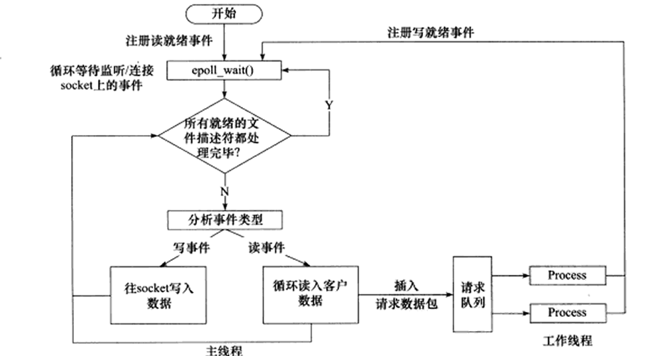
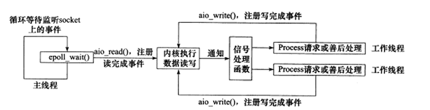
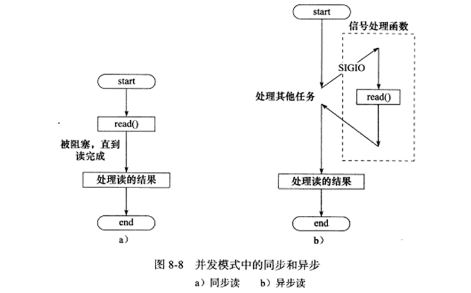
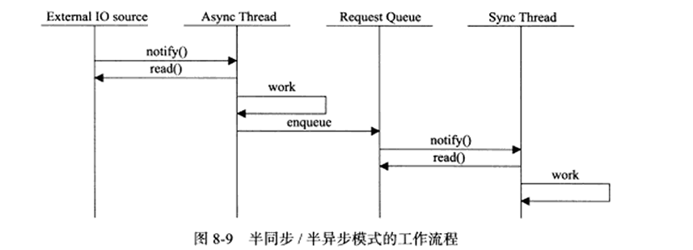
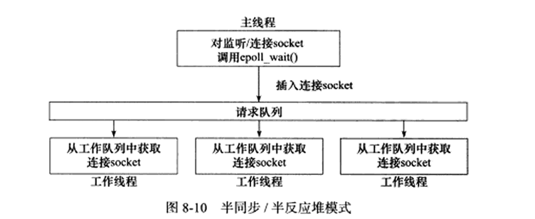
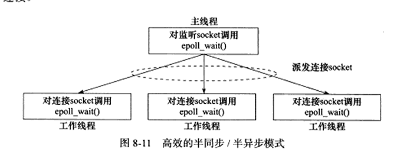
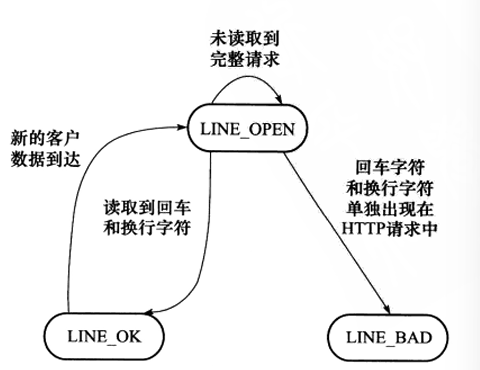
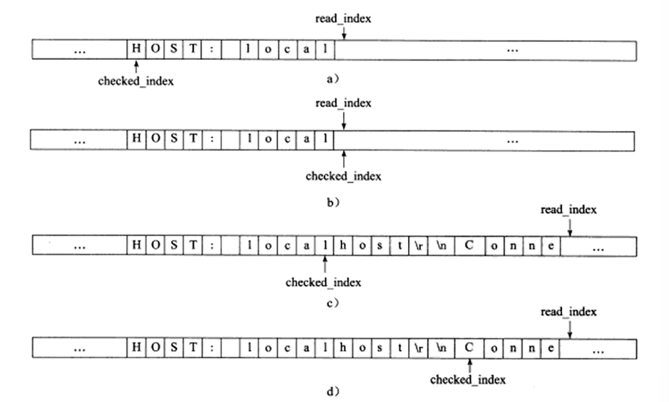

## 事件处理模式

服务器通常需要处理三类事件：IO事件，信号及定时事件。

同步IO通常用于实现Reactor模式，异步IO模型通常用于实现Proactor模式，但也可以使用同步IO模拟实现出Proactor模式。

### Reactor模式

使用同步 I/O 模型（以 epoll_wait 为例）实现的 Reactor 模式的工作流程是：

1）主线程往 epoll 内核事件表中注册 socket 上的读就绪事件。

2）主线程调用 epoll_wait 等待 socket 上有数据可读。

3）当 socket 上有数据可读时，epoll_wait 通知主线程。主线程则将 socket 可读事件放入请求队列。

4）睡眠在请求队列上的某个工作线程被唤醒，它从 socket 读取数据，并处理客户请求，然后往 epoll 内核事件表中注册该 socket 上的写就绪事件。

5）主线程调用 epoll_wait 等待 socket 可写。

6）当 socket 可写时，epoll_wait 通知主线程。主线程将 socket 可写事件放入请求队列。

7）睡眠在请求队列上的某个工作线程被唤醒，它往 socket 上写入服务器处理客户请求的结果。




### Proactor模式

与 Reactor 模式不同，Proactor 模式将所有 I/O 操作都交给主线程和内核来处理，工作线程仅仅负责业务逻辑。

使用异步 I/O 模型（以 `aio_read` 和 `aio_write` 为例）实现的 Proactor 模式的工作流程是：

1）主线程调用 `aio_read` 函数向内核注册 socket 上的读完成事件，并告诉内核用户读缓冲区的位置，以及读操作完成时如何通知应用程序（这里以信号为例，详情请参考 `sigevent` 的 man 手册）。

2）主线程继续处理其他逻辑。

3）当 socket 上的数据被读入用户缓冲区后，内核将向应用程序发送一个信号，以通知应用程序数据已经可用。

4）应用程序预先定义好的信号处理函数选择一个工作线程来处理客户请求。工作线程处理完客户请求之后，调用 `aio_write` 函数向内核注册 socket 上的写完成事件，并告诉内核用户写缓冲区的位置，以及写操作完成时如何通知应用程序（仍然以信号为例）。

5）主线程继续处理其他逻辑。

6）当用户缓冲区的数据被写入 socket 之后，内核将向应用程序发送一个信号，以通知应用程序数据已经发送完毕。

7）应用程序预先定义好的信号处理函数选择一个工作线程来做善后处理，比如决定是否关闭 socket。



连接 socket 上的读写事件是通过 `aio_read`/`aio_write` 向内核注册的，因此内核将通过信号来向应用程序报告连接 socket 上的读写事件。所以，主线程中的 `epoll_wait` 调用仅能用来检测监听 socket 上的连接请求事件，而不能用来检测连接 socket 上的读写事件。

### 模拟Proactor模式

使用同步 I/O 方式模拟出 Proactor 模式的一种方法。其原理是：主线程执行数据读写操作，读写完成之后，主线程向工作线程通知这一 “完成事件”。那么从工作线程的角度来看，它们就直接获得了数据读写的结果，接下来要做的只是对读写的结果进行逻辑处理。

使用同步 I/O 模型（仍然以 `epoll_wait` 为例）模拟出的 Proactor 模式的工作流程如下：

1）主线程往 epoll 内核事件表中注册 socket 上的读就绪事件。

2）主线程调用 `epoll_wait` 等待 socket 上有数据可读。

3）当 socket 上有数据可读时，`epoll_wait` 通知主线程。主线程从 socket 循环读取数据，直到没有更多数据可读，然后将读取到的数据封装成一个请求对象并插入请求队列。

4）睡眠在请求队列上的某个工作线程被唤醒，它获得请求对象并处理客户请求，然后往 epoll 内核事件表中注册 socket 上的写就绪事件。

5）主线程调用 `epoll_wait` 等待 socket 可写。

6）当 socket 可写时，`epoll_wait` 通知主线程。主线程往 socket 上写入服务器处理客户请求的结果。


## 高效的并发模式

### 半同步/半异步

前面的同步和异步指的是内核向应用程序同时的是何种IO事件(就绪事件还是完成事件),以及该由谁完成IO读写。

这里的同步是：程序完全按照代码序列的顺序执行。异步：程序的执行需要由系统事件来驱动。



异步线程执行效率高，实时性强，但编写，调试复杂。同步线程效率较低，但逻辑简单，对于服务器这种既要实时性好，又要能处理多个客户的请求，就应该同时使用同步线程和异步线程，即半同步/半异步模型来实现。

此时，同步线程用于处理客户逻辑，异步线程用来处理IO事件。异步线程监听到客户请求后，就将其封装成请求对象并插入请求队列中。请求队列将通知某个工作在同步模式的工作线程来读取并处理该请求对象。



在服务器程序里，半同步/半异步模式有多种变体，比如半同步/半反应堆模式



在这里异步线程只有一个，由主线程来充当。它负责监听所有 socket 上的事件。如果监听 socket 上有可读事件发生，即有新的连接请求到来，主线程就接受之以得到新的连接 socket，然后往 epoll 内核事件表中注册该 socket 上的读写事件。如果连接 socket 上有读写事件发生，即有新的客户请求到来或有数据要发送至客户端，主线程就将该连接 socket 插入请求队列中。所有工作线程都睡眠在请求队列上，当有任务到来时，通过唤醒或等待空闲的工作线程获得任务的接管权。

主线程插入请求队列中的任务是就绪的连接 socket。这说明该图所示的半同步 / 半反应堆模式采用的事件处理模式是 Reactor 模式：它要求工作线程自己从 socket 上读取客户请求和往 socket 写入服务器应答。这就是该模式的名称中 “half-reactive” 的含义。实际上，半同步 / 半反应堆模式也可以使用模拟的 Proactor 事件处理模式，即由主线程来完成数据的读写。在这种情况下，主线程一般会将应用程序数据、任务类型等信息封装为一个任务对象，然后将其（或者指向该任务对象的一个指针）插入请求队列。工作线程从请求队列中取得任务对象之后，即可直接处理之，而无须执行读写操作了。

半同步 / 半反应堆模式存在如下缺点：

- 主线程和工作线程共享请求队列。主线程往请求队列中添加任务，或者工作线程从请求队列中取出任务，都需要对请求队列加锁保护，从而白白耗费 CPU 时间。
- 每个工作线程在同一时间只能处理一个客户请求。如果客户数量较多，而工作线程较少，则请求队列中将堆积很多任务对象，客户端的响应速度将越来越慢。如果通过增加工作线程来解决这一问题，则工作线程的切换也将耗费大量 CPU 时间。

下面这种图描述了一种相对高效的半同步 / 半异步模式，它的每个工作线程都能同时处理多个客户连接。




在这里主线程只管理监听 socket，连接 socket 由工作线程来管理。当有新的连接到来时，主线程就接受之并将新返回的连接 socket 派发给某个工作线程，此后该新 socket 上的任何 I/O 操作都由被选中的工作线程来处理，直到客户关闭连接。主线程向工作线程派发 socket 的最简单的方式，是往它和工作线程之间的管道里写数据。工作线程检测到管道上有数据可读时，就分析是否是一个新的客户连接请求到来。如果是，则把该新 socket 上的读写事件注册到自己的 epoll 内核事件表中。

可见，每个线程（主线程和工作线程）都维持自己的事件循环，它们各自独立地监听不同的事件。因此，在这种高效的半同步 / 半异步模式中，每个线程都工作在异步的模式，所以它并非严格意义上的半同步 / 半异步模式。

还有另一种并发模式，追随者/领导者模式，但实际应用较少，故不在赘述。

### 追随者/领导者模式

**一种无共享队列的线程池事件处理模式，通过线程动态切换「领导者 / 追随者」角色，实现低锁开销、低延迟的 I/O 事件处理**，常用于传统高性能服务器、嵌入式服务，现代服务器中较少作为主架构使用,故只做简单了解即可。

------

**工作原理**

- 线程池内的线程分为两种角色，**同一时间仅存在 1 个「领导者（Leader）」线程**，其余为「追随者（Follower）」线程。
- Leader 线程负责监听所有 I/O 事件；Follower 线程处于阻塞等待状态，等待被推选为新的 Leader。
- 当 Leader 监听到 I/O 事件时：
  1. 先从线程池中推选 1 个 Follower，升级为**新的 Leader**，继续监听后续事件；
  2. 原 Leader 线程降级，转为**Processing 状态**，处理本次 I/O 事件；
  3. 处理完成后，原 Leader 线程根据当前是否有新 Leader，转为 Leader 或 Follower 状态。
- 核心特点：**无共享请求队列**，事件无需经过队列中转，监听和处理由同一批线程轮换完成，实现并发。

------

**四大核心组件**

|              组件              |                             作用                             |
| :----------------------------: | :----------------------------------------------------------: |
|       **句柄（Handle）**       |    表示 I/O 资源，Linux 下通常是文件描述符（socket fd）。    |
|    **句柄集（HandleSet）**     | 管理多个句柄，提供`wait_for_event()`方法监听句柄上的 I/O 事件，将就绪事件通知给 Leader 线程；支持`register_handle()`绑定句柄和事件处理器。 |
|    **线程集（ThreadSet）**     | 所有工作线程的管理者，负责线程同步、新 Leader 推选；管理线程的三种状态，提供`promote_new_leader()`推选新 Leader，通过`Synchronizer`避免线程间竞态条件。 |
| **事件处理器（EventHandler）** | 事件处理的回调接口，包含`handle_event()`方法，用于处理事件对应的业务逻辑；具体实现（`ConcreteEventHandler`）需重写该方法，处理特定任务。 |

------

**线程的三种状态与转移**

线程在任一时刻只能处于以下三种状态之一，状态转移逻辑如下：

1. Leader 状态

   ：当前线程是领导者，负责等待句柄集上的 I/O 事件。

   - 事件到来后，推选新 Leader，自身转为 Processing 状态；
   - 被推选为新 Leader 的 Follower，转为 Leader 状态。

2. Processing 状态

   ：线程正在处理 I/O 事件。

   - 事件处理完成后：
     - 若当前没有 Leader 线程 → 转为 Leader 状态；
     - 若当前已有 Leader 线程 → 转为 Follower 状态。

3. Follower 状态

   ：线程是追随者，通过 join() 方法等待成为新 Leader，或被当前 Leader 指定处理任务。

   - 被推选为新 Leader 时，转为 Leader 状态；
   - 被指定处理任务时，转为 Processing 状态。

------

###### 核心优缺点

**优点**

1. **无锁竞争，开销极低**：没有共享请求队列，无需像半同步 / 半反应堆模式那样对队列加锁、同步，减少 CPU 消耗。
2. **低延迟**：事件从监听到处理无需经过队列排队，延迟更低，适合短耗时的纯 I/O 转发场景。
3. 线程逻辑简单，无需复杂的队列同步逻辑，理论上实现成本低。

**缺点**

1. **多核利用率低，扩展性差**：同一时间仅 1 个 Leader 监听事件，其余线程闲置，无法充分利用多核 CPU 性能。
2. **连接管理能力弱**：仅支持一个事件源集合，无法让每个工作线程独立管理多个客户连接，不适合高并发长连接场景（如游戏网关服）。
3. **不适合耗时业务**：如果事件处理逻辑耗时较长，当前线程被占用，新的 I/O 事件会被阻塞，造成服务卡顿，无法适配游戏逻辑服、战斗服的复杂业务。
4. **调试与维护困难**：线程角色动态切换，运行逻辑隐蔽，线上问题排查、调试难度大。

## 有限状态机

有限状态机是逻辑单元内部的一种高效编程方法，通常用来做HTTP请求的读取和分析。

根据协议可以知道HTTP头部结束是遇到一个空行（仅包含\r\n)。如果没有遇到空行，就等待客户继续写入数据并再次读入。所以，每完成一次读操作，就需要分析新读入的数据中是否有空行，在寻找空行过程中也完成了整个HTTP请求头部的解析。

这里使用两个状态机进行解析，主状态机负责调用从状态机，并根据返回的结果解析不同位置调用不同函数(比如初始状态是解析请求行，解析请求行成功后在函数内部修改状态，去解析请求头)。从状态机负责行解析，并返回对应结果。

从状态机(parse_line)函数，从buffer中解析出一个行。可能的结果如下图所示。



从状态机通过分析数据来决定返回的状态，分析的数据来源于buffer中的客户数据。在main函数里通过循环调用recv读取数据，recv通过buffer缓冲区+read_index（(已经读取了多少字节)接收数据，保证每次读取的数据不会被覆盖，BUFEER_SIZE-read_index保证了读取数据不会超过BUFFER的缓冲区大小，每次读取完数据后，更新read_index的值，加上刚才读取的数据大小(data_read)，调用parse_content函数来分析新读入的数据(里面包含主状态机)。根据result的值来判断下一步。

passe_line函数在内部，从checked_index(已经检查过的位置)到read_index(缓冲区里客户数据的下一个位置)检查每一个字符，如果当前字节是\r就判断当前checked_index+1==read_index，是则说明读完了。否则判断下一个字符是不是\n，是则说明读取到完整的行，同时将\r\n都替换成\0截断。否则是语法错误。

如果检查到\n，查看上一个字符是否是\r，同上处理。如果所有都检查完了也没有\r，说明需要再读取客户数据。



如果成果解析出请求行，在主状态机里调用parse_requestline来处理，将其拆分为method,url,version，并判断是否有误，返回时将状态设置为CHECK_STATE_HEADER处理头部字段。

```c++
#include <sys/socket.h>
#include <netinet/in.h>
#include <arpa/inet.h>
#include <assert.h>
#include <stdio.h>
#include <stdlib.h>
#include <unistd.h>
#include <errno.h>
#include <string.h>
#include <fcntl.h>

#define BUFFER_SIZE 4096 //读缓冲区大小
//主状态机的两种可能，当前正在分析请求行，当前正在分析头部字段
enum CHECK_STATE{CHECK_STATE_REQUESTLINE = 0,CHECK_STATE_HEADER};

          //从状态机，读取到完整的行，行出错，行数据不完整
enum LINE_STATUS{LINE_OK = 0,LINE_BAD,LINE_OPEN};

   //服务器处理HTTP请求的结果        
enum HTTP_CODE {NO_REQUEST,GET_REQUEST,BAD_REQUEST,FORBIDDEN_REQUEST,INTERNAL_ERROR,CLOSED_CONNECTION};

//根据服务器的处理结果发送如下成果或失败信息
static const char* szret[] = {"I get a correct result\n","Something wrong\n"};

//从状态机，用来解析出一行内容
LINE_STATUS parse_line(char*buffer,int& checked_index,int& read_index)
{   
    //buffer是读缓冲区中当前正在分析的字节，
    //checked_index指向当前要分析的字节
    //read_index指向buffer中客户数据的尾部的下一字节  
    char temp;
    //给它单个字符拆分检查
    for(;checked_index<read_index;++checked_index)
    {
        //获得当前要分析的字节  
        temp = buffer[checked_index];
        //如果当前字节是\r，即回车符，说明可能得到一个完整的行
        if(temp == '\r')
        {
            //如果\r时buffer中最后一个，说明读完了
            if((checked_index+1)==read_index)
            {
               return LINE_OPEN;
            }else if(buffer[checked_index + 1 ] == '\n')
            {//如果下一个字符是\n说明读取到一个完整的行
            buffer[checked_index++]='\0';
            buffer[checked_index++]='\0';
            return LINE_OK;
            }
            //如果都不是，说明客户端发送的http请求有语法问题
             return LINE_BAD;
        }else if(temp == '\n')
        { //检查是否读取到一个完整的行
          if((checked_index>1)&&buffer[checked_index-1]=='\r')
          {
           buffer[checked_index-1]='\0';// 把前一个字符（\r）改成字符串结束符
           buffer[checked_index++]='\0';// 把当前字符（\n）改成字符串结束符，解析位置+1
           return LINE_OK; // 返回“解析到完整行”的状态
          }
             return LINE_BAD;
       }
         
    }
    //如果所有内容都分析完也没遇到\r，表示需要再读取客户端数据报
    return LINE_OPEN;
}


//分析请求行
HTTP_CODE parse_requestline(char*temp,CHECK_STATE&checkstate)
{
    //在temp中(已经解析好的HTTP请求行)，找到第一个空格或制表符
    char*url = strpbrk(temp," \t");
    //如果请求行中没有空白字符或\t字符，http请求必有问题
    if(!url) return BAD_REQUEST;
    //把分隔符改成 \0，截断字符串 → temp 就变成了单纯的 "GET"
    *url++='\0';
    char*method = temp;
    if(strcasecmp(method,"GET")==0) {
        printf("The request method is GET\n");
    }else{
        return BAD_REQUEST;
    }
    //将请求方法后面的空格都跳过，保证指向url位置
    url+=strspn(url," \t");
    //找到下一个空格位置，指向url后
    char* version = strpbrk(url," \t");
    if(!version) return BAD_REQUEST;
    *version++='\0';

    //仅支持HTTP/1.1
    if(strcasecmp(version,"HTTP/1.1")!=0) return BAD_REQUEST;
    //检查url是否合法
    if(strncasecmp(url,"http://",7)==0){
        url+=7;
        url=strchr(url,'/');
        //在字符串中查找第一个/，找到返回指针，没找到返回NULL
    }

    if(!url||url[0]!='/') return BAD_REQUEST;
    printf("the request URL is:%s\n",url);
    //HTTP请求行处理完毕，状态转移到头部字段的分析
    checkstate=CHECK_STATE_HEADER;
    return NO_REQUEST;
}

//分析头部字段
HTTP_CODE parse_headers(char* temp)
{
    //遇到空行 表示 HTTP 头部全部解析完毕
    if(temp[0]=='\0')
    {
        return GET_REQUEST;
    }
    else if(strncasecmp(temp,"Host:",5)==0)
    {//处理HOST头部字段
       temp+=5;
       temp+=strspn(temp," \t");
       printf("the request host is： %s\n",temp);
    }else{
        //其他头部都不处理
        printf("I can not handle this headler\n");
    }
    // 头部还没解析完，继续读取下一行头部
    return NO_REQUEST;
}

//分析HTTP请求的入口函数
HTTP_CODE parse_content(char*buffer,int&checked_index,CHECK_STATE&checkstate,int&read_index,int&start_line)
{
    LINE_STATUS linestatus = LINE_OK;//记录当前行的读取状态
    HTTP_CODE retcode = NO_REQUEST;//记录HTTP请求的处理结果

    //主状态机，用于从buffer中取出所有完整的行
    while((linestatus = parse_line(buffer,checked_index,read_index))==LINE_OK)
    {
         char*temp = buffer + start_line;//start_line是行在buffer中的起始位置
         start_line = checked_index;//记录下一行的起始位置
         //checkstate记录主状态机当前的状态
         switch(checkstate)
         {
             case CHECK_STATE_REQUESTLINE://第一个状态，分析请求行
             {
                 retcode=parse_requestline(temp,checkstate);
                 if(retcode==BAD_REQUEST)
                 {
                     return BAD_REQUEST;
                 }
                 break;
             }
             case CHECK_STATE_HEADER:
             {   //第二个状态，分析头部字段
                 retcode = parse_headers(temp);
                 if(retcode==BAD_REQUEST)
                 {
                     return BAD_REQUEST;
                 }
                 else if(retcode == GET_REQUEST)
                 {
                     return GET_REQUEST;
                 }
                 break;
             }
             default:
             {
                 return INTERNAL_ERROR;
             }
         }
    }
    //如果没有读取到完整的行，表示需要继续读取客户数据
    if(linestatus == LINE_OPEN)
    {
        return NO_REQUEST;
    }
    else
    {
        return BAD_REQUEST;
    }
}

int main(int argc,const char*argv[])
{
    if(argc<=2)
    {
        printf("usage: %s ip_address port_number\n",basename(argv[0]));
        return 1;
    }
    const char*ip = argv[1];
    int port = atoi(argv[2]);
    struct sockaddr_in address;
    bzero(&address,sizeof(address));
    inet_pton(AF_INET,ip,&address.sin_addr);
    address.sin_family=AF_INET;
    address.sin_port=htons(port);

    int listenfd = socket(PF_INET,SOCK_STREAM,0);
    assert(listenfd>=0);
    int ret = bind(listenfd,(struct sockaddr*)&address,sizeof(address));
    assert(ret!=-1);
    ret = listen(listenfd,5);
    assert(ret!=-1);
    struct sockaddr_in client_address;
    socklen_t client_addrlength=sizeof(client_address);
    int fd = accept(listenfd,(struct sockaddr*)&client_address,&client_addrlength);
    if(fd<0) printf("errno is %d\n",errno);
    else
    {
        char buffer[BUFFER_SIZE];//读缓冲区
        memset(buffer,'\0',BUFFER_SIZE);
         int data_read=0;
         int read_index=0;//当前已经读取了多少字节的客户数据
         int checked_index=0;//当前已经分析了多少字节的客户数据
         int start_line=0;//行在buffer中的起始位置
         //设置主状态机的初始状态
         CHECK_STATE checkstate=CHECK_STATE_REQUESTLINE;
         while(1) //循环读取客户数据
         {
            data_read = recv(fd,buffer+read_index,BUFFER_SIZE-read_index,0);
            if(data_read==-1){
                printf("reading failed\n");
                break;
            }
            else if(data_read==0)
            {
                printf("remote client has closed the connection\n");
                break;
            }
            read_index+=data_read;
            //分析目前已经获得的所有客户数据
            HTTP_CODE result = parse_content(buffer,checked_index,checkstate,read_index,start_line);
            if(result == NO_REQUEST) continue;//没有得到完整的HTTP请求
            else if(result==GET_REQUEST)
            {//得到正确的HTTP请求
               send(fd,szret[0],strlen(szret[0]),0);
               break;
            }else
            {//其他错误情况
                 send(fd,szret[1],strlen(szret[1]),0);
                 break;
            }

         }
         close(fd);
    }
    close(listenfd);
    return 0;
}
```

