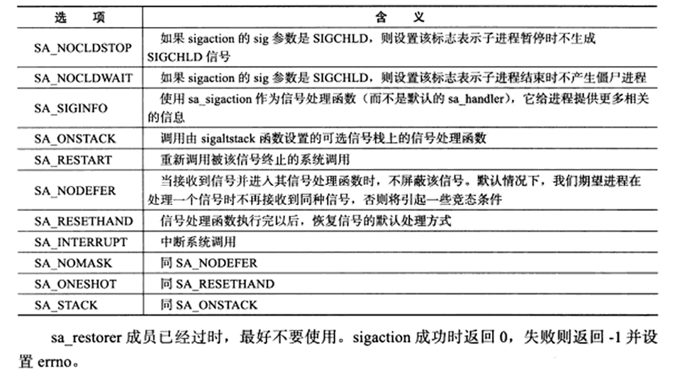
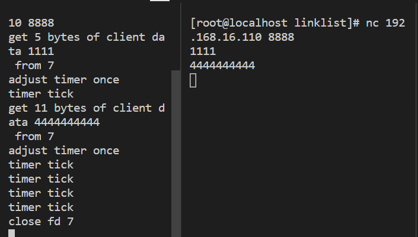

这次来学习基于升序链表的定时器。

### 定时器架构

定时器至少包含一个超时时间和一个任务回调函数，使用双向链表来串联所有的定时器。

先定义一个客户端信息结构体，用来存储sockfd和定时器等。

```c++
struct client_data
{
    sockaddr_in address;   //客户端socket地址
    int socket;            //socket文件描述符
    char buf[BUFFER_SIZE]; //读缓存
    util_timer *timer;     //定时器（提前声明）
};
```

定义一个定时器结构体，包含任务的超时时间（绝对时间），函数指针，客户端数据，前后指针。

```c++
class util_timer
{
public:
    util_timer() : prev(NULL), next(NULL) {}

public:
    time_t expire; //任务的超时时间，用绝对时间
    //函数指针
    void (*cb_func)(client_data *); //任务回调函数
    //回调函数处理的客户数据，由定时器传递给回调函数
    client_data *user_data;
    util_timer *prev; //指向前一个
    util_timer *next; //指向后一个
};
```

这里的回调函数是函数指针类型，返回值类型 (* 指针变量名)(参数列表);格式 

指针cb_func指向返回值是void，参数是client_data*的函数，被赋值函数后，可以通过这个指针调用指向的函数。主要是为了将架构和业务代码解耦，架构中的回调函数统一使用cb_func，但回调函数指向的业务处理函数可以更改，不用修改架构中的代码。

指针函数是函数，返回值是指针类型比如void* handler(int arg);是返回值void*类型的函数。

在刚才的client_data和util_timer里可以发现，他们互相持有对方的指针(双向绑定)，是为了在不同的场景下可以快速找到对方。

比如客户端发来了数据，客户端主动断开连接场景下，可以通过client_data快速找到对应的定时器，不用遍历链表查找。

比如定时器超时，需要执行回调函数，直接把自己存储的client_data传给cb_func就可以，如果不存就不知道关哪个客户端。

下面看定时器链表的代码

```c++
//定时器链表，是一个升序，双向链表，带有头结点和尾节点
class sort_timer_lst
{
public:
  sort_timer_lst():head(NULL),tail(NULL){}
  //链表被销毁时，删除里面所有定时器
  ~sort_timer_lst()
  {
      util_timer*tmp=head;
      while(tmp)
      {
          head = tmp->next;
          delete tmp;
          tmp = head;
      }
  }

  //将目标定时器timer添加到链表中
  void add_timer(util_timer* timer)
  {
      if(!timer)
      {//timer为空返回
          return;
      }
      if(!head)
      {//链表为空
          head = tail = timer;
          return;
      }

      //如果timer的超时时间小于链表中的所有定时器的超时时间，把timer插入头部，否则
      //调用重载函数add_timer(timer,lst_head)把它插入合适位置，保证链表的升序
      if(timer->expire<head->expire)
      {
          timer->next = head;
          head->prev= timer;
          head =timer;
          return;
      }
      add_timer(timer,head);
  }

  //当某个定时任务发生变化时，调整timer的位置，这个函数只考虑timer超时时间延长情况，即timer只往链表尾部移动
  void adjust_timer(util_timer* timer)
  {
      if(!timer) return;//timer为空
      util_timer*tmp = timer->next;
      //如果timer在尾部，或timer的超时值仍小于下一个timer则不用调整
      if(!tmp||(timer->expire<tmp->expire)) return;

      //如果目标定时器是链表的头结点，则将定时器从链表取出重新插入链表
      if(timer==head)
      {
          head=head->next;
          head->prev = NULL;
          timer->next = NULL;
          add_timer(timer,head);
      }else
      {//如果timer不是头结点，从链表取出，插入原来位置的后面部分链表中
         timer->prev->next = timer->next;
         timer->next->prev = timer->prev;
         add_timer(timer,timer->next);
      }
  }

  //将timer从链表中删除
  void del_timer(util_timer* timer)
  {
      if(!timer) return;//为空
      if((timer==head)&&(timer==tail))//链表中只有一个定时器
      {
          delete timer;
          head=NULL;
          tail = NULL;
          return;
      }

      //如果链表中有至少两个定时器，且timer是头结点，则将头结点设置为timer的下一个
      if(timer == head)
      {
          head = head->next;
          head->prev = NULL;
          delete timer;
          return;
      }
      //如果链表有至少两个定时器，且timer是尾节点，则将尾节点设为timer前一个节点
      if(timer == tail)
      {
          tail = tail->prev;
          tail->next = NULL;
          delete timer;
          return;
      }
      //如果timer位于中间，把它前后的定时器连起来
      timer->prev->next = timer->next;
      timer->next->prev = timer->prev;
      delete timer;
  }

  //SIGALRM信号每次被触发就在处理信号函数里执行一次tick函数，处理链表中到期任务
  void tick()
  {
      if(!head) return;
      printf("timer tick\n");
      time_t cur = time(NULL);//获得系统当前时间
      util_timer*tmp = head;
      //从头节点开始遍历，直到遇到一个未到期的定时器
      while(tmp)
      {
          //因为每个定时器都是用绝对时间做值，所以可以直接比较timer的超时值和cur
          if(cur<tmp->expire) break;//未超时
          //调用定时器的回调函数，执行定时任务
          tmp->cb_func(tmp->user_data);//传入客户数据
          head = tmp->next;
          if(head) 
          {
              head->prev = NULL;
          }
          delete tmp;
          tmp = head;
      }
  }

  private:
   //重载辅助函数add_timer，将timer添加到当前位置的后面部分链表中
   void add_timer(util_timer* timer,util_timer*lst_head)
   {
     util_timer* prev=lst_head;
     util_timer* tmp = prev->next;
     //遍历lst_head节点之后的部分链表，直到找到一个超时时间大于timer的节点，将timer插入该节点前
     while(tmp)
     {
         if(timer->expire<tmp->expire)
         {
             prev->next =timer;
             timer->next = tmp;
             tmp->prev = timer;
             timer->prev = prev;
             break;
         }
         prev = tmp;
         tmp = tmp->next;
     }
    //如果遍历完lst_head之后的链表，仍然找不到，就把timer作为尾节点
    if(!tmp)
    {
        prev->next = timer;
        timer->prev = prev;
        timer->next = NULL;
        tail = timer;
    }
   }
private:
   util_timer*head;
   util_timer*tail;
};
```

这个函数里大部分都是链表的基础操作，不过多赘述，挑些关键的来看下。

在add_timer函数里遍历链表中超时时间小于timer的，如果能找到直接插入，否则调用add_timer的重构函数，插入尾部。

如果客户端发来消息，需要延长超时时间，就调用adjust_timer，将定时器调整到链表合适的位置。

如果客户端下线或者超时，调用del_timer函数，将timer从链表中删除。

当服务器的SIGALRM信号触发时(每隔5秒)，就会调用一次tick，检查链表中是否有超时的timer。

在adjust_timer中，因为timer延时一定会插入在原来位置的后面，所以调用add_timer的重载函数，传入timer和当前的下一个位置。


### 服务器使用定时器

通过alarm设置5秒触发一次SIGALRM信号，调用信号的回调函数，通过管道发送对应信号，在epoll_wait处阻塞等待检查链表是否有超时timer，当客户端超时或断开链接等情况分别调用对应函数。

具体先来看信号处理函数这一块

```c++
void sig_handler(int sig)
{
    int save_errno = errno;//存储原来的errno,因为 send 函数可能修改 errno
    int msg =sig;//把信号编号存为变量
    send(pipefd[1],(char*)&msg,1,0);//往管道写端发送信号编码
    errno=save_errno;//恢复 errno，保证不影响主程序的错误处理
}

void addsig(int sig)
{
    struct sigaction sa;//定义信号配置结构体
    memset(&sa,'\0',sizeof(sa));//清空结构体内存，避免脏数据
    sa.sa_handler=sig_handler;//信号触发时，操作系统自动调用 sig_handler
    sa.sa_flags |= SA_RESTART;//防止程序因为信号中断报错，被打断就重启
    sigfillset(&sa.sa_mask);//处理当前信号时，屏蔽所有其他信号
    assert(sigaction(sig,&sa,NULL)!=-1);//将配置应用到信号 sig
}
```

在主程序中，通过addsig函数注册SIGALRM(闹钟信号),SIGTERM(关闭信号)。

sigaction系统调用类似于signal，但比signal更健壮。

```c++
#include <signal.h>
int sigaction( int sig, const struct sigaction* act, struct sigaction* oact );
//sig 参数指出要捕获的信号类型
//act 参数指定新的信号处理方式
//oact 参数则输出信号先前的处理方式（如果不为 NULL 的话）
```

act 和 oact 都是 sigaction 结构体类型的指针，sigaction 结构体描述了信号处理的细节,定义如下

```c++
struct sigaction
{
#ifdef __USE_POSIX199309
  union
  {
    _sighandler_t sa_handler;
      //回调函数
    void (*sa_sigaction) ( int, siginfo_t*, void* );
  }
  _sigaction_handler;
# define sa_handler    _sigaction_handler.sa_handler
# define sa_sigaction  _sigaction_handler.sa_sigaction
#else
  _sighandler_t sa_handler;
#endif

  _sigset_t sa_mask;
  int sa_flags;
  void (*sa_restorer) (void);
};
 //该结构体中的 sa_handler 成员指定信号处理函数。
//sa_mask 成员设置进程的信号掩码,以指定哪些信号不能发送给本进程
//sa_mask 是信号集 sigset_t类型，该类型指定一组信号。
//sa_flags 成员用于设置程序收到信号时的行为
```

其中sa_flags参数如下，在addsig函数中sa_flags设为SA_RESTART，被信号打断的系统调用(epoll_wait等)会自动重新启动。



在sa设置的回调函数sig_handler中，通过管道通知应用程序。

因为信号是异步中断，直接处理会导致程序乱数据等(比如timer_lst.tick()会修改链表，是非可重入函数)，通过管道将不安全的异步信号变为安全的IO事件，交给epoll统一管理。

```c++
void timer_handler()
{
    //定时处理任务，实际上就是使用tick函数
    timer_lst.tick();
    //因为一次alarm调用只会引起一次SIGALRM信号，所以要重新定时
    alarm(TIMESLOT);
}
```

当epoll_wait检测到管道的SIGALRM信号后，会执行timer_handler函数处理超时的timer并重设alarm。

```c++
//定时器回调函数，它删除非活动链接socket上的注册事件，并关闭fd
void cb_func(client_data*user_data)
{
    epoll_ctl(epollfd,EPOLL_CTL_DEL,user_data->socket,0);
    assert(user_data);
    close(user_data->socket);
    printf("close fd %d\n",user_data->socket);
}
```

在新客户端链接时，将这个回调函数注册到client_data里，在timer检测到超时后，调用回调函数，删除epoll注册事件，关闭fd。

在main函数中创建全双工无名管道，设置管道写端非阻塞并注册到epoll里。通过addsig捕获SIGALRM和SIGTERM信号。

创建用户信息数组users，设置alarm定时信号。

```c++
  //...很多代码
  epoll_event events[MAX_EVENT_NUMBER];
  epollfd = epoll_create(5);
   assert(epollfd!=-1);
   addfd(epollfd,listenfd);
 
 //创建全双工无名管道
   ret = socketpair(PF_UNIX,SOCK_STREAM,0,pipefd);
  assert(ret != -1);
  //避免信号处理函数阻塞
  setnonblocking(pipefd[1]);
  addfd(epollfd,pipefd[0]);
  
  //设置信号处理函数
  //闹钟定时信号
  addsig(SIGALRM);
  //程序终止信号
  addsig(SIGTERM);
  bool stop_server = false;
  
  //用户信息数组
  client_data* users = new client_data[FD_LIMIT];
  bool timeout = false;
  alarm(TIMESLOT);//定时

//很多代码...
```

##### epoll触发事件

新的客户端链接：就添加到用户信息数组users里，创建定时器，将前面创建的负责检查超时timer的回调函数赋值给cb_func，设置expire为当前时间+15秒的绝对时间。并进行双向绑定，添加到链表中。

```c++
          int sockfd = events[i].data.fd;
          //处理新到的客户链接
          if(sockfd == listenfd)
          {
              struct sockaddr_in client_address;
              socklen_t client_addrlength = sizeof(client_address);
              int connfd = accept(listenfd,(struct sockaddr*)&client_address,&client_addrlength);
              
              addfd(epollfd,connfd);
              users[connfd].address = client_address;
              users[connfd].socket=connfd;

              //创建定时器，设置回调函数和超时时间，绑定定时器与用户数据，添加到timer链表中
              util_timer* timer = new util_timer;
              timer->user_data = &users[connfd];
              timer->cb_func = cb_func;//设置回调函数
              time_t cur = time(NULL);
              //设置定时器的【超时时间】= 当前时间 + 15秒
              timer->expire = cur+3*TIMESLOT;
              //让客户端数据记录自己的定时器
              users[connfd].timer = timer;
              timer_lst.add_timer(timer);
```

管道的读事件：将信号赋给signals数组接收，遍历所有触发的信号。如果是SIGALRM就标记定时任务在最后处理，如果是SIGTERM就优雅关闭服务器。

```c++
          }else if((sockfd == pipefd[0])&&(events[i].events&EPOLLIN))
          {
              int sig;
              char signals[1024];
              ret = recv(pipefd[0],signals,sizeof(signals),0);
              if(ret == -1)
              {
                  continue;//出错
              }
              else if(ret == 0)
              {
                  continue;
              }
              else{
                  for(int i=0;i<ret;i++)
                  {
                      switch(signals[i])
                      {
                          case SIGALRM:
                          {//用timeout标记有定时任务，因为定时任务优先级不高，优先处理别的
                              timeout = true;
                              break;
                          }
                          case SIGTERM:
                          {
                              stop_server = true;
                          }
                      }
                  }
              }
```

客户端读事件：如果接收数据错误或者客户端下线就调用cb_func回调函数，并移除定时器。如果正常接收消息，就延长对应timer的expire时间并调用adjust_timer函数调整。

```c++
          } else if(events[i].events&EPOLLIN)
           {
                memset(users[sockfd].buf,'\0',BUFFER_SIZE);
                ret = recv(sockfd,users[sockfd].buf,BUFFER_SIZE-1,0);
                printf("get %d bytes of client data %s from %d\n",ret,users[sockfd].buf,sockfd);
                util_timer* timer = users[sockfd].timer;
                if(ret < 0)
                {
                    //发生错误，关闭连接并移除定时器
                    if(errno!=EAGAIN)
                    {
                       cb_func(&users[sockfd]);
                       if(timer){
                           timer_lst.del_timer(timer);
                       }
                    }
                }else if(ret == 0)
                {//对端关闭连接，这边也关闭连接，并移除对应定时器
                    cb_func(&users[sockfd]);
                    if(timer)
                    {
                        timer_lst.del_timer(timer);
                    }
                }
                else{
                    //如果某个客户连接有数据可读，也需要调整对应的timer，延迟关闭的时间
                    if(timer)
                    {
                        time_t cur = time(NULL);
                        timer->expire = cur + 3*TIMESLOT;
                        printf("adjust timer once\n");
                        timer_lst.adjust_timer(timer);
                    }
                }

           }
```

在最后处理定时事件，如果timeout为true，就调用timer_handler，用tick处理超时timer，并重新alarm定时。

```c++
        //最后处理定时事件，因为IO事件优先级更高
      if(timeout){
          timer_handler();
          timeout = false;
      }
```



### 完整可运行代码

**lst_timer.h**

```c++
#ifndef LST_TIMER
#define LST_TIMER

#include <time.h>
#include <sys/socket.h>
#include <netinet/in.h>
#include <arpa/inet.h>
#include <assert.h>
#include <stdio.h>
#include <unistd.h>
#include <stdlib.h>
#include <errno.h>
#include <string.h>
#include <sys/types.h>
#include <sys/stat.h>
#include <fcntl.h>
#include <sys/sendfile.h>
#include<sys/epoll.h>
#include<pthread.h>
#include <signal.h>
#define BUFFER_SIZE 64

class util_timer; //提前声明

struct client_data
{
    sockaddr_in address;   //客户端socket地址
    int socket;            //socket文件描述符
    char buf[BUFFER_SIZE]; //读缓存
    util_timer *timer;     //定时器
};

// 定时器类

class util_timer
{
public:
    util_timer() : prev(NULL), next(NULL) {}

public:
    time_t expire; //任务的超时时间，用绝对时间
    //函数指针
    void (*cb_func)(client_data *); //任务回调函数
    //回调函数处理的客户数据，由定时器传递给回调函数
    client_data *user_data;
    util_timer *prev; //指向前一个
    util_timer *next; //指向后一个
};

//定时器链表，是一个升序，双向链表，带有头结点和尾节点
class sort_timer_lst
{
public:
  sort_timer_lst():head(NULL),tail(NULL){}
  //链表被销毁时，删除里面所有定时器
  ~sort_timer_lst()
  {
      util_timer*tmp=head;
      while(tmp)
      {
          head = tmp->next;
          delete tmp;
          tmp = head;
      }
  }

  //将目标定时器timer添加到链表中
  void add_timer(util_timer* timer)
  {
      if(!timer)
      {//timer为空返回
          return;
      }
      if(!head)
      {//链表为空
          head = tail = timer;
          return;
      }

      //如果timer的超时时间小于链表中的所有定时器的超时时间，把timer插入头部，否则
      //调用重载函数add_timer(timer,lst_head)把它插入合适位置，保证链表的升序
      if(timer->expire<head->expire)
      {
          timer->next = head;
          head->prev= timer;
          head =timer;
          return;
      }
      add_timer(timer,head);
  }

  //当某个定时任务发生变化时，调整timer的位置，这个函数只考虑timer超时时间延长情况，即timer只往链表尾部移动
  void adjust_timer(util_timer* timer)
  {
      if(!timer) return;//timer为空
      util_timer*tmp = timer->next;
      //如果timer在尾部，或timer的超时值仍小于下一个timer则不用调整
      if(!tmp||(timer->expire<tmp->expire)) return;

      //如果目标定时器是链表的头结点，则将定时器从链表取出重新插入链表
      if(timer==head)
      {
          head=head->next;
          head->prev = NULL;
          timer->next = NULL;
          add_timer(timer,head);
      }else
      {//如果timer不是头结点，从链表取出，插入原来位置的后面部分链表中
         timer->prev->next = timer->next;
         timer->next->prev = timer->prev;
         add_timer(timer,timer->next);
      }
  }

  //将timer从链表中删除
  void del_timer(util_timer* timer)
  {
      if(!timer) return;//为空
      if((timer==head)&&(timer==tail))//链表中只有一个定时器
      {
          delete timer;
          head=NULL;
          tail = NULL;
          return;
      }

      //如果链表中有至少两个定时器，且timer是头结点，则将头结点设置为timer的下一个
      if(timer == head)
      {
          head = head->next;
          head->prev = NULL;
          delete timer;
          return;
      }
      //如果链表有至少两个定时器，且timer是尾节点，则将尾节点设为timer前一个节点
      if(timer == tail)
      {
          tail = tail->prev;
          tail->next = NULL;
          delete timer;
          return;
      }
      //如果timer位于中间，把它前后的定时器连起来
      timer->prev->next = timer->next;
      timer->next->prev = timer->prev;
      delete timer;
  }

  //SIGALRM信号每次被触发就在处理信号函数里执行一次tick函数，处理链表中到期任务
  void tick()
  {
      if(!head) return;
      printf("timer tick\n");
      time_t cur = time(NULL);//获得系统当前时间
      util_timer*tmp = head;
      //从头节点开始遍历，直到遇到一个未到期的定时器
      while(tmp)
      {
          //因为每个定时器都是用绝对时间做值，所以可以直接比较timer的超时值和cur
          if(cur<tmp->expire) break;//未超时
          //调用定时器的回调函数，执行定时任务
          tmp->cb_func(tmp->user_data);//传入客户数据
          head = tmp->next;
          if(head) 
          {
              head->prev = NULL;
          }
          delete tmp;
          tmp = head;
      }
  }

  private:
   //重载辅助函数add_timer，将timer添加到当前位置的后面部分链表中
   void add_timer(util_timer* timer,util_timer*lst_head)
   {
     util_timer* prev=lst_head;
     util_timer* tmp = prev->next;
     //遍历lst_head节点之后的部分链表，直到找到一个超时时间大于timer的节点，将timer插入该节点前
     while(tmp)
     {
         if(timer->expire<tmp->expire)
         {
             prev->next =timer;
             timer->next = tmp;
             tmp->prev = timer;
             timer->prev = prev;
             break;
         }
         prev = tmp;
         tmp = tmp->next;
     }
    //如果遍历完lst_head之后的链表，仍然找不到，就把timer作为尾节点
    if(!tmp)
    {
        prev->next = timer;
        timer->prev = prev;
        timer->next = NULL;
        tail = timer;
    }
   }
private:
   util_timer*head;
   util_timer*tail;
};

#endif
```

**main.cpp**

```c++
#include "lst_timer.h"

using namespace std;
#define FD_LIMIT 65535
#define MAX_EVENT_NUMBER 1024
#define TIMESLOT 5
static int pipefd[2];

//利用升序链表来管理定时器
static sort_timer_lst timer_lst;
static int epollfd =0;

int setnonblocking(int fd)
{
    int old_option = fcntl(fd,F_GETFL);
    int new_option = old_option | O_NONBLOCK;
    fcntl(fd,F_SETFL,new_option);
    return old_option;
}

void addfd(int epollfd,int fd)
{
    epoll_event event;
    event.data.fd = fd;
    event.events = EPOLLIN|EPOLLET;
    epoll_ctl(epollfd,EPOLL_CTL_ADD,fd,&event);
    setnonblocking(fd);
}

void sig_handler(int sig)
{
    int save_errno = errno;
    int msg =sig;
    send(pipefd[1],(char*)&msg,1,0);
    errno=save_errno;
}

void addsig(int sig)
{
    struct sigaction sa;
    memset(&sa,'\0',sizeof(sa));
    sa.sa_handler=sig_handler;
    sa.sa_flags |= SA_RESTART;
    sigfillset(&sa.sa_mask);
    assert(sigaction(sig,&sa,NULL)!=-1);
}

void timer_handler()
{
    //定时处理任务，实际上就是使用tick函数
    timer_lst.tick();
    //因为一次alarm调用只会引起一次SIGALRM信号，所以要重新定时
    alarm(TIMESLOT);
}

//定时器回调函数，它删除非活动链接socket上的注册事件，并关闭fd
void cb_func(client_data*user_data)
{
    epoll_ctl(epollfd,EPOLL_CTL_DEL,user_data->socket,0);
    assert(user_data);
    close(user_data->socket);
    printf("close fd %d\n",user_data->socket);
}

int main(int argc,char*argv[])
{
   if(argc<=2)
   {
       printf("argc error\n");
       return -1;
   }
   const char*ip = argv[1];
   int port =atoi(argv[2]);

   int ret =0;
   struct sockaddr_in address;
   bzero(&address,sizeof(address));
   address.sin_family = AF_INET;
   inet_pton(AF_INET,ip,&address.sin_addr);
   address.sin_port=htons(port);

   int listenfd = socket(PF_INET,SOCK_STREAM,0);
   assert(listenfd>=0);

   ret = bind(listenfd,(struct sockaddr*)&address,sizeof(address));
   assert(ret != -1);

   ret =listen(listenfd,5);
   assert(ret != -1);

   epoll_event events[MAX_EVENT_NUMBER];
   epollfd = epoll_create(5);
   assert(epollfd!=-1);
   addfd(epollfd,listenfd);
 
 //创建全双工无名管道
   ret = socketpair(PF_UNIX,SOCK_STREAM,0,pipefd);
  assert(ret != -1);
  //避免信号处理函数阻塞
  setnonblocking(pipefd[1]);
  addfd(epollfd,pipefd[0]);
  
  //设置信号处理函数
  //闹钟定时信号
  addsig(SIGALRM);
  //程序终止信号
  addsig(SIGTERM);
  bool stop_server = false;
  
  //用户信息数组
  client_data* users = new client_data[FD_LIMIT];
  bool timeout = false;
  alarm(TIMESLOT);//定时

  while(!stop_server)
  {
      int number = epoll_wait(epollfd,events,MAX_EVENT_NUMBER,-1);
      if((number<0)&&(errno!=EINTR))
      {
          printf("epoll failture\n");
          break;
      }

      for(int i=0;i<number;i++)
      {
          int sockfd = events[i].data.fd;
          //处理新到的客户链接
          if(sockfd == listenfd)
          {
              struct sockaddr_in client_address;
              socklen_t client_addrlength = sizeof(client_address);
              int connfd = accept(listenfd,(struct sockaddr*)&client_address,&client_addrlength);
              
              addfd(epollfd,connfd);
              users[connfd].address = client_address;
              users[connfd].socket=connfd;

              //创建定时器，设置回调函数和超时时间，绑定定时器与用户数据，添加到timer链表中
              util_timer* timer = new util_timer;
              timer->user_data = &users[connfd];
              timer->cb_func = cb_func;//设置回调函数
              time_t cur = time(NULL);
              //设置定时器的【超时时间】= 当前时间 + 15秒
              timer->expire = cur+3*TIMESLOT;
              //让客户端数据记录自己的定时器
              users[connfd].timer = timer;
              timer_lst.add_timer(timer);
          }else if((sockfd == pipefd[0])&&(events[i].events&EPOLLIN))
          {
              int sig;
              char signals[1024];
              ret = recv(pipefd[0],signals,sizeof(signals),0);
              if(ret == -1)
              {
                  continue;//出错
              }
              else if(ret == 0)
              {
                  continue;
              }
              else{
                  for(int i=0;i<ret;i++)
                  {
                      switch(signals[i])
                      {
                          case SIGALRM:
                          {//用timeout标记有定时任务，因为定时任务优先级不高，优先处理别的
                              timeout = true;
                              break;
                          }
                          case SIGTERM:
                          {
                              stop_server = true;
                          }
                      }
                  }
              }

          } else if(events[i].events&EPOLLIN)
           {
                memset(users[sockfd].buf,'\0',BUFFER_SIZE);
                ret = recv(sockfd,users[sockfd].buf,BUFFER_SIZE-1,0);
                printf("get %d bytes of client data %s from %d\n",ret,users[sockfd].buf,sockfd);
                util_timer* timer = users[sockfd].timer;
                if(ret < 0)
                {
                    //发生错误，关闭连接并移除定时器
                    if(errno!=EAGAIN)
                    {
                       cb_func(&users[sockfd]);
                       if(timer){
                           timer_lst.del_timer(timer);
                       }
                    }
                }else if(ret == 0)
                {//对端关闭连接，这边也关闭连接，并移除对应定时器
                    cb_func(&users[sockfd]);
                    if(timer)
                    {
                        timer_lst.del_timer(timer);
                    }
                }
                else{
                    //如果某个客户连接有数据可读，也需要调整对应的timer，延迟关闭的时间
                    if(timer)
                    {
                        time_t cur = time(NULL);
                        timer->expire = cur + 3*TIMESLOT;
                        printf("adjust timer once\n");
                        timer_lst.adjust_timer(timer);
                    }
                }

           }
           else
           {
               //other
           }
      }
        //最后处理定时事件，因为IO事件优先级更高
      if(timeout){
          timer_handler();
          timeout = false;
      }
  }
  close(listenfd);
  close(pipefd[1]);
  close(pipefd[0]);
  delete [] users;
  return 0;
}

 
```

