Source Insight 是一款专业的源代码阅读与查看工具，非常适合用来研读开源项目代码、梳理函数调用关系、查看类与接口关联等。

安装完成后，打开软件即可进入软件主页面：

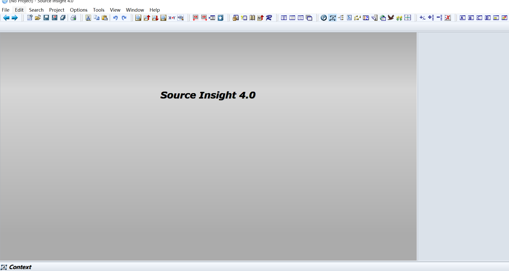

## 一、新建代码工程

点击顶部菜单栏 `Project` 选项，开始新建代码工程：

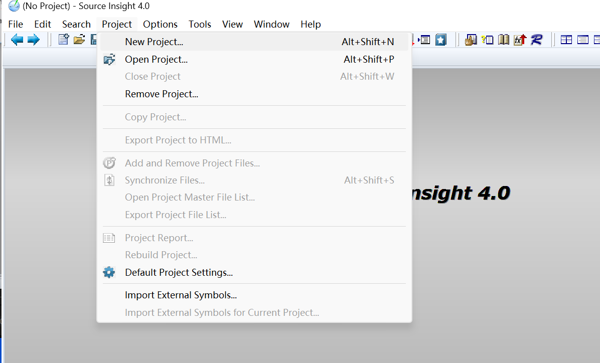

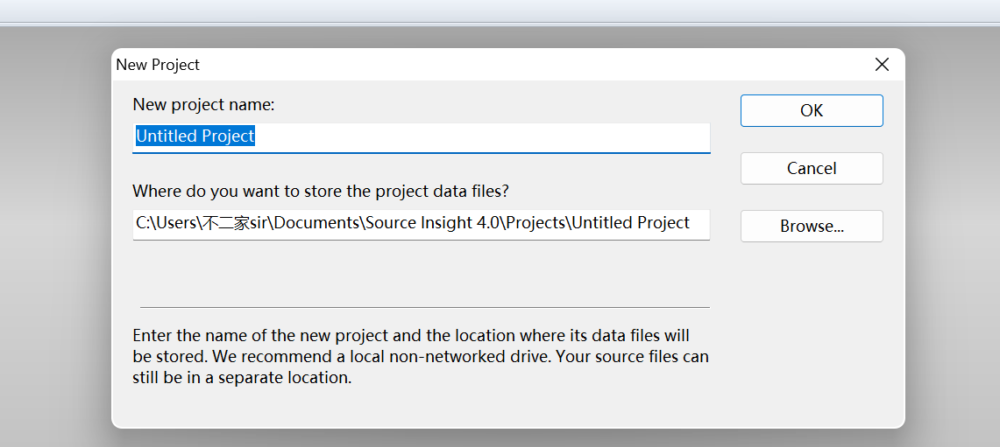

**工程存放小建议**：建议一个源码项目单独对应一个工程路径。可以在源码同级目录下，新建一个 `insight` 专用文件夹，用来存放 Source Insight 工程相关文件，方便后续管理。

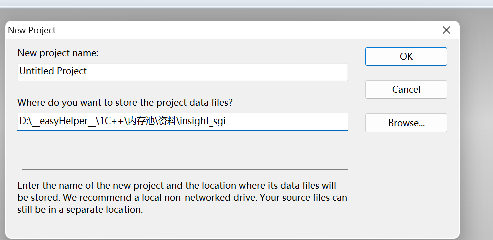

后续页面直接点击 `OK` 确认，进入文件添加界面：

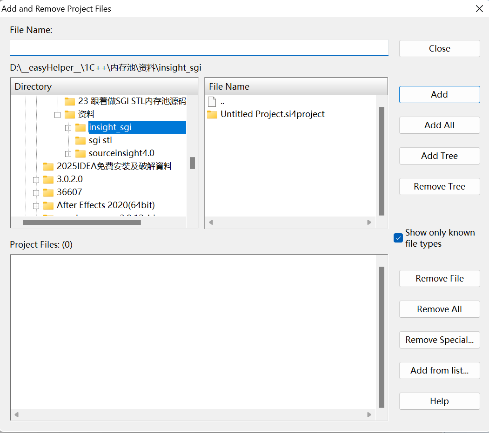

## 二、导入源码文件

选中开源代码的**顶级根目录**，点击右侧 `Add Tree` 按钮，软件会自动扫描并提示即将添加到工程的文件总数。

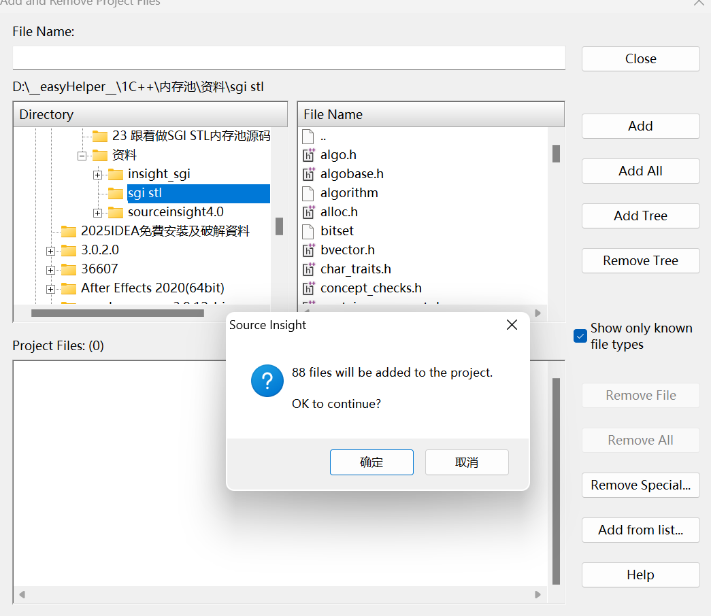

文件添加完成后，点击 `Close` 关闭当前窗口，再找到工具栏的 `Sync` 同步按钮进行工程同步。

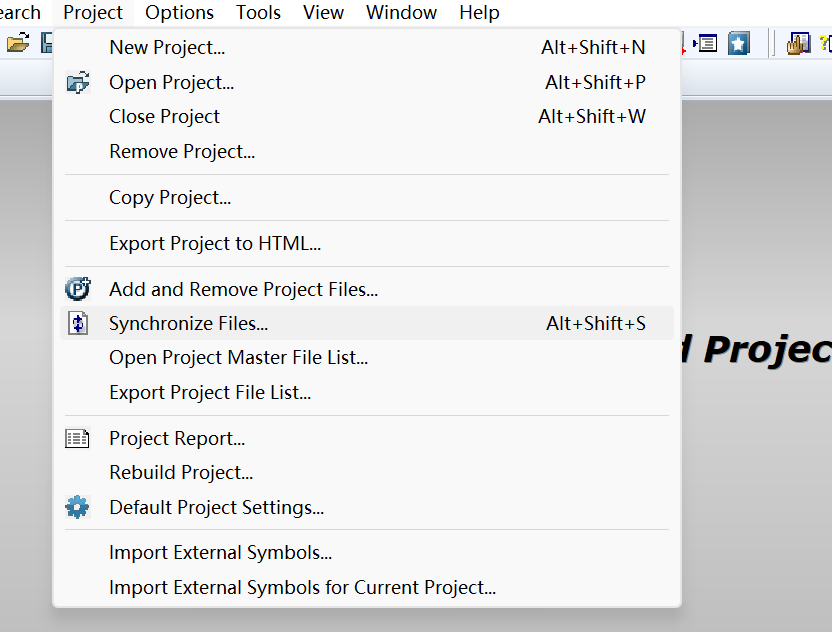

同步完成后，在 Source Insight 内对代码做的编辑修改，会直接同步生效到本地原始源码文件中。

## 三、常用面板功能

点击软件右侧的「P」图标，可展开文件目录面板，会展示项目下所有源文件、头文件，也支持直接检索定位指定文件。

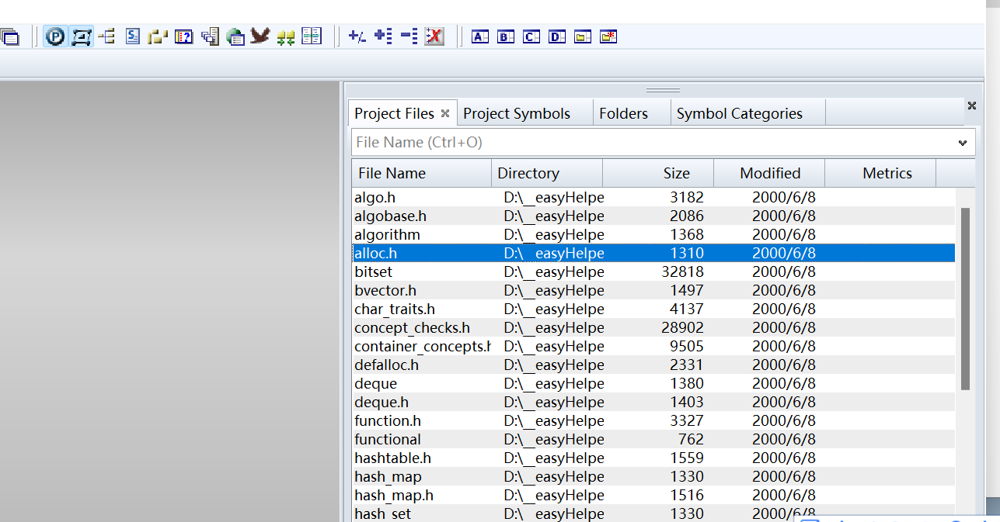

若软件默认无法识别部分自定义后缀的代码文件，可通过顶部菜单栏 `Option` → `File Type Options`，手动添加对应文件类型的解析规则。

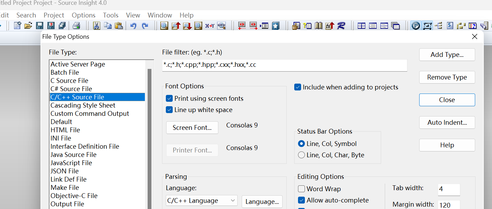

软件左侧面板，会实时展示当前打开文件依赖的头文件、定义的类、结构体、宏定义等结构信息。

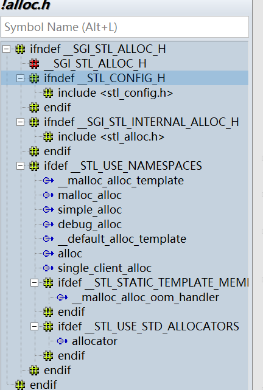

软件右侧检索面板，支持快速全局搜索项目内任意函数、变量、接口定义。

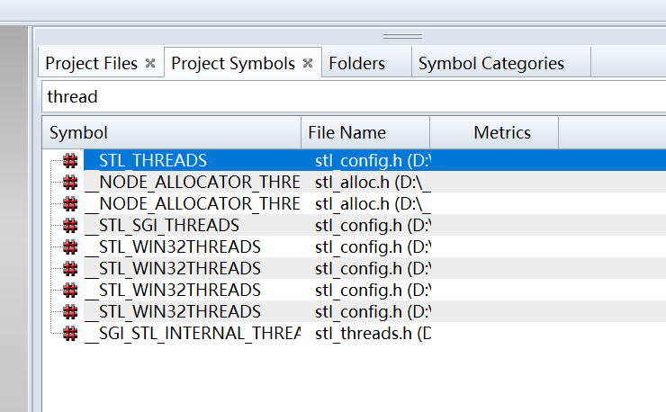

## 四、个性化设置与工程关闭

Source Insight 自定义能力很强，可在 `Options` → `Key Assignments` 中自定义快捷键，比如设置代码高亮、跳转、查找等常用操作的快捷方式。

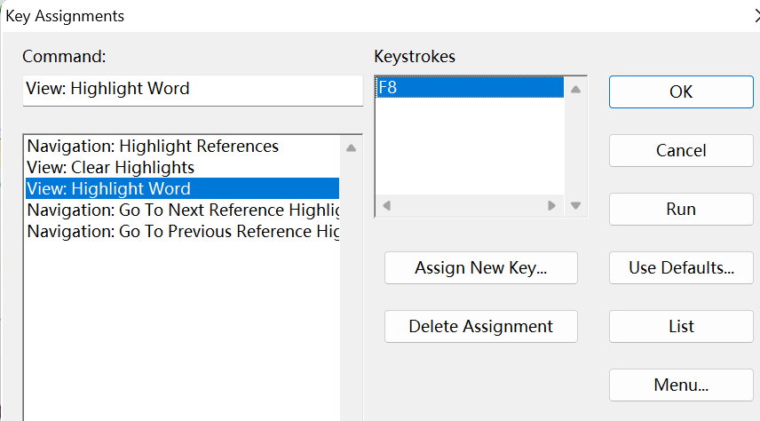

如需退出当前代码工程，可通过顶部 `Project` → `Close Project` 关闭即可。

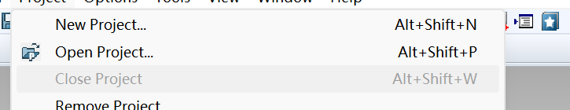

（此文档已经同步到博客）

[Source Insight 4.0 使用简易教程-CSDN博客](https://blog.csdn.net/2302_78913144/article/details/160993744?sharetype=blogdetail&sharerId=160993744&sharerefer=PC&sharesource=2302_78913144&spm=1011.2480.3001.8118)

