# C++ 模板

模板包含函数模板和类模板

## 函数模板

如果相同的函数，除了变量类型不同，其他一样，不用重复写重载函数，用模板就可以。

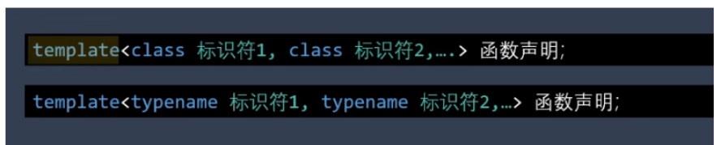

```c++
template<class T>或者template<typename T>

void swap(T&a,T&b)
{
    T temp = a;
    a = b;
    b = temp;
}
```

```c++
int a =1,b=2;
swap<int>(a,b);
```

在尖括号中写上模板类型参数 T 的值 int，编译器就会把模板代码中所有的标识符 T 替换成 int。

对于这个例子来说，由于模板只有一个参数 T，函数参数 a 与 b 的类型都是相同的。传递的实参类型也可以是相同的，可以省略尖括号里的类型参数，直接写成普通函数的形式。

当两者实参类型不同时，编译器无法自动推断出类型参数 T 的类型，就需要写出模板类型参数的值。

```c++
int a=1;
double b=1.5;
max<double> (a,b);
```

函数模板只是描述了函数的外观，并不是真正定义了函数，编译器需要对模板所描述的函数进行实例化。

这种通过调用函数来实例化函数模板的方式，叫做隐式实例化。只有需要的时候才生成对应的函数。

### 显式实例化

```c++
template float max<float>(float a,float b);
```

将函数模板的类型参数替换成要实例化的实际类型。

多个参数时，需要传递对应数量的类型：

```c++
template<class T1,class T2>
T1 max(T1 a ,T2 b){
  return a>b?a:b;
}

max<int,double> (a,b);
```

函数模板也可以重载，比如不同参数数量：

```c++
T max(T a,T b);
T max(T a,T b,T c);
```

### 显式特化模板

```c++
template<>
double max<double> (double a,double b){
 cout<<" Specilized Template function call."<<endl;
 return a>b?a:b;
}
```

在函数名之前加`template<>`，<> 没有参数。

补充：不能对于一个函数模板使用相同的类型参数，同时做显式实例化和显式特化。

当函数模板和重载函数同时存在时，调用函数又没有显式的指定模板参数，如果参数类型与重载函数完全匹配，编译器优先使用重载函数。

```c++
template<class T>
T max(T a,T b);
double max(double a,double b);
```

当参数不完全匹配时，则调用模板。

模板有三种实例化形式：隐式实例化、显式实例化、显式特化。

隐式实例化：调用时传入模板类型实参，或者通过函数实参类型推断出模板参数类型。

```c++
f<int>(3)
```

显式实例化使用关键字 template 并将函数声明中的类型参数替换成实际类型。

```c++
template void f<int>(int)
```

特化使用关键字`template<>`并将函数声明中的类型参数替换成实际类型，然后写出该函数的定义，当参数完全匹配时优先使用普通函数的重载。

------

## 类模板

与函数模板类似，也用 template 来定义

```c++
template<typename T>
class Vector3{
 private:
    T m_vec[3];
 public:
     Vector3(T v1,T v2,T v3){
       m_vec[0] = v1;
       m_vec[1] = v2;
       m_vec[2]=v3;
     }
};

Vector3<int> vec1(1,2,3);
```

如果在刚才的类中声明`T getMax();`，则类外实现写法如下：

```c++
template<typename T>
T Vector3<T>::getMax()
{
  T temp = m_vec[0]>m_vec[1]?m_vec[0]:m_vec[1];
  return temp>m_vec[2]?temp:m_vec[2];
}
```

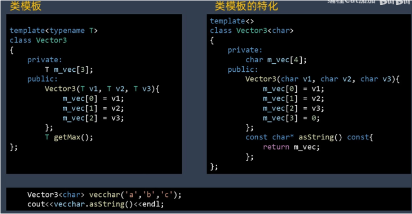

类模板也可以特化，将模板参数设为 char

类模板也可以部分特化，对于模板有多个参数的情况，可以特化其中的某个参数

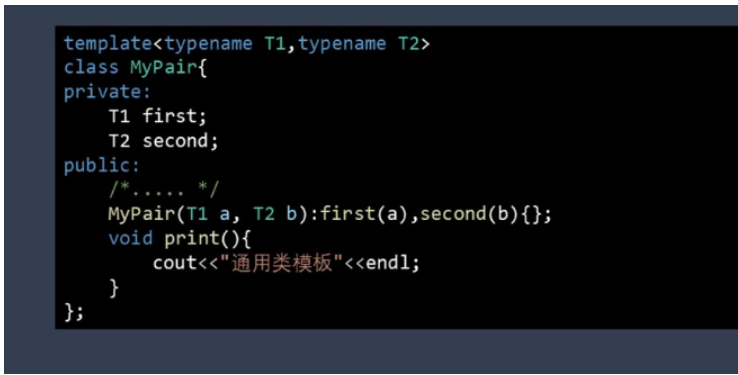

如，将 T1 全部改为 int

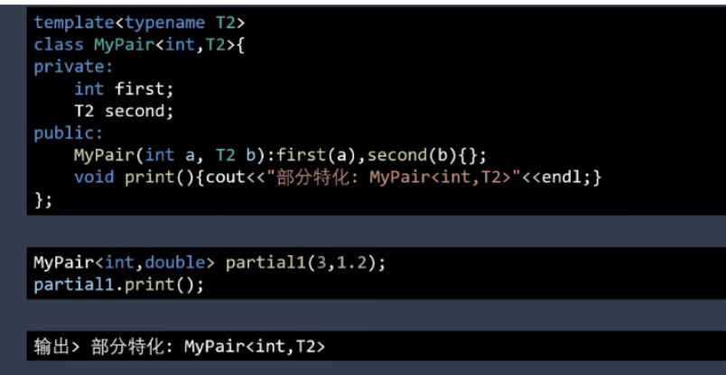

如果分别将 T1,T2 特化，调用函数，编译器会报错，无法区分

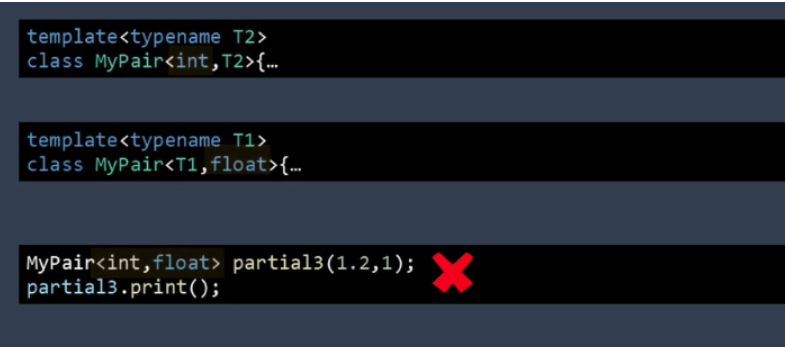

这时候需要定义一个完全特化的实例才能解决上述冲突。

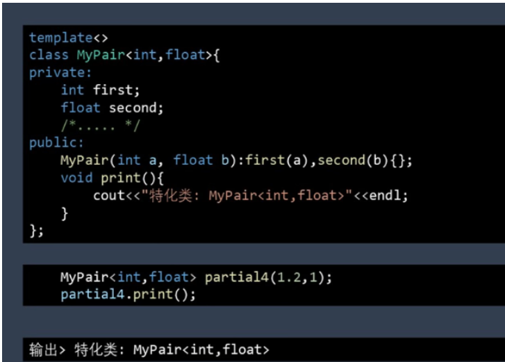

也可以类似这种，对指针进行特化

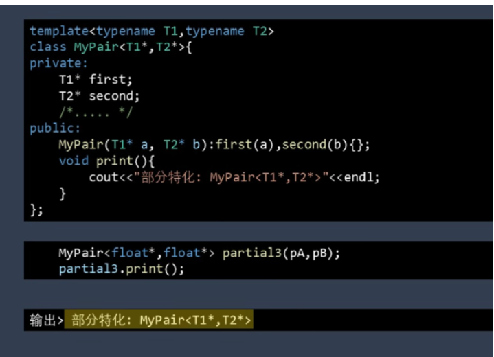

模板除了使用类型参数以外，还可以使用非类型参数。非类型参数包括整型常量，枚举以及指针。而浮点数，变量以及用户定义的其它类型是不能作为非类型模板使用的。

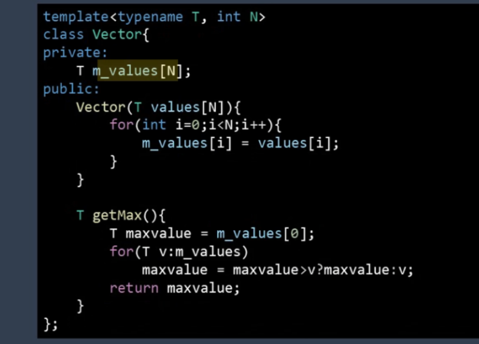

第二个传入的 int 类型的 N 必须是常量。

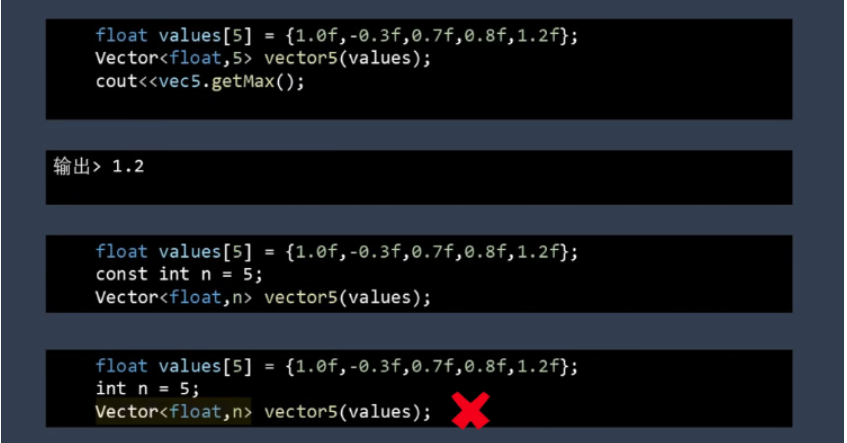

也可以给模板加上默认值，当使用时省略这两个模板参数，相当于默认 float 和 int

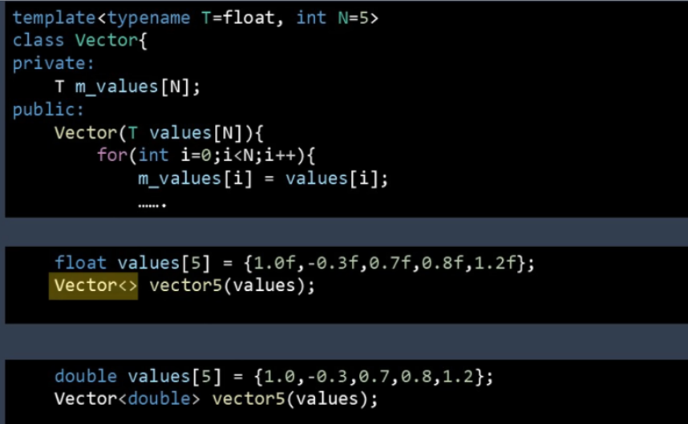

类模板的参数也可以是模板

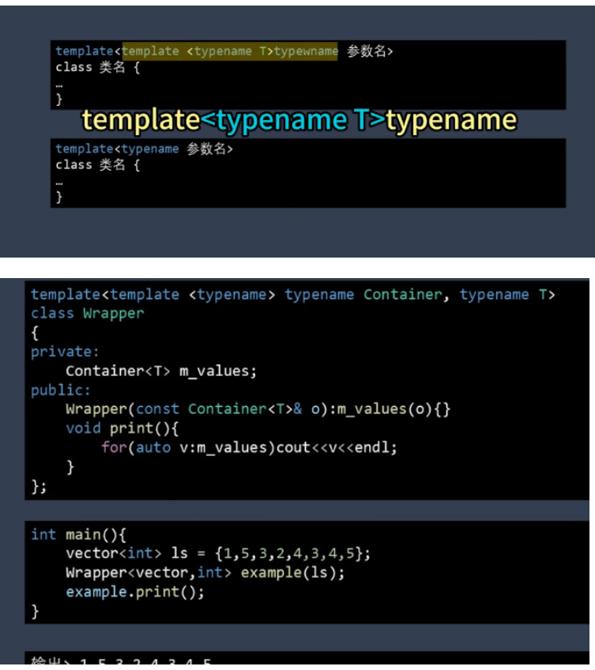

标准类中的 vector 也是类模板，这段代码就是封装了一个`vector`，也可以用 set 等。