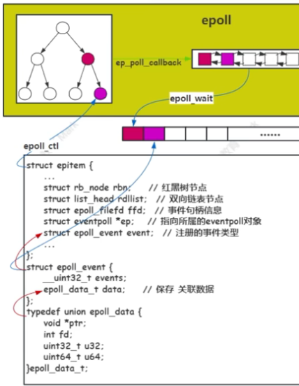

### 共同点

它们都可以拿来 IO 多路复用（一个线程通过管理和检测多个 IO 是否就绪)，且都是同步 IO (接口返回时职责完成了)。

**为什么要用 IO 多路复用呢？**

如果有很多 fd 需要检测 IO 是否就绪，就可以将检查的职责都丢给 IO 多路复用了，这样就可以更高效的处理 IO 了。

------

##### select

```c++
#include <sys/time.h>
#include <sys/types.h>
#include <unistd.h>

//所监听的最大fd+1，读事件集合，写事件集合，异常事件集合，超时参数
int select(int nfds, fd_set *readfds, fd_set *writefds,
           fd_set *exceptfds, struct timeval *timeout);

void FD_CLR(int fd, fd_set *set);  // 从集合中移除fd
int  FD_ISSET(int fd, fd_set *set); // 判断fd是否就绪
void FD_SET(int fd, fd_set *set);  // 向集合添加fd
void FD_ZERO(fd_set *set);         // 清空集合
```

------

##### poll

```c++
#include <poll.h>

//pollfd结构体数组，数组大小，超时参数
int poll(struct pollfd *fds, nfds_t nfds, int timeout);

struct pollfd {
    int    fd;         /* 待监听的文件描述符 */
    short  events;     /* 期望监听的事件 */
    short  revents;    /* 实际就绪的事件 */
};
```

------

##### epoll

```c++
#include <sys/epoll.h>

/* 操作宏：新增/修改/删除监听事件
EPOLL_CTL_ADD
EPOLL_CTL_MOD
EPOLL_CTL_DEL
*/

typedef union epoll_data {
    void        *ptr;
    int         fd;
    uint32_t    u32;
    uint64_t    u64;
} epoll_data_t;

struct epoll_event {
    uint32_t      events;    /* 监听的Epoll事件 */
    epoll_data_t  data;      /* 自定义数据（常用存fd） */
};

// 创建epoll实例，返回epoll文件描述符
int epoll_create(int size);
// epoll实例fd，操作类型，目标fd，监听事件
int epoll_ctl(int epfd, int op, int fd, struct epoll_event *event);
// epoll实例fd，用户态接收事件的数组，数组最大容量，超时参数
int epoll_wait(int epfd, struct epoll_event *events, int maxevents, int timeout);
```



在调用`epoll_create`时，会创建 epoll 实例返回 epoll fd，在内核当中，会创建两个核心结构：**红黑树** + **就绪队列**。

`epoll_ctl`主要操作的对象是红黑树，可进行增删改操作。通过`ADD`向红黑树注册一个具体的事件（读 / 写事件），同时会与网卡驱动构建**回调关系**（回调函数`ep_poll_callback`）；未来 fd 就绪时会触发回调，将红黑树中的节点移入就绪队列。`MOD/DEL`用于修改 / 删除红黑树中的节点。

通过`epoll_wait`系统调用，将内核**就绪队列**中的数据拷贝到用户态。

------

### 核心原理对比

select 跟 poll 都是**只有一个接口**，epoll 有三个接口，实际用`epoll_ctl`+`epoll_wait`实现 select/poll 的功能。

select 每次调用都需要把监听的事件集合从**用户态拷贝到内核态**，poll 也是一样；

对于 epoll 来说，仅在注册 fd 时拷贝一次数据到内核红黑树，无需重复拷贝。

select 取出就绪事件是 **O(n)** 时间复杂度，因为采用**轮询**机制；

epoll_wait 是 **O(1)** 时间复杂度，直接拷贝就绪队列的数据到用户态。

------

##### 常见读写事件

```c++
accept(listenfd,&addr,&size); // 读事件
connect(connfd,&addr,&size);  // 写事件
read(fd,buf,sz);              // 读事件
write(fd,buf,sz);             // 写事件
```

------

### 区别

##### 接口上

- select、poll 只有一个接口
- epoll 有三个核心接口；实际通过两个接口完成 select/poll 单个接口的功能

##### 传参以及返回上

- select 需要传递可读、可写、异常三个集合，返回后仍需遍历取出就绪事件
- poll 只需要传递一个结构体集合，返回后仍需遍历取出就绪事件
- epoll 通过 `epoll_ctl` 只需注册一次，`epoll_wait` 直接取出就绪事件

##### 底层实现上

- select、poll 通过**轮询**检测；select 是**固定大小位图**，poll 是**动态数组**
- epoll 通过**回调机制**，将就绪 IO 从红黑树拷贝到就绪队列

##### 管理 fd 数量上

- select 有硬限制 `FD_SETSIZE`
- poll 和 epoll 无最大 fd 限制

##### 触发机制上

- select、poll 只有**水平触发**
- epoll 支持水平触发 + 边缘触发

##### 效率上

- 少量 fd，且都比较活跃的情况下，select/poll 性能更高
- 大量 fd，且只有小部分活跃的情况下，epoll 性能更高