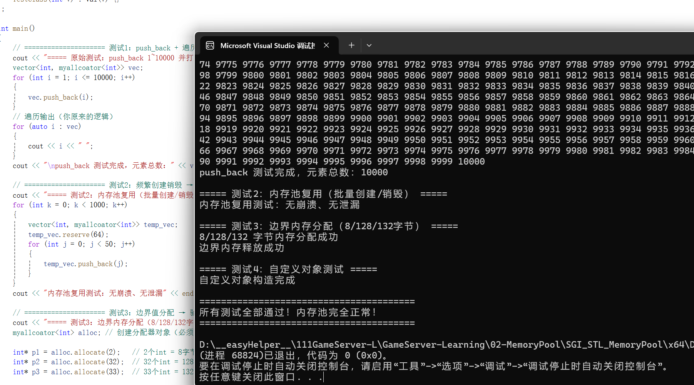

# SGI STL 内存池原理与源码详解

SGI STL 是经典的内存池实现方案，采用**一级、二级双层空间配置**协同工作。一级空间配置器专门处理**大于 128 字节的大块内存**，底层直接调用`malloc`、`free`完成内存操作；二级空间配置器负责**128 字节及以内的小块内存**，依靠自由链表搭配内存池实现高效管理。

内存池按照**8 字节**为一档依次递增划分内存块，最大划分到 128 字节为止，对应自由链表数组里：0 号下标存放 8 字节内存块、1 号下标存放 16 字节内存块，以此类推。自由链表本质就是一个指针数组，数组中每一个元素都单独挂载一条空闲内存块链表，日常通过**头删**取出空闲内存、**头插**归还使用完毕的内存块，再依靠辅助函数快速匹配对应规格链表。同时这份内存池加入了线程安全机制，也完善了内存耗尽场景下的异常处理逻辑。

使用内存池具备两大实际意义：第一，减少系统调用资源开销，`malloc`与`new`都属于底层系统调用，频繁反复申请释放内存执行效率很低；第二，有效规避内存碎片化问题。如果不使用内存池，程序长期频繁申请释放小块内存后，会产生大量零散的空闲内存碎片。就比如程序想要申请一块连续 8 字节内存，内存中左边空余 4 字节、右边空余 4 字节，整体空闲内存充足，却凑不出连续的 8 字节空间，最终导致内存资源闲置浪费。现如今市面上绝大多数商用内存池，都借鉴了 SGI STL 这套成熟设计思想，非常值得深入学习。

## 一、基础常量与核心结构体

代码中依靠`_ALIGN`、`_MAX_BYTES`、`_NFREELISTS`三个枚举常量，统一约束整个内存池的运行规则。

联合体`_Obj`是内存池设计精髓，内部包含两个成员变量：一个用于指向后续空闲内存块的指针，另一个是字符数组占位符。设计目的十分明确：空闲状态下，把内存块当作链表节点使用；内存分配给用户使用后，直接整块交给用户存储数据，全程**不产生任何额外内存开销**。很多人会疑惑`char[1]`只有一个字节为何够用，核心原因是`union`共用体的内存大小，由内部占用空间最大的成员决定，这里指针占用 8 字节，所以整块内存固定为 8 字节，`char[1]`仅仅只是用来定位内存首地址，并不会限制实际使用的内存大小。

同时代码中定义三个全局静态变量，默认初始化为空指针或者 0，主要用来记录内存池起始地址、结束地址以及整体分配总大小，在拼接内存块、划分内存空间等场景中频繁使用。自由链表数组内所有指针成员，初始化时全部置为空指针。

```cpp
	// 配置常量定义_ALIGN，_MAX_BYTES，_NFREELISTS
	enum { _ALIGN = 8 };// 内存对齐基数：按8字节对齐
	enum { _MAX_BYTES = 128 };// 小块内存最大阈值：128字节
	enum { _NFREELISTS = 16 };// 自由链表个数：128/8=16个（8/16/.../128字节）

	// 自由链表节点结构体（共用体：节省内存）
	union _Obj {
		union _Obj* _M_free_list_link; // 指向下一个空闲内存块
		char _M_client_data[1];        // 占位符，用户实际使用的内存
	};

	// 内存池全局变量
	static char* _S_start_free;    // 内存池起始地址
	static char* _S_end_free;      // 内存池结束地址
	static size_t _S_heap_size;    // 内存池总分配大小

	// 自由链表数组：16个链表，对应不同大小的内存块
	// volatile：禁止编译器优化，保证多线程可见性
	static _Obj* volatile _S_free_list[_NFREELISTS];

	// 互斥锁：保证多线程下自由链表/内存池操作安全
	static std::mutex mtx;
```


### 静态成员变量初始化

```cpp
// ==================== 静态成员变量初始化 ====================
template<typename T>
char* myallcoator<T>::_S_start_free = nullptr; // 内存池起始地址
template<typename T>
char* myallcoator<T>::_S_end_free = nullptr;   // 内存池结束地址
template<typename T>
size_t myallcoator<T>::_S_heap_size = 0;       // 内存池总大小

template<typename T>
std::mutex myallcoator<T>::mtx; // 互斥锁初始化

// 自由链表数组初始化（全为空）
template<typename T>
typename myallcoator<T>::_Obj* volatile myallcoator<T>::_S_free_list[myallcoator<T>::_NFREELISTS] =
{ nullptr, nullptr, nullptr, nullptr, nullptr, nullptr, nullptr, nullptr, nullptr, nullptr, nullptr, nullptr, nullptr, nullptr, nullptr, nullptr };
```


## 二、核心内存分配 allocate 函数

该函数接收用户需要开辟的内存字节数，自动判断选择一级配置器还是二级配置器完成分配工作。如果判定为大块内存，直接调用一级配置器内部的`allocate`方法，依托`malloc`完成内存申请；如果判定为小块内存，先借助辅助函数定位到对应的自由链表位置，取出链表头部空闲内存块。若当前目标链表没有空闲内存，就调用内存填充函数向系统申请新内存并拼接链表；若存在空闲内存块，直接通过链表头删方式取出内存，最终将空闲内存地址返回给调用者。

这里着重解释`_Obj* volatile* __my_free_list`这个二级指针：`volatile`关键字作用是禁止编译器对自由链表数据做缓存优化，在多线程并发场景下，能保证线程每次读取到的都是内存中最新的数据。`const`与`volatile`的修饰规则为：修饰符优先修饰自身左侧的数据，左侧无数据时才修饰右侧。自由链表数组中每一个元素的类型本身就是`_Obj* volatile`，想要修改这类指针类型的数据，就必须使用`_Obj* volatile*`二级指针进行操作。

```cpp
	T* allocate(size_t __n)
	{
		void* __ret = 0;
		// 大于128字节：大块内存，交给一级配置器处理
		if (__n > (size_t)_MAX_BYTES) {
			__ret = malloc_alloc::allocate(__n);
		}
		// 小于等于128字节：小块内存，使用自由链表分配
		else {
			// 获取对应大小的自由链表头指针（二级指针：用于修改链表头）
			_Obj* volatile* __my_free_list = _S_free_list + _S_freelist_index(__n);

			// 加锁：多线程安全，防止并发修改自由链表
			std::lock_guard<std::mutex> guard(mtx);

			// 取出链表头节点
			_Obj* __result = *__my_free_list;
			// 链表为空：需要重新填充内存
			if (__result == 0) __ret = _S_refill(_S_round_up(__n));
			// 链表有可用内存：摘除头节点，返回给用户
			else {
				*__my_free_list = __result->_M_free_list_link;
				__ret = __result;
			}
		}
		return (T*)__ret;
	}
```


## 三、两大辅助推导函数

### 1. 内存对齐函数 _S_round_up

这个函数的作用是把用户传入的任意字节数，向上调整为 8 的整数倍，保证所有申请的小块内存都能匹配自由链表的划分规则。对齐基数固定为 8，表达式中`~((size_t)_ALIGN - 1)`起到规整作用，7 的二进制为低位全 1（0000...0111），按位取反后低位全 0（111...1000），能够精准保留 8 的倍数数值。举个实际例子方便理解：用户申请 1 字节内存，经过运算对齐为 8 字节（8 & 111...1000 ）；申请 8 字节依旧对齐为 8 字节（8 & 111...1000 ）；申请 9 字节则对齐为 16 字节（8 & 111...1000 ），严格贴合链表内存规格。

### 2. 链表下标计算函数 _S_freelist_index

函数前半部分运算逻辑和内存对齐函数完全一致，后半部分通过整除 8 再减一的方式，换算出对应自由链表的数组下标。依旧举例推导：申请 1 字节内存对齐后为 8 字节，`8/8-1`最终得到下标 0，完美匹配 0 号 8 字节链表，所有规格内存都可以以此类推推导。

```cpp
	// ---------------- 内存对齐函数 ----------------
	// 将字节数上调到最接近的8的倍数
	static size_t _S_round_up(size_t __bytes)
	{
		return (((__bytes)+(size_t)_ALIGN - 1) & ~((size_t)_ALIGN - 1));
	}

	// ---------------- 计算自由链表下标 ----------------
	// 根据内存大小，找到对应的自由链表索引
	static size_t _S_freelist_index(size_t __bytes) {
		return (((__bytes)+(size_t)_ALIGN - 1) / (size_t)_ALIGN - 1);
	}
```


## 四、内存释放 deallocate 函数

内存释放逻辑区分两种场景：大于 128 字节的大块内存，直接调用底层`free`函数释放即可；小于等于 128 字节的小块内存，先定位到对应规格的自由链表，采用**链表头插**的方式，把使用完毕的内存块重新挂载回空闲链表中，等待下一次重复利用，同时全程加锁保证多线程释放安全。

```cpp
	// ---------------- 核心内存释放函数 ----------------
	void deallocate(void* __p, size_t __n)
	{
		// 大块内存：直接调用free
		if (__n > (size_t)_MAX_BYTES) malloc_alloc::deallocate(__p, __n);
		// 小块内存：回收至自由链表
		else {
			// 找到对应大小的自由链表
			_Obj* volatile* __my_free_list = _S_free_list + _S_freelist_index(__n);
			_Obj* __q = (_Obj*)__p;

			// 加锁：多线程安全
			std::lock_guard<std::mutex> guard(mtx);
			// 将内存块插回自由链表头部
			__q->_M_free_list_link = *__my_free_list;
			*__my_free_list = __q;
		}
	}
```


## 五、内存重分配 reallocate 函数

该函数支持内存扩容与缩容操作，旧内存尺寸大于新尺寸即为缩容，反之则为扩容。逻辑判定规则：新旧内存尺寸都超出 128 字节阈值，说明不属于内存池管理内存，直接调用系统`realloc`调整空间；如果是小块内存，经过对齐运算后尺寸完全一致，说明无需重新分配内存，直接返回原内存地址即可；若尺寸规格不一致，重新分配全新内存空间，拷贝新旧内存中重合的有效数据，最后释放旧内存空间，返回新内存地址。

```cpp
// ---------------- 内存重分配（扩容/缩容） ----------------
static void* reallocate(void* __p, size_t __old_sz, size_t __new_sz)
{
		void* __result;
		size_t __copy_sz;
		//如果新值旧值都大于128，说明不是从内存池中分配的，使用realloc调整大小
		if (__old_sz > (size_t)_MAX_BYTES && __new_sz > (size_t)_MAX_BYTES) {
			return ::realloc(__p, __new_sz);
		}
		//如果是小块内存，如果新值旧值向上取值结果一样，没有必要调整，直接返回
		if (_S_round_up(__old_sz) == _S_round_up(__new_sz)) return(__p);
		//如果新值旧值不同，通过allocate分配对应new值的大小
		__result = allocate(__new_sz);
		//如果new>old，就拷贝old大小的数据，否则拷贝new大小的数据
		__copy_sz = __new_sz > __old_sz ? __old_sz : __new_sz;
		memcpy(__result, __p, __copy_sz);//使用memcpy把数据从旧的chunk块copy到新的chunk块
		deallocate(__p, __old_sz);
		//释放掉旧的chunk块，返回新chunk块的地址
		return(__result);
}
```


## 六、对象构造与析构函数

标准 STL 分配器中统一包含`allocate`、`deallocate`、`construct`、`destroy`四个核心方法，本代码将功能拆分实现，做到内存管理与对象生命周期管理分离。`construct`依靠定位`new`在已经分配好的内存地址上直接构造对象，全程不额外开辟新内存，内存分配工作全权交给`allocate`；`destroy`仅单纯调用对象自身析构函数销毁内部成员，不会释放底层内存空间，内存回收统一交由`deallocate`处理。

```cpp
	// ---------------- 对象构造：定位new ----------------
	void construct(T* __p, const T& val)
	{
		new (__p) T(val);// 在指定内存地址构造对象，不分配新内存
	}

	// ---------------- 对象析构 ----------------
	void destroy(T* __p)
	{
		__p->~T();// 调用析构函数，不释放内存
	}
```


## 七、自由链表填充 _S_refill 函数

当`allocate`函数检测到目标自由链表无空闲内存时，就会调用此函数完成内存填充工作。函数默认一次性向内存池申请 20 个同等规格的内存块，再调用`_S_chunk_alloc`向系统申请整块连续内存资源。如果最终仅申请到 1 个内存块，直接返回地址即可，不需要拼接链表结构；如果成功申请到多个内存块，将第一个内存块直接交付用户使用，剩余所有内存块依次串联拼接，统一挂载到对应规格的自由链表当中。

这里重点强调指针类型选择原因：函数使用`char*`类型变量接收整块内存，因为`_S_chunk_alloc`申请到的是无具体类型的连续字节流内存，只有`char*`能够以 1 字节为最小单位，精准完成内存切割与地址偏移操作。后续进行地址偏移运算时，必须先强制转为`char*`再进行数值偏移，计算完成后转回`_Obj*`类型使用；如果直接使用结构体指针偏移，会按照结构体整体大小跳转地址，极易出现内存越界错误。

```cpp
	// ---------------- 填充自由链表 ----------------
	// 内存池分配一块内存，切割成多个块，填充到自由链表
	static void* _S_refill(size_t __n)
	{
		int __nobjs = 20; // 默认分配20个内存块
		// 从内存池申请内存
		char* __chunk = _S_chunk_alloc(__n, __nobjs);
		_Obj* volatile* __my_free_list;
		_Obj* __result;
		_Obj* __current_obj;
		_Obj* __next_obj;
		int __i;

		// 只分配到1块：直接返回，不填充链表
		if (1 == __nobjs) return (__chunk);
		// 找到对应自由链表
		__my_free_list = _S_free_list + _S_freelist_index(__n);

		// 第一块返回给用户
		__result = (_Obj*)__chunk;
		// 剩余块串联成自由链表
		*__my_free_list = __next_obj = (_Obj*)(__chunk + __n);

		// 遍历串联所有内存块
		for (__i = 1;; __i++)
		{
			__current_obj = __next_obj;
			__next_obj = (_Obj*)((char*)__next_obj + __n);

			// 最后一块next置空
			if (__nobjs - 1 == __i)
			{
				__current_obj->_M_free_list_link = nullptr;
				break;
			}
			// 串联节点
			else {
				__current_obj->_M_free_list_link = __next_obj;
			}
		}

		return(__result);
	}
```


## 八、内存池底层申请 _S_chunk_alloc 函数

这是二级配置器真正向操作系统申请堆内存的核心底层函数，执行逻辑层层递进：

1. 先计算所需总内存大小，通过内存池首尾地址差值，判断内存池剩余空闲空间；
2. 若剩余空间足够使用，直接截取对应内存使用，同步更新内存池起始地址后返回；
3. 若剩余空间不足以满足全部需求，但足够分配单个内存块，就用尽内存池所有剩余空间并返回；
4. 若内存池彻底无剩余空间，就向系统申请至少两倍需求大小的新内存（相加的 _S_heap_size会随着内存池使用分配越多而变得越大 ），同时把内存池中零散无法利用的碎片内存，挂载到对应自由链表中二次利用；
5. 调用`malloc`申请新内存，若系统内存不足申请失败，就从更大规格的空闲自由链表中挪用闲置内存应急；
6. 所有空闲内存均无法挪用的情况下，将_S_end_free置0 ，调用一级空间配置器的allocate ，执行内存耗尽兜底处理逻辑。

```cpp
// ---------------- 从内存池分配内存 ----------------
// 核心：向系统申请内存，补充内存池
static char* _S_chunk_alloc(size_t __size, int& __nobjs)
{
	char* __result;
	size_t __total_bytes = __size * __nobjs; // 总需要字节数
	size_t __bytes_left = _S_end_free - _S_start_free; // 内存池剩余内存

	// 内存池剩余内存足够：直接分配
	if (__bytes_left >= __total_bytes) {
		__result = _S_start_free;
		_S_start_free += __total_bytes;
		return(__result);
	}
	// 内存池剩余内存至少分配1块：分配剩余所有
	else if (__bytes_left >= __size) {
		__nobjs = (int)(__bytes_left / __size);
		__total_bytes = __size * __nobjs;
		__result = _S_start_free;
		_S_start_free += __total_bytes;
		return(__result);
	}
	// 内存池内存不足：向系统malloc申请新内存
	else {
		size_t __bytes_to_get = 2 * __total_bytes + _S_round_up(_S_heap_size >> 4);

		// 回收内存池剩余的零碎内存，插入对应自由链表
		if (__bytes_left > 0) {
			_Obj* volatile* __my_free_list = _S_free_list + _S_freelist_index(__bytes_left);
			((_Obj*)_S_start_free)->_M_free_list_link = *__my_free_list;
			*__my_free_list = (_Obj*)_S_start_free;
		}
		// 系统调用malloc申请内存
		_S_start_free = (char*)malloc(__bytes_to_get);
		// 系统malloc失败：尝试从更大的自由链表中挪用内存
		if (nullptr == _S_start_free) {
			size_t __i;
			_Obj* volatile* __my_free_list;
			_Obj* __p;

			// 遍历更大的自由链表，寻找可用内存
			for (__i = __size; __i <= (size_t)_MAX_BYTES; __i += (size_t)_ALIGN) {
				__my_free_list = _S_free_list + _S_freelist_index(__i);
				__p = *__my_free_list;
				if (0 != __p) {
					*__my_free_list = __p->_M_free_list_link;
					_S_start_free = (char*)__p;
					_S_end_free = _S_start_free + __i;
					return(_S_chunk_alloc(__size, __nobjs));
				}
			}
			// 无内存可用：交给一级配置器处理OOM
			_S_end_free = 0;
			_S_start_free = (char*)malloc_alloc::allocate(__bytes_to_get);
		}
		// 更新内存池大小
		_S_heap_size += __bytes_to_get;
		_S_end_free = _S_start_free + __bytes_to_get;
		// 递归重新分配
		return(_S_chunk_alloc(__size, __nobjs));
	}
}
```


## 九、一级空间配置器整体逻辑

前文所有二级配置器相关逻辑，都是针对小块内存与内存池调度设计，而一级空间配置器核心作用就是管理大块内存，同时充当整个内存管理体系的最后一道防线。二级配置器底层向系统申请内存调用`malloc`失败时，就会调用一级配置器内部的`allocate`方法再次尝试申请内存。如果依旧申请失败，就会进入`_S_oom_malloc`内存耗尽处理函数，函数内部开启死循环重试分配，如果没有自定义回调函数就抛出异常，如果有则一直调用直到申请内存成功为止。

其中核心成员`__malloc_alloc_oom_handler`是一个无参无返回值的**函数指针**，专门用来存储用户自定义的内存应急释放函数地址。用户可以提前编写清理缓存、释放闲置资源的函数，通过`__set_malloc_handler`接口完成注册绑定。一旦触发内存耗尽逻辑，程序就会自动执行用户自定义的释放函数，腾出空闲内存后再次重试分配；若用户没有注册应急回调函数，程序直接抛出`std::bad_alloc`内存异常终止运行。

`deallocate`方法直接封装`free`，`reallocate`封装`realloc`，失败后统一调用对应 OOM 处理函数，`realloc`异常处理逻辑和`malloc`基本一致，仅替换底层调用函数即可。

```cpp
// ==================== 一级空间配置器 ====================
// 封装 malloc/free/realloc，处理**大块内存**分配
// 核心功能：处理内存分配失败（OOM），支持设置回调函数
template <int __inst>
class __malloc_alloc_template {

private:
	// 内存分配失败处理函数（OOM：Out Of Memory）
	static void* _S_oom_malloc(size_t);
	static void* _S_oom_realloc(void*, size_t);
	// 内存分配失败的回调函数指针
	static void (*__malloc_alloc_oom_handler)();
public:

	// 分配内存：封装 malloc
	static void* allocate(size_t __n)
	{
		void* __result = malloc(__n);
		// 分配失败，调用OOM处理函数
		if (0 == __result) __result = _S_oom_malloc(__n);
		return __result;
	}

	// 释放内存：封装 free
	static void deallocate(void* __p, size_t /* __n */)
	{
		free(__p);
	}

	// 重分配内存：封装 realloc
	static void* reallocate(void* __p, size_t /* old_sz */, size_t __new_sz)
	{
		void* __result = ::realloc(__p, __new_sz);
		// 分配失败，调用OOM处理函数
		if (0 == __result) __result = _S_oom_realloc(__p, __new_sz);
		return __result;
	}

	// 设置OOM回调函数 注册【用户自定义的OOM内存释放函数】
	static void (*__set_malloc_handler(void (*__f)()))()
	{
        // 1. 备份：把原来的旧回调函数存起来
		void (*__old)() = __malloc_alloc_oom_handler;
        // 2. 赋值核心：把用户传入的新函数存入静态指针，内存不足时自动调用
		__malloc_alloc_oom_handler = __f;
        // 3. 返回旧回调函数，方便后续恢复使用
		return(__old);
	}

};

// 静态成员初始化：OOM回调函数默认为空
template<int __inst>
void (*__malloc_alloc_template<__inst>::__malloc_alloc_oom_handler)() = nullptr;

// malloc分配内存失败（OOM）处理逻辑
template <int __inst>
void*
__malloc_alloc_template<__inst>::_S_oom_malloc(size_t __n)
{
	void (*__my_malloc_handler)();
	void* __result;

	// 死循环尝试分配内存
	for (;;) {
		__my_malloc_handler = __malloc_alloc_oom_handler;
		// 无自定义回调，直接抛出异常
		if (0 == __my_malloc_handler) { throw std::bad_alloc(); }
		// 执行用户自定义的内存释放回调
		(*__my_malloc_handler)();
		// 再次尝试分配内存
		__result = malloc(__n);
		if (__result) return(__result);
	}
}

// realloc分配内存失败（OOM）处理逻辑
template <int __inst>
void* __malloc_alloc_template<__inst>::_S_oom_realloc(void* __p, size_t __n)
{
	void (*__my_malloc_handler)();
	void* __result;

	for (;;) {
		__my_malloc_handler = __malloc_alloc_oom_handler;
		if (0 == __my_malloc_handler) { throw std::bad_alloc(); }
		(*__my_malloc_handler)();
		__result = ::realloc(__p, __n);
		if (__result) return(__result);
	}
}

// 定义别名，简化使用 。0在这里是占位符
typedef __malloc_alloc_template<0> malloc_alloc;
```

## 十、测试

使用vector进行测试，将vector的空间配置器换成自定义的SGL STL空间配置器，不过这里vector在allocate里会传入元素的个数而不是字节数，所以需要转换为对应字节大小  __ n = __n * sizeof(T)，而且还需要额外定义STL分配器需要的类型和构造函数

```c++
	// STL分配器必须的类型定义
	using value_type = T;

	// 构造函数
	constexpr myallcoator() noexcept
	{
	}

	// 拷贝构造/泛型拷贝构造（STL容器要求）
	constexpr myallcoator(const myallcoator&) noexcept = default;
	template<class _Other>
	constexpr myallcoator(const myallcoator<_Other>&) noexcept
	{
	}
```

```c++
int main()
{
	vector<int, myallcoator<int>> vec;

	for (int i = 1; i <= 100; i++) vec.push_back(i);

	for (auto i : vec) cout << i << " ";
	cout << endl;
	return 0;
}
```

结果显示执行成功



(该学习笔记已经同步到博客)